# Multi Product Trading System Wiki

*As of 2026-09-17 (code at commit dc1e520). Exported from the operator's working copy; edits made there are not synced to this file.*

## Start here

Multi Product is a robot that invests a real brokerage account on its own, twice a day, across US, European, Japanese and Hong Kong shares. A person sets the rules and watches; the machines do the daily work.

It has three moving parts. A **signal factory** on GitHub downloads prices every hour and decides which shares look attractive. A **trading bot** on a rented cloud computer reads those decisions and places real orders with the broker, Interactive Brokers. A **phone dashboard** and a **Telegram chat** show what happened and let the owner step in.

The account is in Hong Kong dollars (HKD). The owner also uses HKD to move money in and out every month, so the bot is never allowed to sell HKD.

### How to read this wiki

1. Sections 2 and 3 teach the trading and coding basics you need. Skip them if you already know both.
2. Section 4 is the whole system on one page. Read it before anything else after the basics.
3. Sections 5 to 11 explain how the robot thinks and trades, in the order a trade happens.
4. Sections 12 to 17 explain the dashboard, the platforms, the code and daily operations.
5. Section 18 is a step-by-step path to build your own system. Section 19 is the glossary.

### Facts at a glance

| Item | Value |
| --- | --- |
| Broker | Interactive Brokers (IBKR), Hong Kong entity |
| Account currency | HKD |
| Account size | about HK$215,000 (September 2026) |
| Positions held at once | up to 15 |
| Trading runs | 23:35 and 09:00 UTC, every day |
| Markets traded | US, Germany, France, Netherlands, Italy, Spain, Belgium, Finland, Austria, Portugal, Japan, Hong Kong |
| Markets parked | London (prices in pence), Switzerland, Denmark, Sweden, Norway |
| Code language | Python |
| Where signals are built | GitHub Actions, hourly |
| Where the bot runs | Oracle Cloud virtual machine (VM), Linux |
| Where you watch it | GitHub Pages dashboard on your phone, plus Telegram |

## Trading basics for a beginner

To follow this system you need about a dozen ideas: shares, exchanges, brokers, orders, prices, currencies and risk. Each one is explained below with the exact meaning used in this wiki.

### Shares and exchanges

A **share** (also called a stock) is a small piece of ownership in a company. If you own 10 shares of Apple and the price rises from US$200 to US$210, your holding gains US$100.

Shares trade on an **exchange**, a marketplace with fixed opening hours. Examples used here: NASDAQ and NYSE (New York), Xetra (Frankfurt), Euronext (Paris, Amsterdam, Brussels, Lisbon), the Tokyo Stock Exchange and the Hong Kong Stock Exchange (HKEX).

Each share has a **ticker**, a short code. This system uses Yahoo Finance tickers: `AAPL` is Apple in the US, `SAP.DE` is SAP in Germany, `7203.T` is Toyota in Tokyo and `0700.HK` is Tencent in Hong Kong. The part after the dot tells you the market.

### Brokers and accounts

You cannot trade on an exchange directly. A **broker** does it for you. This system uses Interactive Brokers (IBKR), which reaches almost every exchange from one account.

The account holds **cash** in several currencies and **positions** (shares you own). **Net liquidation value (NetLiq)** is what the account would be worth if everything were sold now, expressed in the account's base currency, HKD.

### Orders

An **order** is an instruction to buy or sell. Two kinds matter here:

| Order type | What it means | Used by this bot for |
| --- | --- | --- |
| Market order (MKT) | Buy or sell now at whatever price is available | Exits (selling), so a stop is never missed |
| Limit order (LMT) | Buy only at this price or better | Entries (buying), so the bot never overpays |

Orders here are **DAY** orders: if not filled during that market's next trading session, they expire. When an order is **filled**, the trade actually happened. An order can also be **refused** (rejected) by the broker, for example for an illegal price.

### Prices, ticks and lots

Prices cannot be any number. Each exchange has a **tick size**, the smallest allowed price step. A US share moves in steps of US$0.01; a German share around €48 might have to move in steps of €0.01 or €0.005.

Some markets also have a **lot size**, the smallest bundle you may buy. Tokyo shares trade in lots of 100. Hong Kong lots vary per company, from 50 to 2,000 shares or more.

### Currencies

A US share costs US dollars, a German share costs euros, and so on. To buy it you need cash in that currency, or you must **convert** (exchange) money first.

A conversion is itself a trade on a currency pair such as `USD.HKD` (US dollars priced in Hong Kong dollars). The **exchange rate** says how much of one currency buys one unit of another. For example, about 7.8 HKD buys 1 USD.

### Profit, loss and risk

You make money when you sell above your buying price and lose when you sell below it. Every rule in this system exists to keep losses small and let gains run.

- **Diversification**: holding up to 15 different positions, so one bad company cannot sink the account.
- **Stop loss**: a price at which you sell to cap a loss. This bot uses a **trailing stop**, which moves up as the price rises but never down.
- **Position sizing**: deciding how much money goes into each share. Here each position gets about one fifteenth of the account.
- **Drawdown**: how far the account has fallen from its highest value. A large drawdown pauses new buying (the kill switch).

### Signals and systematic trading

A **signal** is a rule-based opinion on a share: BUY, HOLD, WATCH or SELL. **Systematic trading** means following such rules exactly, without emotion, and testing the rules on past data first. That test on history is a **backtest**.

Nothing in this wiki is financial advice. It describes how one private system works.

## Coding and tools basics for a beginner

The whole system is ordinary Python programs, stored on GitHub and run on a schedule by two computers you rent for free or cheaply. These are the building blocks.

### Programs, Python and files

A **program** is a text file of instructions a computer follows. This system is written in **Python**, a popular, readable language. A Python file ends in `.py`; you run it with a command such as `python3 ib_bot.py`.

Programs read and write **files**. Two formats appear everywhere here:

- **JSON**: structured text such as `{"symbol": "AAPL", "price": 210.5}`. Used for signals, bot state and dashboard data.
- **JSONL** (JSON Lines): one JSON record per line, handy for logs that only grow, like the fills ledger.

A **library** (or package) is code someone else wrote that you reuse. Examples here: `yfinance` downloads prices from Yahoo, `pandas` handles tables of numbers, `ibind` talks to Interactive Brokers.

### Git and GitHub

**Git** records every change to the code as a **commit**, a saved snapshot with a message. You can always see who changed what and go back.

The full history lives in a **repository** (repo). **GitHub** hosts the repo online. **Pushing** sends your commits to GitHub; **pulling** fetches others' commits. A **branch** is a separate line of work that is merged back when finished.

GitHub also gives this system three free services:

| Service | What it is | Used here for |
| --- | --- | --- |
| GitHub Actions | Runs programs on GitHub's computers on a schedule or when code changes | Building the signals every hour |
| GitHub Pages | Hosts a simple website from files in the repo | The phone dashboard and the published signals |
| GitHub Issues | A to-do list with titles and authors | A command channel: a phone tap creates an issue the bot reads |

### Servers, VMs and the cloud

A **server** is a computer that runs all day without a person at it. A **virtual machine (VM)** is a rented slice of a big computer in a data centre that behaves like your own server.

This system uses an Oracle Cloud VM running **Linux**. The owner reaches it through **SSH**, a secure remote terminal, from Oracle Cloud Shell in a web browser.

### Schedules with cron

**cron** is Linux's alarm clock for programs. A crontab line such as `35 23 * * *  python3.11 ib_bot.py` means "run the bot at 23:35 every day". The VM's cron runs the bot, the publisher, the phone-command reader, the digest and the Telegram poller.

### APIs and authentication

An **API** (application programming interface) lets one program ask another for data or actions over the internet. The bot uses the **IBKR Web API** to read the account and place orders, the **Telegram Bot API** to send messages and the **GitHub API** to read issues.

**Authentication** proves who is calling. IBKR uses **OAuth**, a signed-token login that works without a password on the VM. Secrets such as tokens live in files only on the VM or in GitHub's encrypted secrets, never in the code.

### Environment variables, flags and logs

- An **environment variable** is a named setting given to a program from outside, for example `IB_BACKEND=web` or `HK_ENABLED=1`.
- A **flag** is an option on the command line, for example `--dry` to preview without placing orders.
- A **log** is a text file where a program writes what it did, line by line. The bot writes `/root/bot.log`.

### Tests

A **test** is a small program that runs part of the real code on invented data and checks the answer. This repo has 25 test suites; `python execution/run_all_tests.py` runs them all and refuses any test that touches the live files.

## The big picture

The system is a loop: GitHub turns prices into signals every hour, the VM turns signals into orders twice a day, and results flow back to your phone. No part talks to another directly except through files and APIs, so each part can fail without breaking the others.

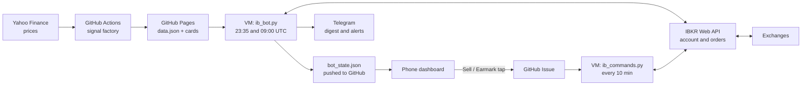

Read left to right: prices become signals on GitHub, the VM trades on them through IBKR, and the dashboard and Telegram report back. The one path back into the bot is a phone tap, which travels as a GitHub issue.

### The five parts

| Part | Where it runs | When | What it does |
| --- | --- | --- | --- |
| Signal factory (`engine/`) | GitHub Actions | Every hour at :05, plus on every code push | Downloads prices for about 1,000 tickers, computes indicators and scores, writes `docs/data.json` and one card per product |
| Trading bot (`execution/ib_bot.py`) | Oracle VM | 23:35 and 09:00 UTC | Reads signals and the live account, manages exits, buys new positions, saves state, publishes results |
| Publisher (`execution/publish_web.py`) | Oracle VM | Hourly at :25 | Pulls the latest code, refreshes account numbers for the dashboard |
| Command reader (`execution/ib_commands.py`) | Oracle VM | Every 10 minutes | Executes phone commands: Sell, Earmark, Refresh |
| Messengers (`daily_signal.py`, `telegram_poll.py`) | Oracle VM | 23:40 daily; every 2 minutes | Sends the nightly digest; answers `/update` and delivers alerts |

### One day in the life

| Time (UTC) | What happens |
| --- | --- |
| Every hour :05 | GitHub rebuilds signals with the latest prices and republishes them |
| Every hour :25 | The VM pulls any new code and republishes account numbers |
| 00:00 | Tokyo opens; Japanese orders placed at 23:35 execute |
| 01:30 | Hong Kong opens; Hong Kong orders execute |
| 07:00 | European markets open (08:00 in winter) |
| 09:00 | Morning run: decides only markets whose last session has finished and been published (US, and Japan when a fresh build is out) |
| 13:30 | US market opens (14:30 in winter); US orders execute |
| 23:35 | Main run: every market has closed, so all are decided |
| 23:40 | Telegram digest arrives with positions, P&L and actions |

### Why it is built this way

- **Free and simple hosting.** GitHub Actions and Pages cost nothing; the VM is on Oracle's free tier.
- **Decisions on finished days only.** Signals use daily closing prices, so the bot waits until a market's day is over and the data is published.
- **Nothing trusts a single check.** Money rules such as "never sell HKD" have several independent guards, and every change is tested and reviewed before it goes live.
- **You stay in control.** The dashboard shows everything, Telegram alerts anything unusual, and a phone tap can sell a position.

## How signals are designed

Every hour, the signal factory gives about 1,000 products one verdict from daily prices: buy a sharp dip in a strong uptrend, or wait. It runs on GitHub Actions (GitHub's free build servers that run on a schedule), not on the trading VM. It publishes JSON files (structured text data) that the bot and the dashboard read.

### The idea: a trend filter plus buying dips

The code gives its own reasoning. A short dip inside an uptrend is "the highest-win-rate long entry", and buying a dip in a downtrend is "catching a falling knife". So the trend test always comes first.

`analyze()` in `engine/production.py` asks three kinds of question about each stock:

- **Trend:** is the price above its 200-day average, and the 50-day average above the 200-day one?
- **Dip:** have the last few days fallen hard (RSI(3) below 25)?
- **Quality:** is the stock up more than 30% over 90 bars, within 12% of its 52-week high, and moving enough to cover costs?

Winners are then left to run under a trailing stop instead of a fixed profit target. Bitcoin and Ether use a simpler rule: hold them while they are in an uptrend, with no dip needed. The +30% momentum gate is "config D", picked on 2026-07-11 after a four-way re-test in which two alternatives broke the 30% drawdown limit.

### Step 1: fetching the prices

Prices come from Yahoo Finance through yfinance, a free Python library. The product list, called the universe, lives in `data/universe.json`. The build of 2026-09-17 09:57 UTC analysed 993 tickers (a ticker is a product's trading symbol).

| Market group | Products | Can reach the BUY list? |
| --- | --- | --- |
| US stocks | 502 | Yes |
| Japan stocks (`.T`) | 223 | Yes |
| Hong Kong stocks (`.HK`) | 83 | Yes |
| Europe and UK stocks | 73 | Yes |
| Crypto (`BTC-USD`, `ETH-USD`) | 2 | Yes |
| ETFs, bond and leveraged ETFs, indices, FX, commodities | 110 | No, their cards say "Analysis only" |

`fetch_all()` in `engine/data_fetch.py` downloads about 11.2 years of daily bars. A bar is one day's open, high, low, close and volume. It passes `auto_adjust=True` (prices corrected for splits and dividends) and `keepna=True` (keep empty rows so the code can judge them).

**Per-calendar batches.** Tickers are fetched in batches of up to 80, and a batch never mixes trading calendars. yfinance lines up a whole batch on every date any member traded. So a US stock batched with Tokyo names used to get an empty row on a Tokyo-only day.

That row was filled in as a flat bar with zero range. It cut the 14-day ATR by 1/14 (7.1%) and tightened live trailing stops for good. `_calendar_group()` now keys batches on the exchange suffix, and only Paris, Amsterdam, Brussels and Lisbon share one Euronext calendar.

On the 2026-09-17 universe this gives 57 batches, including 562 unsuffixed US listings in 8 batches of 70 or 71. A ticker missing from its batch is retried alone by `fetch_one()`. Files are cached as `data/prices/<ticker>.csv` for 20 hours, but the hourly GitHub build starts empty because that folder is not committed.

**Cleaning.** `_clean()` keeps the five price columns, drops rows with no close, and drops closes of zero or below. Only products with more than 260 clean bars are analysed.

**The null-close fill.** Yahoo sometimes leaves the newest close empty for hours after a market shuts. On 2026-08-31 the engine read Tokyo's 5301.T at 1,681.5 (the previous close) instead of 1,811.0. That fake fall produced a false trailing-stop exit (stop 1,686.65) on a position that was up 7.7%.

`_fill_last_close()` repairs only the newest row, and only when its close is missing. It uses Yahoo's live quote, but only with proof that the exchange traded that day. Proof means part of the bar arrived, or the last trade is dated that day on the exchange's own clock.

The filled bar takes the day's high and low from the quote, so it is not flattened. Without proof, the row is dropped as before.

**The build stamp.** `generated_at` records when the price download started, in UTC, for example `2026-09-17T09:57:32Z`. `data.json` and every card carry the same value. If the start is unknown, the build time is used and a `!!` warning is printed.

`.github/workflows/daily.yml` builds at :05 each hour, and also on every push to `main`. A daily run at 00:20 UTC also calls `update_universe()`, which adds market-cap leaders, momentum leaders and names near their 52-week high. Names are removed only after five failed checks in a row, for poor trading volume or missing data.

### Step 2: the indicators

`add_features()` in `engine/indicators.py` builds each indicator only from data up to that bar. A decision made on a close is acted on at a later open, so no future data leaks in. The live settings are the `PROD` dictionary in `engine/config.py`.

A simple moving average (SMA) is the plain average of the last N closes. RSI (Relative Strength Index) scores recent gains against recent losses on a 0 to 100 scale. ATR (Average True Range) is the typical daily move, counting overnight gaps as part of the range.

| Indicator | Column | Setting in `PROD` | Live use |
| --- | --- | --- | --- |
| SMA200 | `sma_trend` | `sma_trend = 200` | Trend filter; a close below it means AVOID |
| SMA50 | `sma_fast` | `sma_fast = 50` | Must sit above SMA200; sets the WATCH buy zone |
| RSI(3) | `rsi` | `rsi_period = 3`, `rsi_entry = 25` | Dip test: below 25 |
| ATR(14) | `atr` | `atr_period = 14`, `min_atr_pct = 0.012` | Stop, target, and the 1.2%-of-price cost floor |
| 90-bar momentum | `mom_90` | `min_mom = 0.30` | Quality gate and the score |
| 52-week high | `hi_52w` (highest close of 252 bars) | `near_high = 0.88` | Close must be at least 88% of it |

RSI and ATR both use Wilder smoothing (`ewm(alpha=1/n)`), a running average that favours recent days. "90-day" momentum really means 90 bars: about four months for stocks, but 90 calendar days for crypto, which trades every day.

`add_features()` also computes `vol_surge`, `prev_high`, `sma_250`, `sma200_slope`, `sma50_slope` and `ext_atr`. No live card uses them; they serve research variants in `engine/engine_rr.py`. The older `STRAT` dictionary (RSI below 15, 2 ATR target) belongs to the superseded X4 generation.

### Step 3: from indicators to an action

`analyze()` turns each product's latest bar into a card, testing in this order:

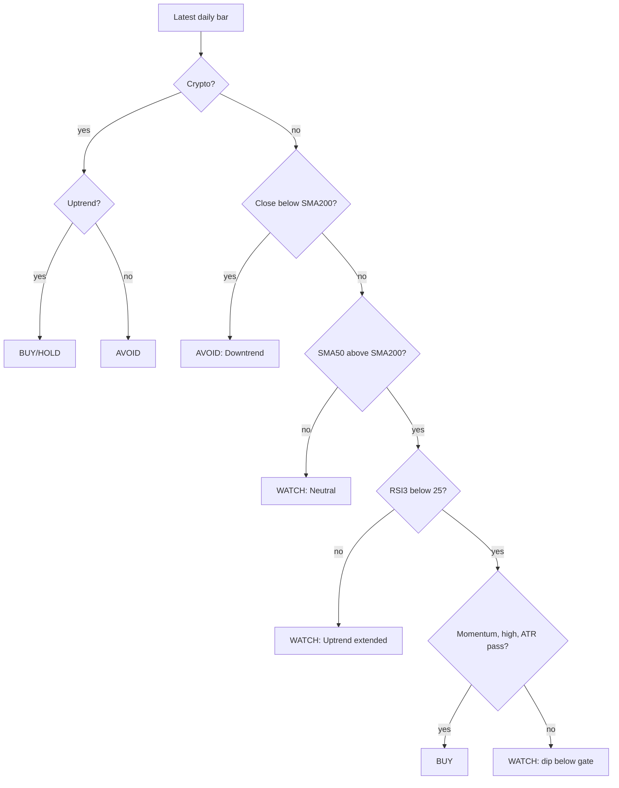

A stock moves down the chart until a test fails, and that test sets its verdict; crypto only checks the uptrend.

| Action | When it appears | What it means |
| --- | --- | --- |
| BUY | A stock passes the trend, dip and all quality tests | Candidate to buy at the next open |
| BUY/HOLD | Crypto closes above SMA200, with SMA50 above SMA200 | Trend engine is long: buy if flat, keep if held |
| WATCH | Not a downtrend, but no qualifying dip | No trade; `reasons` says what is missing |
| AVOID | A stock closes below SMA200, or crypto has no uptrend | Stand aside |
| SELL | Never on a card | Exits for held positions are decided by the bot: close below SMA200, trailing stop, or 60-bar time stop |

The 09:57 UTC build held 560 WATCH, 428 AVOID, 3 BUY and 2 BUY/HOLD cards. BUYs are rare by design.

A BUY card carries these price levels:

- `entry`: the latest close, the reference price for a next-open buy.
- `stop` (the cut-loss, where a losing trade is closed): the higher of close − 3.5 × ATR and close − 12%. Crypto uses close − 4 × ATR.
- `target`: close + 3 × ATR, shown for information only. The real exit is a trailing stop, which ratchets up behind the price.
- `confidence`: High when momentum is above 15% and the price is within 12% of its high, else Medium. A BUY already passes both tests, so it almost always shows High.

On AVOID cards and most WATCH cards, `stop` shows the SMA200 level instead.

### Step 4: the score

The score is momentum alone: `momentum_score(mom) = round(clamp(mom / 0.50) × 100)`. `clamp` pins the ratio between 0 and 1, so a rise of 50% or more over 90 bars scores 100. `band()` labels 65 and up Strong, 50 to 64 Moderate, and below 50 Marginal.

`SCORE_ENTRY_GATE = 60` in `config.py` is the same line as `min_mom = 0.30`, since 30% ÷ 50% × 100 = 60. The code tests the momentum itself; the score sorts candidates and explains a refused dip. Crypto has no gate: `BTC-USD` showed BUY/HOLD with a score of 40 in the same build.

A richer mix, `scoring.composite()` (trend 40, dip 20, strength 15, risk 25 points), was tested for ordering on 2026-07-09. It cut backtested CAGR (compound yearly growth) from 26.7% to 5.1%, and win rate from 54.5% to 49.6%. It was rejected and nothing on the live path calls it.

### Worked example

A made-up stock, ABC, closes at 100.00. Its SMA200 is 80.00, SMA50 is 92.00, RSI(3) is 18, 90-bar momentum is +36%, the 52-week high is 106.00, and ATR is 2.50.

1. Trend: 100 > 80 and 92 > 80, so it is in an uptrend.
2. Dip: an RSI of 18 is below 25.
3. Quality: 36% > 30%; 100 ≥ 0.88 × 106 = 93.28; ATR is 2.5% of price, above 1.2%.
4. Verdict: BUY, with score 0.36 ÷ 0.50 × 100 = 72, band Strong.
5. Stop: max(100 − 3.5 × 2.50, 100 × 0.88) = max(91.25, 88.00) = 91.25, a cut-loss of −8.75%.
6. Target: 100 + 3 × 2.50 = 107.50.

With momentum of +24% instead, the score would be 48. The card would say WATCH: "Score 48 is below the entry gate (60)".

### What gets published

`engine/build_dashboard.py` writes into `docs/`, which GitHub Pages (GitHub's free web hosting) serves at btctree.github.io/multi-product-signals.

| Key in `docs/data.json` | Contents |
| --- | --- |
| `generated`, `generated_at` | Build date; UTC time the download started |
| `product`, `headline` | Live config name; backtest figures read from `data/revalidation.json` |
| `universe_count`, `universe_listed` | Products analysed; tickers in the universe file |
| `universe_updated`, `universe_changes`, `add_reasons` | Last refresh; recent additions and removals; why each name was added |
| `actions` | Up to 20 full BUY or BUY/HOLD cards from tradeable markets, highest score first |
| `index` | One short row per analysed product |
| `positions`, `history` | From old manual tracker files; empty in the live build |
| `backtest_trades` | The 200 most recent backtest trades, not live fills |

An abbreviated `data.json` from the 09:57 UTC build:

```json
{
  "generated": "2026-09-17",
  "generated_at": "2026-09-17T09:57:32Z",
  "product": "D: score>60 dips + crypto trend · 15 positions (13+2)",
  "headline": {"win": "52.5%", "cagr": "30.8%", "maxdd": "-29.0%",
               "grows": "HK$150k -> 3.04M (11.2y backtest)"},
  "universe_count": 993,
  "universe_listed": 993,
  "actions": [
    {"symbol": "HUM", "action": "BUY", "score": 100, "price": 384.72, "...": "full card"},
    {"symbol": "ETH-USD", "action": "BUY/HOLD", "score": 85, "...": "full card"}
  ],
  "positions": [],
  "backtest_trades": [
    {"sym": "MS", "sleeve": "DIP", "entry_date": "2026-07-20",
     "exit_date": "2026-09-15", "ret_pct": -6.03, "hold_days": 39, "reason": "trail"}
  ],
  "index": [
    {"sym": "HYG", "market": "BOND", "action": "WATCH",
     "regime": "Uptrend — dip (below entry gate)", "price": 78.42}
  ]
}
```

Each product also gets `docs/products/<safe name>.json`. `safe_name()` turns `.` into `_`, so `0700.HK` becomes `0700_HK.json`. The file holds the last 500 closes and SMA200 values for the chart, plus the full card:

```json
{
  "sym": "HUM", "name": "Humana", "market": "US",
  "generated_at": "2026-09-17T09:57:32Z",
  "prices": [["2024-09-18", 306.7191], "...", ["2026-09-16", 384.72]],
  "sma200": ["...", ["2026-09-16", 284.6559]],
  "card": {
    "symbol": "HUM", "tradeable": true, "action": "BUY",
    "regime": "Uptrend — pullback (BUY zone)",
    "price": 384.72, "atr": 13.807942, "sma200": 284.6559,
    "score": 100, "score_band": "Strong", "confidence": "High",
    "entry": 384.72, "stop": 338.55, "target": 426.14,
    "reasons": ["Short-term oversold pullback: RSI(3) = 15 (< 25) ...", "..."]
  }
}
```

Here the 12% floor set the stop. 3.5 × 13.81 is 48.33, a wider gap than 12% of 384.72 (46.17), so 338.55 is the higher price.

### How the bot uses a signal

`execution/ib_bot.py` reads `data.json` at its 23:35 and 09:00 UTC runs. It keeps BUY and BUY/HOLD actions, sorts them by score, and fills free slots up to 15 positions. For held positions it reads each card's `price`, `atr` and `sma200`, and a new position's first stop is the card's `stop`.

`execution/market_clock.py` checks that the prices are final. `market_decidable()` blocks decisions on a market during its session and for 90 minutes after its close. `last_settled_close()` also requires `generated_at` to fall at or after that settle time.

Example: Tokyo closes at 15:30 JST, which is 06:30 UTC, so its bar settles at 08:00 UTC. The 09:00 UTC run acts on Tokyo only if the build's download started at 08:00 UTC or later. Otherwise the decision waits for a later run.

Some BUYs never become orders:

- London (`.L`) entries are skipped, because Yahoo quotes pence and orders would be sized 100 times too small.
- Swiss, Danish, Swedish and Norwegian listings are refused at contract lookup in `execution/ib_orders.py`.
- Crypto needs IBKR's crypto permission, and the root `README.md` says the live bot has never traded crypto.
- Hong Kong entries need `HK_ENABLED=1`. The code default is off; the live VM's schedule sets it to 1 (switched on 2026-09-12).

### Backtests and research, briefly

A backtest replays the rules over past prices to measure how they would have done. `engine/engine_rr.py` simulates the stock side: decide on a close, fill at the next open, and charge costs on each buy and sell (US 0.10%, HK 0.25%, Japan and EU 0.15%, crypto 0.20%). `engine/research_revalidate.py` measured config D at a 52.5% win rate, 30.8% CAGR and −29.0% maximum drawdown (worst fall from a peak) over 11.2 years.

The dashboard warns those figures carry survivorship bias. They test today's index members over past years, so companies that failed are missing. `engine/backtest.py` is the older X4 simulator, and 26 `engine/research_*.py` scripts tested alternatives such as shorts, options and margin, which were rejected.

### Where it lives in the code

| File | Role |
| --- | --- |
| `engine/data_fetch.py` | Yahoo download, calendar batches, `_clean()`, `_fill_last_close()`, download-start record |
| `engine/universe.py` | Product list, `market_of()`, `update_universe()`, `prune_dead()` |
| `engine/indicators.py` | `sma`, `rsi`, `atr`, `roc`, `add_features()` |
| `engine/config.py` | `PROD` live settings, `SCORE_ENTRY_GATE`, per-market costs |
| `engine/production.py` | `analyze()` cards and `scan_actions()` BUY list |
| `engine/scoring.py` | `momentum_score()`, `band()`, the rejected `composite()` |
| `engine/build_dashboard.py` | Writes `docs/data.json`, `docs/products/*.json` and `generated_at` |
| `.github/workflows/daily.yml` | Hourly build at :05, universe refresh at 00:20 UTC, Pages deploy |
| `execution/market_clock.py` | The close + 90 minutes rule the bot applies to signals |
| `engine/engine_rr.py`, `engine/backtest.py`, `engine/research_*.py` | Backtests and research |

## Conditions and selection

The bot buys a strong stock during a short dip inside an uptrend. It sells on the first of three exits: a trend break, a trailing stop, or 60 trading days held. These are the exact rules of the live product, which the code calls "D" (`engine/config.py`).

### Words used in this section

| Term | Meaning |
| --- | --- |
| Bar | One trading day of prices: open, high, low and close. The prices are Yahoo Finance daily data. |
| Close | The day's last price. Every entry and exit rule here is judged on closes. |
| SMA200, SMA50 | Simple moving average: the plain average of the last 200 (or 50) closes. |
| RSI(3) | Relative Strength Index over 3 bars, a gauge from 0 to 100. Below 25 means the price just fell hard. |
| ATR | Average True Range over 14 bars: the stock's typical daily move, in price units. |
| 90-day momentum | The percent price change over the last 90 bars (`mom_90`). |
| 52-week high | The highest close of the last 252 bars. |
| Slot | One of the 15 positions the bot may hold at once. |

`indicators.add_features` computes all of these. RSI and ATR use Wilder smoothing, an exponential average with weight 1/n.

### Step 1: the universe (what gets looked at)

The universe is the list of products the engine analyses on every build. It is stored in `data/universe.json`. On 2026-09-17 it held 993 tickers, and `market_of()` sorts each one into a class by its Yahoo suffix.

| Class | Count | Example |
| --- | --- | --- |
| US stocks | 502 | NVDA |
| JP (`.T`) | 223 | 7733.T |
| HK (`.HK`) | 83 | 0700.HK |
| EU (`.DE`, `.PA`, `.L`, `.SW` and others) | 73 | DBK.DE |
| ETF, LEV, BOND, MACRO | 60 | SPY, TQQQ, TLT, UUP |
| INDEX, FX, COMMODITY | 50 | ^GSPC, EURUSD=X, GC=F |
| CRYPTO | 2 | BTC-USD, ETH-USD |

The list was built in three layers:

- **Seed lists** (`universe.initial_universe`): the top 50 US, 30 HK, 50 JP and 30 EU names by market cap. Indices, futures, FX, crypto, leveraged ETFs and bond ETFs were added.
- **One-time expansion** (`gen_expanded_universe.py`, approved 2026-07-09): S&P 500 and Hang Seng members scraped from Wikipedia, and Nikkei 225 members from Nikkei's site. It also added hand-picked European names, commodities, FX pairs, indices and ETFs. It only adds, seeds `data/company_names.json`, and is not scheduled.
- **Daily refresh** (`update_universe()`): run by `.github/workflows/daily.yml` at 00:20 UTC, or on a manual run. Only this run commits the updated file.

| Rule | Test | When |
| --- | --- | --- |
| A: size | Enters its market's top N by market cap (US 50, HK 30, JP 50, EU 30) | Mondays only (about 950 slow lookups), or `FORCE_CAP_SCAN=1` |
| B: momentum | A watch-pool name up 30% or more over about three months, with enough trading value | Daily |
| C: near high | A watch-pool name within 3% of its 1-year high, with enough trading value | Daily |
| Remove: illiquid | 60-day median daily traded value in its market's bottom 10% and under the floor, 5 checks in a row | Daily |
| Remove: dead | No analysable card for 5 strikes in a row (`prune_dead`); young, active listings are spared | Every build |

The watch pool is a fixed list of 59 extra names (`EXTRA_CANDIDATES`). The liquidity floors (`VOL_FLOOR`) are 10 million a day for US and EU, HK$50 million and ¥1 billion, in local currency. Dropping out of the top N never removes a name, which the code calls "grow-only".

Held positions are never removed, and there is a reason. A removed ticker loses its product card, and the bot skips every exit for a holding with no card. `held_from_bot_state()` reads the bot's own holdings so that this cannot happen.

### Step 2: which classes the bot may trade

`production.TRADEABLE` limits the BUY list to US, HK, JP, EU and CRYPTO. Every other class gets cards stamped "Analysis only" and never reaches the bot. The bot then applies its own filters.

| Class | On the BUY list | Bot enters? | Where it is decided, and why |
| --- | --- | --- | --- |
| US stocks | Yes | Yes | `contracts.to_ib`. A symbol with `-`, such as BRK-B, returns None and is skipped. |
| JP | Yes | Yes, in whole board lots | `lot_size` uses IB's lot, or 100 if IB gives none. TSE will not trade odd share counts. |
| EU in EUR (`.DE .PA .AS .MC .MI .BR .HE .VI .LS`) | Yes | Yes | Contract lookup must match the exact exchange, so SAN.MC (Santander) never resolves to SAN.PA (Sanofi). |
| London (`.L`, GBP) | Yes | No | LSE prices are in pence, so sizing would come out 100 times too small. |
| Swiss, Danish, Swedish, Norwegian (`.SW .CO .ST .OL`) | Yes | No | These venues are missing from `ib_orders._VENUE_LISTINGS`, so IB cannot qualify the contract. |
| HK | Yes | Yes on the live VM (`HK_ENABLED=1` since 2026-09-12; the code default is 0) | `ib_bot.entry_blocked_reason`. Exits are never blocked. |
| CRYPTO | Yes, as BUY/HOLD | Coded, but see below | Whole-unit sizing |
| ETF, LEV, BOND, MACRO, FX, INDEX, COMMODITY | No | No | Monitored only, not part of the validated strategy |

HK entries needed two safety pieces first. Each stock's board lot (the minimum trading unit) must come from HKEX's own list, and prices must snap to HKEX's tick table. Both now exist in code (`data/hk_board_lots.json` with 2,793 stocks, and `hk_tick`), and the operator switched HK entries on for the live VM on 2026-09-12.

Crypto sizing uses whole units: `int(budget / rate / price)`. A coin priced above one position's budget (about US$1,840) rounds to 0 and is skipped without a log line. The committed fills ledger holds no crypto trade.

### Step 3: the entry rules (what makes a BUY)

`production.analyze()` builds one card per product from its latest close. An equity card says BUY only when all seven tests pass.

| # | Test | Exact rule | Why it exists |
| --- | --- | --- | --- |
| 1 | Long-term uptrend | close > SMA200 | Below it the card says AVOID. The code calls dip-buying in a downtrend "catching a falling knife". |
| 2 | Confirmed trend | SMA50 > SMA200 | Otherwise the card says WATCH, "Neutral / transition". |
| 3 | Short dip | RSI(3) < 25 | Buys a pullback inside the uptrend, which the code calls the highest-win-rate long entry. |
| 4 | Momentum gate | `mom_90` > +30% (score above 60) | The "D" gate, chosen 2026-07-11 after a four-way re-test |
| 5 | Strong stock | close ≥ 0.88 × 52-week high | Only names within 12% of their high |
| 6 | Moves enough | ATR ÷ close > 1.2% | The expected bounce must clear costs, modelled at 0.10% to 0.25% per side. |
| 7 | Enough history | 260 bars or more | `scan_actions` skips shorter series. |

Rule 4's re-test covered 11.2 years, after costs: win rate 52.5%, CAGR 30.8%, maximum drawdown −29.0%. CAGR is the average yearly growth rate, and drawdown is the largest fall from a peak. Two wider variants grew faster but broke the 30% drawdown limit (`data/revalidation.json`).

If rules 1 to 3 pass but rule 4, 5 or 6 fails, the card says WATCH and names the failed test. With no dip yet, it says WATCH and shows a "buy zone" near the SMA50. A BUY card also carries a cut-loss: the higher of close − 3.5 × ATR and 88% of the close.

Crypto cards use a simpler trend rule (`_crypto_card`). BUY/HOLD needs only close > SMA200 and SMA50 > SMA200, with no dip test and no momentum gate. The stop shown is close − 4 × ATR.

### Step 4: ranking and filling free slots

Each BUY gets a score from 0 to 100, based on momentum alone: `round(clamp(mom_90 / 0.50) × 100)`. A stock up 38% scores 76, and anything up 50% or more scores 100. The build keeps the top 20 cards in `docs/data.json`.

Ranking by momentum is what the validated backtest did (`engine_rr.run` sorts candidates by `mom_90`). A richer score (trend 40, dip depth 20, nearness to high 15, stop tightness 25) was tested on 2026-07-09. It cut backtest CAGR from 26.7% to 5.1% and was rejected.

Free slots = 15 − positions held − working BUY orders for names not yet held. The kill switch sets free slots to 0 when NetLiq falls below 92% of its recorded peak. The backtest's split of 13 equity and 2 crypto slots is not enforced: the bot has one pool of 15.

Each entry gets `min(NetLiq ÷ 15, HK$20,000)`, where NetLiq leaves out earmarked cash. At HK$215,000 that is about HK$14,333. The order is a DAY limit at signal price × 1.005.

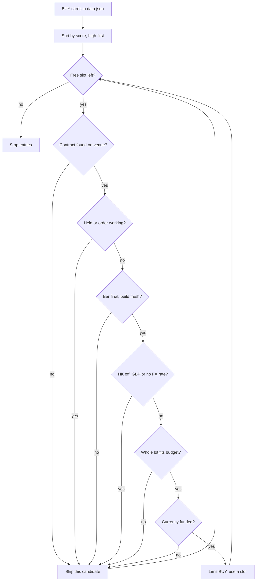

A failed check skips only that candidate, and the loop moves on to the next score until the slots run out.

"Bar final, build fresh" comes from `market_clock.py`. A market is decided only after its close + 90 minutes, and only on a build that started after that. So the 09:00 UTC run decides US and JP, and leaves EU and HK to 23:35.

A deferred candidate uses no slot. An order that is sent uses a slot for the rest of the run, even if IB refuses it.

### Step 5: the exit rules

Exits run before entries, so they free cash and slots first. For each holding with a card and no working order, the bot checks three rules in order and acts on the first that fires.

| Order | Exit | Test on the latest close | Setting | Why |
| --- | --- | --- | --- | --- |
| 1 | Regime break | close < SMA200 | `regime_exit_sma: 200` | The uptrend the trade was bought for has ended. |
| 2 | Trailing stop | close ≤ stop | k = 3.5, or 2.0 once close ≥ entry + 1.5 × ATR | Room to move early, then gains locked in once the move proves itself |
| 3 | Time stop | bars held ≥ 60 | `MAX_HOLD_BARS=60` | Validated default, restored 2026-08-01. It measured +0.8 to +0.9 points CAGR and a 2.0 to 2.3 point shallower drawdown. |

The trailing stop is a "chandelier" stop: it hangs a set distance below the highest close since entry. `ib_bot.run()` does this on every run:

```
hw   = max(stored hw, today's close)            # high-water mark
k    = 2.0 if close >= entry + 1.5 * ATR else 3.5
stop = max(stored stop, hw - k * ATR)           # can never move down
```

The first stored stop is the card's cut-loss on entry day. `bars_held` counts weekdays after the entry date and ignores holidays, so the time stop can fire slightly early, never late.

A stock exit is a DAY market order that fills at the next open. Exits ignore the kill switch and `HK_ENABLED`, so a holding can always be sold. Running twice on the same close changes nothing, because both `max` steps return the same values.

The live bot differs from the backtest (`engine/engine_rr.py`) in three places:

- **Stop test:** the backtest tests the stop against the day's low and exits at the stop price. The bot tests the close and sells at the next open.
- **Tightening:** the backtest tightens when the high-water mark reaches entry + 1.5 × the entry-day ATR. The bot uses today's close and today's ATR.
- **Crypto:** the backtest's crypto sleeve exits after two closes below SMA50. The bot runs the stock exit rules on every holding.

### Worked example: from entry to a trailing-stop exit

These numbers are made up, but they follow the code exactly. ACME is a US stock, so the 23:35 UTC run decides it after the US close has settled.

Signal day: close $100.00, SMA50 $92.00, SMA200 $80.00, RSI(3) 18, 90-day momentum +38%, 52-week high $108.00, ATR $2.50.

- **Trend (rules 1 and 2):** 100 > 80, and 92 > 80.
- **Dip and momentum (rules 3 and 4):** 18 < 25, and +38% > +30%, for a score of 76.
- **Strength and movement (rules 5 and 6):** 100 ≥ 0.88 × 108 = 95.04, and 2.50 ÷ 100 = 2.5% > 1.2%.
- **Cut-loss:** max(100 − 3.5 × 2.50, 88.00) = $91.25.

The budget of HK$14,333 at 7.80 HKD per USD is US$1,837.60, which buys 18 whole shares. The bot sends BUY 18 at a $100.50 limit. It stores entry 100.00, hw 100.00 and stop 91.25.

| Bar | Close | ATR | Tighten line | k | hw | hw − k × ATR | Stored stop | Decision |
| --- | --- | --- | --- | --- | --- | --- | --- | --- |
| 1 | 102.00 | 2.50 | 103.75 | 3.5 | 102.00 | 93.25 | 93.25 | Hold |
| 5 | 106.00 | 2.60 | 103.90 | 2.0 | 106.00 | 100.80 | 100.80 | Hold |
| 9 | 111.00 | 2.80 | 104.20 | 2.0 | 111.00 | 105.40 | 105.40 | Hold |
| 12 | 108.50 | 2.90 | 104.35 | 2.0 | 111.00 | 105.20 | 105.40 | Hold; the stop does not fall |
| 14 | 105.00 | 3.00 | 104.50 | 2.0 | 111.00 | 105.00 | 105.40 | SELL: 105.00 ≤ 105.40 |

On bar 14 the close is still far above SMA200, and 14 bars is under 60. The trailing stop is therefore the exit, so the bot sells 18 shares at market at the next open. If the buy filled at $100.50 and the sell at $104.60, the gain is 18 × $4.10 = US$73.80, about 4%, before commission.

### Where it lives in the code

| File | What it holds |
| --- | --- |
| `engine/config.py` | `PROD` settings (RSI 25, near-high 0.88, momentum 0.30, ATR 1.2%, K 3.5 and 2.0), `SCORE_ENTRY_GATE` |
| `engine/indicators.py` | SMA, RSI, ATR, `mom_90`, 52-week high |
| `engine/production.py` | `analyze()` card rules, `_crypto_card()`, `scan_actions()`, `TRADEABLE` |
| `engine/scoring.py` | `momentum_score()` and the rejected composite score |
| `engine/universe.py` | Seed lists, `market_of()`, `update_universe()`, `prune_dead()` |
| `engine/gen_expanded_universe.py` | The one-time 2026-07-09 expansion |
| `engine/build_dashboard.py` | Writes `docs/data.json` (top 20 actions) and product cards |
| `engine/engine_rr.py` | The validated backtest engine |
| `.github/workflows/daily.yml` | Hourly build at :05, universe refresh at 00:20 UTC |
| `execution/contracts.py` | `to_ib()`, `currency_of()` |
| `execution/ib_bot.py` | `run()` exits and entries, `HK_ENABLED`, `entry_blocked_reason()`, `MAX_HOLD_BARS`, `lot_size()`, `bars_held()` |
| `execution/market_clock.py` | `market_decidable()`, `last_settled_close()` |
| `execution/ib_orders.py` | `resolve_conid()`, `_VENUE_LISTINGS`, `_CCY_EXCHANGES` |

## Trading logic: slots, sizing and protection

The bot holds at most 15 positions, buys each at one fifteenth of NetLiq, and protects that with a kill switch and an earmark. NetLiq (net liquidation value) is what the account would be worth in HKD if everything were sold now. Every rule below lives in `execution/ib_bot.py` and `execution/earmark.py`.

### The settings

Each setting is an environment variable (a value handed to the program when cron, the Linux scheduler, starts it).

| Setting | Default | What it does |
| --- | --- | --- |
| `TARGET_POSITIONS` | 15 | Most holdings at once, and the divisor for sizing |
| `MAX_ORDER_BASE` | 20000 | Cap on one entry's value, in HKD |
| `DAILY_LOSS_KILL` | 0.08 | Blocks new entries when NetLiq is 8% below its stored peak |
| `LIMIT_BUFFER` | 0.005 | Buy limit (the highest price accepted) = price × 1.005 |
| `BASE_FUND_BUFFER` | 1.03 | An HKD shortfall is bought with 3% extra |
| `HK_ENABLED` | 0 in code; 1 on the live VM | Hong Kong entries happen only when this is 1 (switched on 2026-09-12) |

The live crontab (cron's schedule file) is not in the repo, and `execution/vm_ops/crontab.reference` is marked stale. The operator's live schedule on the VM (the Oracle cloud server) sets `HK_ENABLED=1` and leaves the other defaults, including `FX_CONVERT=0`.

### Position slots

A position slot is one seat for one holding. Before buying, `run()` counts the free seats:

`free = TARGET_POSITIONS − holdings with quantity > 0 − working BUY orders`

A working order is one IB has accepted but not yet filled (status PendingSubmit, PreSubmitted, Submitted or ApiPending). Working buys count because a 23:35 order can still be waiting at the 09:00 run. On 2026-07-31 the bot tried to open a 16th position that way, and only IB's rejection stopped it.

BUY candidates from the signal file `data.json` are tried highest score first. Every order the bot sends uses a slot, even one IB then refuses. A candidate skipped before sending (market not settled, lot too big, cash not ready) leaves its slot for the next one.

`engine/config.py` describes the 15 as 13 equity plus 2 crypto slots with 70/30 weights. The live bot does not enforce that split: all 15 slots are shared, and every entry gets the same budget.

### Sizing one entry

Each entry's budget is `notional = min(NetLiq / TARGET_POSITIONS, MAX_ORDER_BASE)`, in HKD. Notional means the money value of an order. At NetLiq HK$215,000 the budget is HK$14,333, so the HK$20,000 cap only bites above NetLiq HK$300,000.

The share count is `int(notional / rate / price)`. Here `rate` is HKD per one unit of the stock's currency, and `int` rounds down. The count is then rounded down again to a whole number of board lots (the smallest bundle an exchange matches automatically).

An order that is not a whole number of lots is an odd lot, which SEHK (the Hong Kong exchange) will not match normally. `lot_size()` picks the lot:

| Market | Lot | Where it comes from |
| --- | --- | --- |
| US, EU, crypto | 1 share | These venues have no board lots |
| Japan (JPY) | IB's size increment if above 1, else 100 | TSE (Tokyo Stock Exchange) has used 100 since Oct 2018 |
| Hong Kong (HKD) | Per stock: 0700 = 100, 1810 = 200, 2269 = 500 | `data/hk_board_lots.json`, from the List of Securities of HKEX, the Hong Kong exchange operator (2,793 codes, as at 14/09/2026) |

An HK code missing from that file gets lot 0, meaning unknown, and is skipped. IB's figure is only a cross-check, because IB reported a flat 100 for every stock on 2026-09-05. London (GBP) names are skipped before sizing, because London prices are in pence.

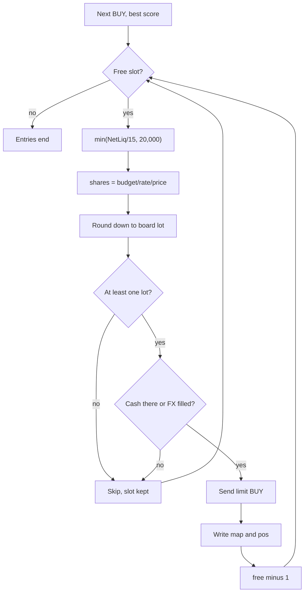

Each candidate passes the slot check, the lot check and the funding check in that order, and only a sent order uses a slot.

### Worked example: a US, a JP and an HK buy

Assume NetLiq after the earmark is HK$215,000, so each budget is HK$14,333. Prices and rates are made up but realistic.

| Step | US stock | JP stock | HK stock 1810.HK |
| --- | --- | --- | --- |
| Signal price | USD 182.40 | JPY 2,450 | HKD 52.30 |
| Rate, HKD per unit | 7.80 | 0.053 | 1 |
| Raw shares | 14,333 / 7.80 / 182.40 = 10.07 → 10 | 14,333 / 0.053 / 2,450 = 110.4 → 110 | 14,333 / 52.30 = 274.1 → 274 |
| Board lot | 1 | 100 | 200 |
| Final shares | 10 | 100 | 200 |
| Cost in HKD | 14,227 | 12,985 | 10,460 |
| Limit (price × 1.005, rounded to a legal price step) | 183.31 | 2,462 | 52.55 |

The JP column shows lots biting. At JPY 3,000 the raw count would be 90, which is zero lots. The bot logs that one lot (about HK$15,900) exceeds the position size and moves on.

Before sending, `ensure_ccy()` checks the cash exists in the stock's currency. Suppose the bot holds no HKD of its own for the HK buy. It sells about USD 1,381 in an FX order (a currency conversion) for the shortfall × 1.03, which is 10,774 HKD.

The stock order goes out only if that conversion has filled; otherwise the candidate is skipped. Other currencies get a 1.02 buffer, and HKD is never sold while `FX_CONVERT` stays at its default, off. Once sent, the order's cost at its limit is added to `_FX_COMMITTED`, so the next candidate cannot spend the same cash.

### The kill switch

The kill switch stops new buys after a big fall in account value. Each run reads `_peak_netliq`, the highest NetLiq stored in `state.json`, then computes:

`peak = max(stored peak, NetLiq)` and `killed = NetLiq < peak × (1 − 0.08)`

Despite its name, `DAILY_LOSS_KILL` never resets daily; the peak only rises. When `killed` is true, `free` becomes 0 and no entries happen. Exits still run: a close under the 200-day average, a hit trailing stop (a rising sell level), or 60 weekdays held.

Example: the stored peak is HK$228,000, so the trip line is 228,000 × 0.92 = HK$209,760. A run seeing NetLiq HK$209,000 logs `KILL-SWITCH` and adds one HALT row per UTC day to the dashboard, tracked by `_kill_noted`. The check repeats every run, so entries restart by themselves once NetLiq is back above HK$209,760.

The peak ignores deposits and withdrawals. A withdrawal can trip it without any trading loss, and the fix is editing `_peak_netliq` by hand, as `execution/README.md` explains. That happened from 2026-08-03 to 08-06, when an older version froze exits as well.

### The earmark: money only passing through

The earmark keeps the operator's pass-through HKD out of NetLiq and out of the bot's spending. Each month end a GBP deposit is converted to HKD, earmarked the same day, and withdrawn early the next month. Counted as capital, it would inflate every budget and lift the peak, and its withdrawal would then trip the kill switch.

The operator sets the marker M, one HKD number, by opening a GitHub issue titled `EARMARK: 23746`. `ib_commands.py` writes it to `/root/excluded_cash`, and `EARMARK: 0` clears it. With H as the HKD cash held and P as the bot's own HKD, `earmark.exclusion()` applies:

| Rule | Exclusion | Used when |
| --- | --- | --- |
| Pocket rule | `min(M, max(0, H − P))`, with P clamped to 0..H | The bot's pocket is known |
| Fallback rule | `min(M, H)` | The pocket is not known |

Both rules cap the exclusion at the HKD actually held. That cap exists because on 2026-08-31 an HK$18,559 marker outlived its withdrawal. NetLiq read 191,875 instead of 210,434, and the kill switch tripped.

### The bot's stamped HKD pocket

The fallback rule cannot tell the operator's HKD from HKD the bot bought for an HK entry. The pocket P counts only executions (fills) that carry the bot's own label. Every bot order sends a client order id starting `mps-`, and IB echoes it back as `order_ref`.

`earmark.bot_pocket()` adds up HKD movements since an anchor time:

| Execution | Counted in P? |
| --- | --- |
| Stamped `mps-`, HKD in or out | Yes, in full |
| Unstamped, HKD out (IB fee sweeps, `FXCONV` rows) | Yes, as a cost |
| Unstamped, HKD in | No, it is the operator's |

The anchor is a UTC minute in `/root/earmark_anchor`. Only a live run that sees HKD cash below 1 writes it. At that moment neither the pot (the operator's pass-through HKD) nor the pocket can exist.

**Worked example**, using the numbers in `test_bot_pocket.py`. The operator marks M = 23,746. The bot then converts USD into 14,500 HKD for an HK buy, stamped `mps-`, and 7 HKD of old change belongs to the operator.

| Situation | H | P | Fallback exclusion | Pocket exclusion | Bot may spend (pocket rule) |
| --- | --- | --- | --- | --- | --- |
| Pot and bot HKD both held | 38,253 | 14,500 | 23,746 | min(23,746, 23,753) = 23,746 | 14,500 |
| Pot withdrawn, marker still set | 14,507 | 14,500 | min(23,746, 14,507) = 14,507 | min(23,746, 7) = 7 | 14,500 |

In the second row the fallback would hide the bot's own 14,500 and understate NetLiq by that much. It would also show nothing spendable, so the bot would convert another \~14,500 of USD into HKD it may never sell back. The pocket rule excludes only the 7.

### When the pocket is not trusted

If P cannot be established, it is None and every reader uses the fallback `min(M, H)`. The fallback errs toward excluding too much, which understates NetLiq but never spends transfer money. The pocket is dropped when:

- no anchor has been written yet;
- stamping is unconfirmed, because no execution anywhere carries an `mps-` reference;
- the canary (a tripwire) fires: a fill on an order the bot submitted came back with a different reference;
- a fill after the anchor has a currency that cannot be priced;
- IB's executions read fails, misses fills already on record, or is empty while IB accepted a bot order in the last 6 days;
- there is a coverage gap, which also deletes the anchor.

IB only returns 7 days of fills, so each live run saves them to `/root/earmark_execs.jsonl` and stamps `/root/earmark_covered` after a complete read. A coverage gap means the anchor is over 6 days old (`COVERAGE_MAX_DAYS`) and so is that stamp, or there is none. A missing or damaged executions file also counts once the anchor is that old.

Processes that never read executions (`publish_web.py`, `daily_signal.py`, `ib_commands.py`) use `/root/earmark_pocket.json`, which a live run deletes right after reading IB's executions, before any order. At the end of the run it rewrites the file with P and `pending`, the HKD tied up in working HK buys. Readers use `max(0, P − pending)` and ignore a file older than 36 hours.

### The per-run earmark freeze

The exclusion used for spending is computed once per run and kept in `_EARMARK_RUN`. It is taken after `reserve_working_cash()` has reserved cash for orders left working by earlier runs, and before any conversion. Freezing matters because buying HKD raises H, and a fresh `min(M, H)` would earmark the new HKD and trigger another conversion.

During the run, a filled conversion into HKD grows P by an estimate (`_pocket_add_fill()`), so the next HK candidate sees its own money. When P is known, spendable HKD is `max(0, min(P, H − frozen exclusion) − committed)`, where committed is cash already reserved.

### state.json: the bot's memory

`execution/state.json` is a JSON file (plain-text keys and values) in `/root/multi-product-signals` on the VM. It is git-ignored (not tracked), so the hourly `git reset --hard` code refresh leaves it alone.

| Key | Meaning | Example |
| --- | --- | --- |
| `map` | IB symbol → dashboard (Yahoo) symbol | `"1810": "1810.HK"` |
| `pos.<sym>.entry` | Signal price at entry | 52.30 |
| `pos.<sym>.hw` | High-water mark: highest card price seen | 58.10 |
| `pos.<sym>.stop` | Trailing stop, which only moves up | 51.20 |
| `pos.<sym>.entry_date` | Entry day, for the 60-weekday time stop | `"2026-09-03"` |
| `_peak_netliq` | Highest NetLiq seen, for the kill switch | 228000 |
| `_kill_noted` | UTC day the last HALT row was added | `"2026-09-10"` |

An entry writes `map` and `pos`, taking `stop` from the signal card. For stocks that is `max(price − 3.5 × ATR, price × 0.88)`, where ATR (average true range) is the stock's typical daily move. Each exit pass raises `hw`, then sets `stop = max(stop, hw − k × ATR)`, with k = 2.0 while price is at least 1.5 ATR above entry, else 3.5.

The code writes `map` and `pos` after every `place()` call, even one IB refused, but the exit loop only walks real IB holdings. A holding with no `map` entry gets no exits at all. That is why `_save_state_on_abort()` saves `state.json` when a live run crashes, while `--dry` (preview mode) writes nothing.

### Where it lives in the code

| File | What to read |
| --- | --- |
| `execution/ib_bot.py` | Settings at the top; `run()` (slots, kill switch, freeze, sizing); `lot_size()`, `hk_board_lot()`; `ensure_ccy()`, `_spendable_base()`, `reserve_working_cash()`; `net_liq()`; `_sweep_pocket()`, `_save_state_on_abort()` |
| `execution/earmark.py` | `marker()`, `exclusion()`, `bot_pocket()`, `coverage_gap()`, `publisher_exclusion()` |
| `execution/ib_commands.py` | The `EARMARK:` phone command |
| `data/hk_board_lots.json` | HKEX board lots |
| `engine/config.py`, `engine/production.py` | Slot split on paper; the card's initial stop |
| `execution/test_bot_pocket.py` | The pocket scenarios used above |

## How a trade actually happens

Every order comes from one call to `ib_bot.run()`, which sells what the exit rules condemn, buys what fits, and records the result. Cron (Linux's built-in scheduler) starts that call on the Oracle VM at 23:35 and 09:00 UTC. Each run rebuilds its picture of the account from IBKR, acts, and exits.

Running `ib_bot.py --dry` walks the same path but sends no order and writes no file. That includes `state.json` (the bot's memory file), the dashboard, the FX rate memory and the contract-id cache.

### The run at a glance

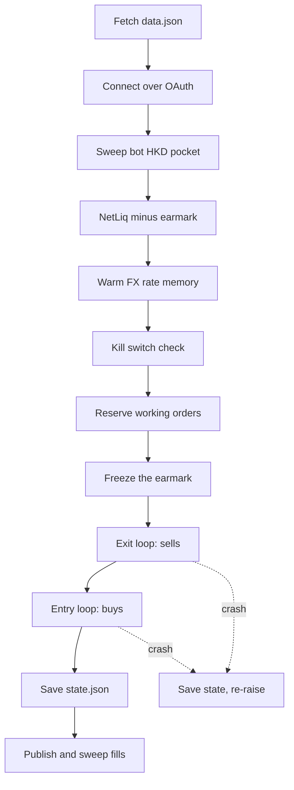

Exits always run before entries, and a run that crashes part-way still saves `state.json` before it stops.

### Step 1: getting ready

Nothing is bought or sold until the account has been read and every earlier order is accounted for.

**Signals and connection.** `get_json(SIGNALS_URL)` downloads `data.json`, the published signal list, and keeps actions marked `BUY` or `BUY/HOLD`. With `IB_BACKEND=web`, `broker.py` (the shim) imitates the old socket library, so the strategy code did not change. OAuth signs each request with cryptographic keys kept in `/root/oauth`, so no login or two-factor prompt is needed.

`connect_or_heal` calls `ib_orders.ensure_session()`, which posts `iserver/auth/ssodh/init` and then reads `iserver/accounts`, up to 4 tries. If that fails, the run raises before anything trades.

**The pocket.** Next, `_sweep_pocket` works out the bot's own HKD, bought to pay for Hong Kong stocks. It reads 7 days of executions (completed trades, also called fills) and credits only HKD bought by orders whose client order id starts `mps-`. If that read looks incomplete, the pocket is treated as unknown.

**NetLiq and the earmark.** `net_liq` reads NetLiq (net liquidation value), what the account would be worth if everything were sold now. The earmark is HKD that is not trading money: the month-end GBP deposit, converted to HKD and earmarked the same day. Until it is withdrawn at the start of the month, the amount in `/root/excluded_cash` is subtracted from NetLiq.

The subtraction is capped at the HKD held, minus the bot's pocket when that is known. So the bot's own HKD stays tradeable, and an unknown pocket errs toward excluding too much.

**FX memory.** IBKR quotes no exchange rates while the currency market is shut, Friday evening to Sunday evening. So `warm_fx_memory` saves each live rate into HKD to `/root/fx_last_good.json`, and a saved rate up to 96 hours old may size an order. A conversion, which moves money, insists on a live rate.

**Kill switch.** The kill switch is a brake on new buys after a large loss. `state.json` remembers the highest NetLiq seen, `_peak_netliq`. With a peak of HK$230,000 the trigger is 230,000 × 0.92 = 211,600, so NetLiq of 210,000 blocks new buys.

Exits still run, and one HALT row reaches the dashboard per UTC day. If a deposit or withdrawal moved NetLiq, the peak is reset by hand.

**Working orders.** A working order is one IBKR has accepted that has not yet filled or expired. IBKR only takes the cash when a trade settles, so a 23:35 buy still looks like free cash at 09:00.

`reserve_working_cash` therefore reserves quantity × limit price (the most a buy may pay) for each working stock buy. It also reserves the source cash of each working conversion, all in `_FX_COMMITTED`.

If IBKR's order book cannot be read, `openTrades()` raises and the run stops with nothing sent. An empty book reported by mistake would make the bot duplicate live orders.

**Earmark freeze.** The earmark is worked out once, after the reservations, and then held for the run. Recomputing it later would count HKD the bot has just bought as earmarked, and the next candidate would convert again.

### Step 2: the exit loop

The bot checks every holding before it buys anything, because a sale frees cash and a slot (one of 15 position places). Each holding passes these gates in order:

1. **Known position.** Its IB symbol must appear in `state["map"]`, which maps IB symbols to Yahoo symbols. Otherwise it is skipped.
2. **No working order.** If an order for that symbol is already live, it is left alone.
3. **Market clock.** `market_decidable(symbol, now)` says no from the local open until 90 minutes after the close (`SESSION_SETTLE_MIN`).
4. **Build stamp.** The card `products/<sym>.json` carries `generated_at`, the time its build started downloading prices. That must be at or after the close + 90 minutes (`_build_behind_close`).
5. **Ratchet and rules**, described below.
6. **Sell** at market.

Gates 3 and 4 exist because Yahoo Finance, the price source, fills today's bar with live prices during trading. A morning dip could otherwise trigger a sale that the close would undo. At 09:00 UTC on a September weekday, New York (05:00) passes, while Frankfurt (11:00) and Hong Kong (17:00, settled at 17:40) do not.

A deferred symbol gets no stop update and no rule check. If the newest build is over 26 hours old, one "signals are stale" alert is queued per UTC day. There is no holiday calendar, by choice: a holiday counts as a trading day, which at worst delays a decision by one run.

**The ratchet.** ATR (average true range) is a stock's typical daily price move, and SMA200 is the average of its last 200 closes. The high-water mark `hw` is the highest close since entry, and the stop trails below it:

- `hw = max(old hw, close)`
- `k = 2.0` once the close reaches entry + 1.5 × ATR, otherwise `k = 3.5`
- `stop = max(old stop, hw − k × ATR)`, so the stop never moves down

Worked example: entry 100, ATR 4, stored `hw` 112 and stop 104. Today closes at 103.50, below 106, so `k` is 3.5 and `hw − k × ATR` is 98. The stop stays at `max(104, 98)` = 104, and 103.50 ≤ 104 fires the trailing stop.

| Checked | Rule | Fires when | Logged reason |
| --- | --- | --- | --- |
| 1st | Regime break | close < SMA200 | `regime break (close < SMA200)` |
| 2nd | Trailing stop | close ≤ stop | `trailing stop 104.00` |
| 3rd | Time stop | held ≥ 60 weekdays (`MAX_HOLD_BARS`) | `time stop (60 bars >= 60)` |

**Selling.** An exit is a market order (it fills at whatever price is available) marked DAY (it expires with its session). The clock gate means it is always sent outside the session, so it executes at the next open, as the backtest (a historical test of the rules) assumed. If the rebuilt contract's conid (IBKR's id for one listing) differs from the held one, the bot sells the held conid and alerts.

**Exit alerts.** The bot reads IBKR's verdict only once, about 3 seconds after sending. `_exit_alerts_sent` alerts when IBKR refuses an exit or an earlier accepted exit never finished; `_exit_alerts_not_firing` alerts when an owed exit lapsed. Alerts are files in `/root/alert_outbox` that `telegram_poll.py` delivers every 2 minutes, and they never change what trades.

### Step 3: the entry loop

Free slots = 15 (`TARGET_POSITIONS`) − positions held − working buy orders, and the kill switch sets them to zero. Candidates are tried highest score (the engine's ranking) first until the slots run out. Each one passes these gates:

1. **Qualify.** `to_ib()` builds a SMART-routed stock (IBKR picks the venue) naming its home exchange. `qualifyContracts` then finds the conid through `ib_orders.resolve_conid`.
2. **Not taken.** Skip if the IB symbol is held, has a working order, or was bought earlier this run.
3. **Clock and build.** Same deferral as exits, using `data.json`'s `generated_at`. A deferred candidate uses no slot.
4. **Blocked markets.** Hong Kong if `HK_ENABLED` were 0 (the code default; the live VM sets 1). London too, because its prices are in pence and would size 100× too small.
5. **Size, fund, price, place**, below.

The conid lookup is venue-exact: SAN.MC (Santander, Madrid) may only match Madrid, never Sanofi's SAN in Paris. US names may match any US exchange. CHF, DKK, SEK and NOK have no exchange mapping, so those names never qualify.

**Sizing.** Each position targets NetLiq ÷ 15, capped at HK$20,000 (`MAX_ORDER_BASE`). Shares = whole part of target ÷ FX rate ÷ price, rounded down to a board lot (the minimum trading unit). The lot is 100 in Tokyo, HKEX's own table in Hong Kong and 1 elsewhere.

Worked example, made-up numbers: NetLiq HK$215,000 gives a target of HK$14,333. ACME trades at USD 120.00 with USD/HKD at 7.80, so shares = int(14,333 ÷ 7.80 ÷ 120.00) = int(15.3) = 15. The order needs USD 1,800, about HK$14,040.

**Funding.** `ensure_ccy` must return True before the order goes out.

| Order currency | Cash used first | If short | Amount converted |
| --- | --- | --- | --- |
| USD, EUR, JPY | that currency, minus reservations | convert from another non-HKD balance, largest value first | shortfall × 1.02 |
| HKD | HKD minus earmark and reservations, capped at the bot's pocket | convert into HKD from non-HKD cash | shortfall × 1.03 (`BASE_FUND_BUFFER`) |

HKD is never a source: `fund_from_nonbase`, `_fx_order_pair` and `_fx_order` each refuse to sell it. A conversion is a market order on IDEALPRO, IBKR's currency market, polled 5 times 2 seconds apart. Only `Filled` counts; an unfilled conversion stays working and reserved, and the stock buy waits for a later run.

Example: ACME needs USD 1,800 but only 1,200 is spendable, so 600 is short. With 0.85 EUR per USD, the bot sells 600 × 0.85 × 1.02 ≈ 520 EUR on EUR.USD, aiming to receive 612 USD. The buffer is on both ends of the pair, so it survives whichever currency IBKR orders in.

**Pricing.** A limit order sets the worst acceptable price: a buy never pays more than its limit. `place()` compares the signal price with IBKR's last price, and switches to IBKR's if they differ by over 1%. The limit is price × 1.005 for a buy (`LIMIT_BUFFER`), a "marketable" limit meant to fill at the open.

For ACME that is 120.00 × 1.005 = 120.60. The limit is then snapped to a tick, the smallest price step the exchange accepts:

| Currency | Tick rule |
| --- | --- |
| USD | IBKR's `minTick`, usually 0.01 |
| JPY | `jp_tick`: ¥1 up to ¥3,000, ¥5 up to ¥5,000, ¥10 up to ¥30,000 |
| HKD | `hk_tick`, HKEX's table: for example 0.02 from HK$20 to HK$50 |
| EUR | `eu_limit`: the coarsest of `minTick`, the MiFID II RTS 11 floor and IBKR's price band |

The MiFID II RTS 11 floor is the finest tick EU trading rules let any venue use at that price. Say a Xetra signal is 48.17: raw limit 48.41085, floor 0.005, and IBKR's band at 48 says 0.01. The coarsest wins, so the limit is 48.41.

If IBKR still refuses the price step, the shim labels it "Error 110" and `place()` retries. It uses the increment named in IBKR's message or the next coarser step, never resends a refused price, and stops after 6 attempts.

**After placing.** Unless the verdict is `REJECTED`, the cost at the limit (15 × 120 × 1.005 = USD 1,809) joins the reservation. A live run records `state["map"]` and `state["pos"]`: entry price, high-water mark, the signal's stop and today's date. One slot is used whatever the verdict.

### Step 4: save, publish, sweep fills

A live run that finishes writes these, in order:

| Output | Written by | Contents |
| --- | --- | --- |
| `/root/earmark_pocket.json` | `_write_pocket_file` | The bot's HKD pocket, for the hourly publishers |
| `execution/state.json` | `save_state` | Symbol map, stops, entry dates, peak NetLiq |
| `data/bot_state.json` | `publish_state` | Positions, cash, NetLiq, last 100 activity rows, account ids masked as `U***` |
| `data/netliq_history.json` | `publish_state` | Today's NetLiq for the P&L calendar, plus `exc` - the earmarked cash that NetLiq was published NET of. Without it a day whose earmark moved reads as trading profit or loss |
| `data/day_parts.json` | `day_parts.upsert` (hourly publisher only) | What each day's P&L was MADE of: every holding's value in HKD, cash per currency, and the exchange rate each was valued at. Read when a day in the calendar is tapped |
| `data/fills_ledger.jsonl` | `fills_capture.capture` | The fills sweep: 7 days of executions, deduplicated by execution id |
| `data/dividends_ledger.jsonl`, `data/tax_report.json` | `flex_dividends`, `uk_cgt` | Dividends and the UK tax report |

It then commits "bot: state update \[skip ci\]" and pushes, so the dashboard can read the new files. A failed stage is logged and skipped rather than crashing the run. A run that dies part-way calls `_save_state_on_abort`, which saves `state.json` (never under `--dry`), publishes nothing and re-raises the error so the crash still shows.

### What happens at the broker

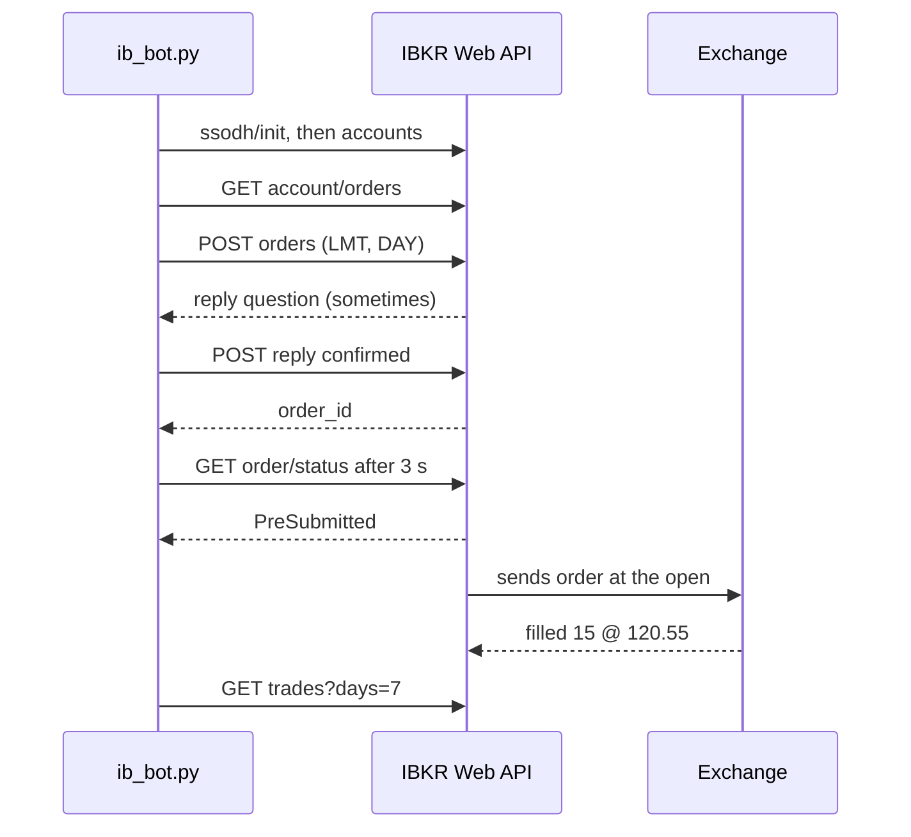

The bot is never told about a fill as it happens: it has to ask, and a later run's fills sweep picks up the execution.

**Order types.** Entries are limit orders; exits and currency conversions are market orders. Every order is DAY: sent into a shut market, a holiday included, it waits for the next session, then expires. `outsideRTH` is false, so nothing trades pre-market or after hours.

**Reply questions.** IBKR sometimes answers an order with a warning question instead of an order id. `ib_orders.place` posts `iserver/reply/<id>` with `confirmed: true` only if every message in the question matches its allow-list:

- an order sent without market data
- a market order confirmation, including IBKR's mandatory price cap
- an order below the IDEALPRO 25,000 minimum, which every small conversion triggers
- the "percentage constraint" price warning, only for a buy whose limit is within the 0.5% buffer plus one tick

Anything else is declined, and the order counts as refused.

**Statuses.** `ib.sleep(3)` in the shim waits 3 seconds, then checks `iserver/account/order/status/<id>` once.

| IBKR status | Meaning | Shim reports | Bot verdict | Activity row |
| --- | --- | --- | --- | --- |
| (not read yet) | order id received | PendingSubmit | pending | `sent` |
| PreSubmitted | accepted, held until the venue opens | Submitted | pending | `sent` |
| Submitted | working at the exchange | Submitted | pending | `sent` |
| Filled | fully executed | Filled | filled | `filled` |
| Cancelled | withdrawn before filling | Cancelled | REJECTED | `REJECTED` |
| Inactive or Rejected | refused, cannot work | Inactive | REJECTED | `REJECTED` |

Stock rows say `sent`, not `pending`, because the activity log only ever gains rows and no later run revises one. The Positions view shows what actually filled.

**How a refusal becomes REJECTED.** Three routes lead there:

- IBKR's POST fails or returns no order id, so `ib_orders.place` raises `OrderError`.
- An unrecognised reply question is declined, which also raises `OrderError`.
- A later status read returns Cancelled, Inactive or Rejected.

The shim turns the first two into status `Inactive` and keeps IBKR's message in `trade.log`. `_order_verdict` maps Cancelled, ApiCancelled and Inactive to `REJECTED` with that message, and the dashboard row shows it. Each submit, decline and answer is also appended to `/root/orders_ledger.jsonl`, under a client order id such as `mps-123456789-B-20260915233512`.

### Timeline: a US buy at 23:35 UTC, filled at 13:30 UTC

This made-up ACME order is placed on a Tuesday in September, when New York is UTC−4. After the US clock change in November, the open moves to 14:30 UTC.

| Time (UTC) | New York | What happens |
| --- | --- | --- |
| Tue 20:00 | 16:00 | US market closes; today's bar is final. |
| Tue 21:30 | 17:30 | Close + 90 minutes: the US market can now be decided. |
| Tue 22:05 | 18:05 | An hourly GitHub Actions build starts, stamps `generated_at` and publishes ACME as `BUY`. |
| Tue 23:35 | 19:35 | `ib_bot` run: 15 shares sized, USD 1,800 confirmed, BUY 15 LMT 120.60 DAY sent. |
| Tue 23:35 + 3 s | 19:35 | Status PreSubmitted, verdict pending, row `sent`. The run ends by saving ACME's map entry and stop. |
| Wed 09:00 | 05:00 | Second run: the order is working, so ACME is not re-bought, holds a slot and keeps USD 1,809 reserved. |
| Wed 13:30 | 09:30 | Market opens; the order fills if ACME trades at or below 120.60, say 15 at 120.55. |
| Wed 14:25 | 10:25 | Hourly `publish_web.py` can now show 15 ACME on the dashboard. |
| Wed 20:00 | 16:00 | An unfilled DAY order would expire here, freeing the slot and the cash. |
| Wed 23:35 | 19:35 | Next run: ACME is held, so exit rules run on today's close, and the fills sweep records the execution. |

### Where it lives in the code

| File | What it holds |
| --- | --- |
| `execution/ib_bot.py` | `run()`, both loops, `place()`, `_order_verdict`, funding, `publish_state` |
| `execution/market_clock.py` | `market_decidable`, `last_settled_close`, the session table |
| `execution/broker.py` | Web API stand-in for ib\_async, status mapping, "Error 110" translation |
| `execution/ib_orders.py` | Session setup, conid lookup, order POST, reply questions, status checks |
| `execution/ib_web.py` | OAuth client, NetLiq and position reads, account-id redaction |
| `execution/contracts.py` | Yahoo symbol to IBKR contract and currency |
| `execution/earmark.py` | Earmark and pocket rules |
| `execution/alerts.py`, `execution/telegram_poll.py` | Alert queue and its delivery |
| `execution/fills_capture.py` | Fills sweep into `data/fills_ledger.jsonl` |
| `execution/day_parts.py` | Per-day position values, cash and FX rates for the calendar breakdown (hourly publisher only) |
| `execution/backfill_day_parts.py` | One-off rebuild of the days that predate that file, from the git history of `bot_state.json` |
| `execution/stamp_app.py` | Stamps `docs/index.html` with a content hash, so the dashboard can tell the phone its page is out of date |

## Currencies and funding

The bot may turn other currencies into Hong Kong dollars (HKD), but it must never sell HKD. The funding code buys only the foreign cash an order needs. It takes that cash from the best non-HKD balance and moves nothing until a conversion has actually happened.

### Why HKD is special

The IBKR account is a Hong Kong account. Its base currency (the currency every total is reported in) is HKD, set by `BASE_CCY`, which reads `IB_BASE_CCY` and defaults to `"HKD"`. NetLiq (net liquidation value, what the account is worth if everything were sold) is about HK$215k, and each position is sized at NetLiq / 15 in HKD.

The HKD cash balance is not trading money. At month end the operator deposits GBP, converts it to HKD the same day and earmarks it (marks it as set aside, see the earmark section). It is withdrawn at the start of the month, so a bot that sold HKD would be spending the operator's transfer money.

Buying HKD is allowed, and sometimes needed. A Hong Kong stock settles (is paid for) in HKD. A comment in `ensure_ccy` says that without HKD, IB books a negative HKD balance and charges margin interest (interest on borrowed money). The bot can never sell HKD back, so it buys only the shortfall.

### The currencies in play

| Currency | Pays for | Status in the code |
| --- | --- | --- |
| HKD | Hong Kong stocks | Base currency. Entries need `HK_ENABLED=1`: the code default is off, and the live VM switched it on on 2026-09-12 |
| USD | US stocks, crypto | Traded |
| JPY | Tokyo stocks | Traded |
| EUR | Euro exchanges | Traded |
| GBP | London stocks | Entries skipped: London quotes in pence, so the order size would come out 100x too small |
| CHF, DKK, SEK, NOK | Swiss and Nordic stocks | Refused at contract lookup: `ib_orders._CCY_EXCHANGES` has no exchanges for them |

### Two switches

FX (foreign exchange) means converting one currency into another. Environment variables (settings passed to the program when it starts) control what FX the bot may do.

| Setting | Default | Meaning |
| --- | --- | --- |
| `FX_CONVERT` | `0`, off since 2026-07-30 | `1` lets `convert_into` pay for foreign cash with HKD, and lifts the order-level HKD guard |
| `FX_FUND_NONBASE` | `1`, on | Cover a shortfall from other non-HKD balances, never from HKD |
| `BASE_FUND_BUFFER` | `1.03` | Multiplier on an HKD shortfall (the operator's number, 2026-09-12) |

With the defaults, a USD, JPY or EUR order that is short gets funded from other foreign balances. An HKD order always takes its own branch, whatever the switches say. With both switches off, `ensure_ccy` returns True and leaves any shortfall to IB. `execution/README.md` still says the bot places no FX orders, which was written before `FX_FUND_NONBASE` existed.

### The funding path

The entry loop sizes an order, rounds it down to a board lot (the smallest bundle of shares the exchange trades), then calls `ensure_ccy(ib, ccy, need_base, dry)`. Funding happens only after the order is known to be placeable. On 2026-09-04, three Tokyo names each converted about US$1,847, but only one became an order.

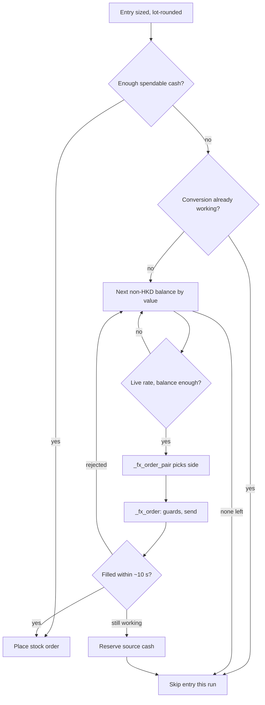

Every "no" ends with the entry skipped, never with an under-funded order, and the signal is read again at the next run.

1. `ensure_ccy` works out spendable cash. For HKD, `_spendable_base` takes the cash held, minus the earmark and minus cash already promised to orders. When the bot's own HKD pocket is known, it is also capped at that pocket. For other currencies, `_spendable` takes the balance minus promised cash.
2. `fund_from_nonbase(ib, ccy, short, dry, buffer)` stops at once if a conversion into `ccy` is already on its way. It lists every balance except HKD and the target, net of reserved cash. Then `_source_rank` sorts them by value in HKD, largest first.
3. For each source it needs a live rate from `fx_rate_live`. It computes `need_src = short x rate x buffer` and `need_dst = short x buffer`, and skips any balance smaller than `need_src`.
4. `_fx_order_pair` finds IB's spot pair (a pair traded for immediate delivery) and chooses the side.
5. `_fx_order` sends a market order (trade now at the best available price) and waits for a fill (the trade actually executing).

If an order is rejected, the loop tries the next balance. If it is accepted but unfilled, the loop stops, so two balances are never converted for one shortfall.

### Pair orientation

A pair such as USD.HKD prices the first currency (the base) in the second (the quote). IB lists each pair one way round only, so getting HKD with USD could be a SELL or a BUY. `_fx_order_pair` reads the pair's symbol from `ib_orders.fx_pair_conid`, which asks IB's `/iserver/currency/pairs`.

| Conversion | IB pair | Side | Amount ordered |
| --- | --- | --- | --- |
| USD to HKD | USD.HKD | SELL | `qty_src`, in USD |
| JPY to HKD | HKD.JPY | BUY | `qty_dst`, in HKD |
| USD to EUR | EUR.USD | BUY | `qty_dst`, in EUR |
| USD to JPY | USD.JPY | SELL | `qty_src`, in USD |
| JPY to USD | USD.JPY | BUY | `qty_dst`, in USD |
| HKD to anything | any | Refused | nothing |

Only the base end is ever ordered, so both ends must carry the buffer. Before dc1e520, only `qty_src` did. The code comments cite a BUY of 1,539 EUR.USD on 2026-09-12: exactly the shortfall (33 x 48.17 − 51 EUR held). The fixed code would buy 1,569.

### Buffers

| Target currency | Multiplier | Reason given in the code |
| --- | --- | --- |
| HKD | x1.03 (`BASE_FUND_BUFFER`) | A price tick between the conversion and the stock order must not leave the buy a few dollars short |
| Any other | x1.02 | A small buffer for slippage and fees |

Slippage is the gap between the expected price and the fill price. The stock order's limit (the highest price it will pay) is also set 0.5% above the signal price (`LIMIT_BUFFER = 0.005`), and the buffer covers that too.

### Three guards against selling HKD

Each guard works on its own. The code says this is deliberate: removing one in an edit must not quietly re-enable selling HKD.

| # | Where | Rule | Lifted by a switch? |
| --- | --- | --- | --- |
| 1 | `fund_from_nonbase` | HKD is never listed as a funding source | No |
| 2 | `_fx_order_pair` | Refuses any conversion whose source is HKD | No |
| 3 | `_fx_order` | Refuses SELL HKD.xxx or BUY xxx.HKD before building the contract | Yes, `FX_CONVERT=1` |

### A conversion must fill

`_fx_order` returns True only when IB reports `Filled`. It checks every 2 seconds, five times, about 10 seconds in all. `Cancelled`, `ApiCancelled` and `Inactive` count as rejected, and anything else counts as pending, including an unreadable status.

Pending never counts as money received. A declined confirmation prompt returns False. Under `--dry`, nothing is sent and it returns True, so a preview can show the stock order that would follow.

### Tracking money already promised

IB lowers the cash balance only when an order settles, not when IB accepts it. Without tracking, two orders could spend the same dollars. The code notes five runs between Friday 23:35 UTC and Monday's Tokyo open, and each could stack another conversion.

| Registry | Holds | Written by | Read by |
| --- | --- | --- | --- |
| `_FX_PENDING` | Pair ids (conids, IB's contract numbers) with an unfilled conversion | `_fx_order` | `_fx_already_working` |
| `_FX_PENDING_CCY` | Target currencies with money on the way | `_fx_order`, `reserve_working_cash` | `fund_from_nonbase` |
| `_FX_COMMITTED` | Cash per currency promised to unfilled orders | `_fx_order`, entry loop, `reserve_working_cash` | `_spendable`, `_spendable_base`, `fund_from_nonbase` |

All three are emptied at the top of `run()`. `reserve_working_cash` then rebuilds them from IB's open orders with status PendingSubmit, PreSubmitted, Submitted or ApiPending. A stock BUY sent in this run reserves shares x price x 1.005. One left over from an earlier run reserves quantity x its limit price.

`_fx_already_working` also blocks a second order on the same pair. If the order book cannot be read, it assumes an order is working. When a conversion into HKD fills mid-run, `_pocket_add_fill` adds it to the bot's HKD pocket. The next Hong Kong candidate in that run then spends it rather than converting again.

### Weekend rates: sizing yes, converting no

IB's `/iserver/exchangerate` returns nothing while the FX market is shut, from Friday evening to Sunday evening. Friday and Saturday runs used to skip every non-HKD entry, even US stocks already covered by USD cash.

Now `fx_rate` saves each live rate to `/root/fx_last_good.json`, on live runs only. With no live rate, it uses a saved one up to 96 hours old (`FX_STALE_MAX_H`) and marks the pair stale. At the start of each run, `warm_fx_memory` looks up USD, EUR, JPY and GBP against HKD, plus every held and candidate currency.

| Use | Function | Saved rate allowed? |
| --- | --- | --- |
| Size an entry | `fx_rate` | Yes |
| Rank funding sources | `fx_rate`, via `_source_rank` | Yes |
| Convert currency | `fx_rate_live` | No |
| GBP rate for the tax ledger | `fx_rate_live` | No |

On a Saturday, a US buy covered by USD cash goes ahead on Friday's rate. A JPY buy that needs a conversion is skipped. With `FX_CONVERT=1`, `ensure_ccy` also refuses to convert when the rate is stale.

### IB's own sweeps

IB sometimes converts small amounts by itself. The fills ledger shows US$2.00 sold for HKD at 21:15 on 2026-09-06, the same minute as the bot's 1,847 USD-to-JPY conversion. A test models such a sweep as 2 USD turned into HKD to pay a HK$15.67 commission.

These rows lack the `mps-` tag that every bot order carries. `earmark.bot_pocket` treats untagged HKD coming in as the operator's money and ignores it. Untagged HKD going out, including IB's `FXCONV` conversions, is charged to the bot's pocket, so a sweep never makes transfer money look spendable.

### Worked example

A Hong Kong buy of 100 shares at HK$141.00 needs HK$14,100. The account holds HKD 7, USD 4,558 and JPY 83,346, and all 7 HKD is spendable. The made-up rates are HK$7.80 per USD and 20.25 JPY per HKD.

| Step | Function | Result |
| --- | --- | --- |
| 1 | `_spendable_base` | 7 HKD spendable |
| 2 | `ensure_ccy` | Short 14,100 − 7 = 14,093. Calls `fund_from_nonbase` with buffer 1.03 |
| 3 | `_source_rank` | USD is worth HK$35,552 and JPY HK$4,116, so USD goes first |
| 4 | `fund_from_nonbase` | `need_src` = 14,093 ÷ 7.80 x 1.03 = 1,861 USD. `need_dst` = 14,516 HKD |
| 5 | `_fx_order_pair` | Pair USD.HKD, with USD as base and source: SELL 1,861 |
| 6 | `_fx_order` | Guard 3 passes, because USD is sold and HKD received. The market order is sent |
| 7a | Filled | About HK$14,523 held. The BUY prices at 141.00 x 1.005 = 141.705, snapped to the 0.10 HK tick: limit **141.70**, so 100 shares cost HK$14,170 |
| 7b | Not filled in 10 s | USD 1,861 reserved and HKD marked in flight. The entry is skipped, and JPY is not tried |

In case 7b, the next run's `reserve_working_cash` reserves the 1,861 USD again while the order is still working. If JPY were the only source, the pair would be HKD.JPY with HKD as base. The order would be BUY 14,516 HKD.JPY for about 293,945 JPY, so the bot logs the JPY shortfall and skips the entry.

### Where it lives in the code

| File | What it holds |
| --- | --- |
| `execution/ib_bot.py` | `BASE_CCY`, `FX_CONVERT`, `FX_FUND_NONBASE`, `BASE_FUND_BUFFER`, `fx_rate`, `fx_rate_live`, `warm_fx_memory`, `_fx_already_working`, `_fx_order`, `_pocket_add_fill`, `convert_into`, `fund_from_nonbase`, `_source_rank`, `_fx_order_pair`, `reserve_working_cash`, `_spendable`, `_spendable_base`, `ensure_ccy`, `run()` |
| `execution/ib_orders.py` | `fx_pair_conid`, `fx_quote_ccy`, `_CCY_EXCHANGES` |
| `execution/broker.py` | `Forex`, rate quotes from `/iserver/exchangerate` |
| `execution/earmark.py` | Earmark and pocket rules, handling of untagged sweeps |
| `execution/contracts.py` | `currency_of` |
| Tests | `test_hkd_funding.py`, `test_fund_buffer.py`, `test_fx_weekend.py`, `test_bot_pocket.py` |

## Market rules the bot respects

The bot acts on a market only once its daily price is final, and sends only prices, share counts and listings the exchange accepts. Each rule was added after breaking it cost a refused order, a decision on half-finished data, or nearly the wrong company.

### Deciding only on a finished bar

A **bar** is one day's price summary for a stock: open, high, low and close. Every exit and entry rule is judged on the **close**, the last price of the **session** (the hours the exchange is open). While a market trades, Yahoo Finance fills today's bar with the live price, so a card built mid-session holds an unfinished bar.

That caused real mistakes. On 15 and 16 Sep the 09:00 UTC run read cards built at 07:35 UTC, about 35 minutes into Europe's session. A **trailing stop** (a sell level that follows the price upward) could fire on a morning dip that the close then undid.

`execution/market_clock.py` fixes this with `MARKET_SESSIONS`, one row per **Yahoo suffix** (the ticker ending that names the exchange, such as `.HK`). Each row holds a time zone plus the local open and close, Monday to Friday. `market_decidable(ysym, now_utc)` says "not decidable" only on a local weekday between the open and the close plus `SESSION_SETTLE_MIN = 90` minutes.

The 90 minutes cover three delays. They are the closing auction (a final matching round, 16:00-16:10 in Hong Kong), Yahoo publishing late, and the hourly signal build at :05. When a market is not decidable, the bot logs a line and moves on:

- **Exits**: no rule is checked, and no stop is **ratcheted** (moved up to lock in gains).
- **Entries**: the BUY is skipped without using a position slot, and a later run re-reads it.

Crypto (`-USD`) and any suffix missing from the table are always decidable. The run reads the clock once, into `decide_now`, so a run that crosses a boundary cannot judge one market two ways.

### The build stamp: is the data new enough?

The clock alone is not enough, because GitHub Actions builds can start late or be skipped. From 28 Aug to 14 Sep, on 12 of 14 weekdays, the newest build the 09:00 run saw started around 04:45 UTC. That is mid-session in Tokyo.

So every build stamps `data.json` and each `products/<sym>.json` card with `generated_at`. It is the UTC time the price **download started**, written like `2026-09-17T08:06:00Z`. If the start is unknown, `engine/build_dashboard.py` falls back to the build time and prints a `!!` warning.

`last_settled_close(ysym, t)` returns the newest weekday close + 90 minutes at or before `t`, in UTC. `_build_behind_close` in `ib_bot.py` defers the market if the build started before that instant. Entries use `data.json`'s stamp; exits use their card's stamp, else `data.json`'s.

- A stamp without a time zone is rejected: `parse_generated_at` returns None rather than guess.
- With no usable stamp, markets are judged on the clock alone, and the run logs this once.
- A deferral is only logged. If the newest build is over 26 hours old (`STALE_SIGNALS_ALERT_H`), one "Signals are stale" alert is queued per UTC day.

**Worked example.** At the 09:00 UTC run on Thursday 17 Sep, Tokyo's bar is final from 17:00 JST (15:30 close + 90 min), which is 08:00 UTC. A build that started at 04:45 UTC is too early, so Japan waits for the 23:35 run. One that started at 08:06 UTC is fine.

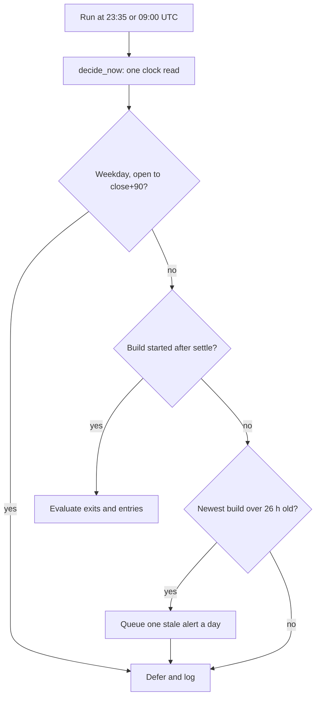

Every held symbol and every BUY candidate passes this gate on its own market's clock, and crypto passes straight through.

### What each daily run decides

**UTC** is the world reference clock, which never shifts for summer. The table uses 16-17 Sep 2026; winter times are in brackets where they differ.

| Market | Bar final from (UTC) | 23:35 UTC run | Weekday 09:00 UTC run |
| --- | --- | --- | --- |
| US | 21:30 (22:30) | Decides today's close; 19:35 in New York | Decides the same close again; 05:00 in New York, before the open |
| Hong Kong | 09:40 | Decides; 07:35 next day in HK, before the open | Defers; 17:00 in HK, bar final from 17:40 |
| Japan | 08:00 | Decides; 08:35 next day in Tokyo, before the open | Decides, if the build started at or after 08:00 |
| Traded euro venues and London | 17:00 (18:00) | Decides | Defers; mid-session locally |
| Crypto | Always | Decides | Decides |

The README sums up the 09:00 run as deciding US and Japan and deferring Europe and Hong Kong. The 23:35 run sits before both Asian opens, so its orders wait for the next session.

On paper, the winter US close is tight. It settles at 22:30 UTC, so only a build starting after that (normally the 23:05 one) qualifies for 23:35. If that build is not published in time, the US waits until 09:00; the code does not discuss this case, it follows from the times.

The 23:40 Telegram digest (`daily_signal.py`) imports the same clock and build check. It lists a deferred symbol under "decided after the close" instead of as a SELL or BUY.

### Weekends, daylight saving and holidays

- **Weekends**: the weekday test uses the market's own local date. Friday 23:35 UTC is already Saturday in Asia, so Asia is decidable on Friday's bar.
- **Daylight saving time (DST)**, the summer clock shift: sessions are stored in local time and converted with Python's `zoneinfo`. In 2026 the US shifts on 8 Mar and 1 Nov, Europe on 29 Mar and 25 Oct; Hong Kong and Japan never shift.
- **Holidays**: there is no holiday calendar, by the operator's choice. A holiday is treated as a trading day.

The operator's reasoning is that a hand-kept holiday list goes stale, and a stale list could block a real trading day. Without one, an order sent into a shut market simply rests at IB (status `PreSubmitted`) until the next session. At worst, the clock defers a closed market for one run it did not need to.

The missing calendar has two known side effects. A resting limit order was priced from the last close, so it can be stale after a long weekend. The 60-bar time stop counts weekdays, so holidays make it fire slightly early, never late.

Holidays also affect downloads: `yf.download` aligns a batch on the union of its tickers' dates, giving phantom empty rows. `_download_chunks` in `engine/data_fetch.py` therefore never mixes trading calendars in one batch (Euronext Paris, Amsterdam, Brussels and Lisbon share one).

### Tick sizes: legal price steps

A **tick** is the smallest price step an exchange allows; a price between steps is refused. Entries use **limit orders** (buy at this price or better), so their prices must sit on the grid. Stock exits and phone SELLs are **market orders** (fill at the going price), so ticks do not apply to them.

`place()` starts from the signal price, re-based to IB's latest quote if the two differ by more than 1%. A BUY limit is that price × 1.005 (`LIMIT_BUFFER = 0.005`). `snap_to_tick` then rounds it to the nearest multiple of the tick.

IB's `minTick` is only the lowest step of a price ladder, so most markets override it. US limits use IB's `minTick`, which is 0.01 for US stocks and is also the fallback when IB does not answer. London uses `minTick` too, but London entries are skipped anyway. Hong Kong, Japan and the euro venues follow.

**Hong Kong.** The tick is the larger of `minTick` and `hk_tick(price)`, from HKEX's Rules, Second Schedule, Part A. The tick grows with price, and each range includes its upper edge:

| Price (HK$) | Tick |
| --- | --- |
| up to 0.25 | 0.001 |
| over 0.25 to 10 | 0.005 |
| over 10 to 20 | 0.01 |
| over 20 to 50 | 0.02 |
| over 50 to 100 | 0.05 |
| over 100 to 200 | 0.10 |
| over 200 to 500 | 0.20 |
| over 500 to 1,000 | 0.50 |
| over 1,000 to 2,000 | 1 |
| over 2,000 to 5,000 | 2 |
| over 5,000 | 5 |

This is the current, narrower Part A grid. Reviewers have more than once "corrected" it to the older grid (0.02 at HK$10-20, 0.05 at HK$20-100), which would send illegal prices. Real closes settle it: 2269.HK printed 48.84 and 49.18, multiples of 0.02 but not of 0.05.

From `test_hk_market.py`: a HK$47.00 signal gives 47.235, which snaps on 0.02 to **47.24**. A HK$188.80 signal gives 189.744, which snaps on 0.10 to **189.70**.

**Japan.** The tick is the larger of `minTick` and `jp_tick(price)`. It uses the Tokyo Stock Exchange's coarse grid, meant for stocks outside the TOPIX 500 (Tokyo's 500 largest names). The coarse grid is valid for every stock, while IB's own value is often wrong, e.g. 0.1 at ¥24,700.

| Price (¥), up to and including | Tick |
| --- | --- |
| 3,000 | 1 |
| 5,000 | 5 |
| 30,000 | 10 |
| 50,000 | 50 |
| 300,000 | 100 |
| 500,000 | 500 |
| 3,000,000 | 1,000 |
| above 3,000,000 | 5,000 |

Made-up example: a ¥2,480 signal gives 2,492.4, which snaps on 1 to **¥2,492**.

**Europe.** MiFID II, the EU's market law, includes RTS 11: a tick table split into six liquidity bands. Band 6 (at least 9,000 trades a day) has the finest ticks, and a venue may use that tick or coarser, never finer. `eu_floor_tick` holds band 6, so it is a safe floor, not always the answer.

Some band-6 rows, each range including its lower edge: €10-20 ticks 0.002, €20-50 ticks 0.005, €50-100 ticks 0.01, €1,000-2,000 ticks 0.2. `eu_limit` takes the largest of `minTick`, that floor, and IB's own band at that price (`priceBands`, read from IB's `incrementRules`). If snapping lands across a band edge, it re-snaps on a grid legal on both sides, up to four times.

Live case, 13-14 Sep: BUY 33 BAYN off €48.17 gave 48.41085, sent as 48.4108 on IB's lowest step, 0.0001. Xetra refused it. Now the floor says 0.005 and IB's band at €48 says 0.01, so the first price sent is **€48.41**.

### When the exchange still refuses a price

IB rejects an off-grid price with **Error 110**. The Web API words it differently, so `broker._translate_error` rewrites it into the "Error 110" form the bot checks for. `place()` then makes up to six submissions in total, choosing each retry in `_retry_price`:

1. Use the increment IB named ("minimum price variation of 0.02") if it is coarser than the current tick.
2. Otherwise take the next coarser rung of `0.0001, 0.001, 0.01, 0.05, 0.1, 0.2, 0.5, 1, 5, 10, 50, 100, 500, 1000`.
3. Never resend a price already refused in this call, and stop if the price reaches zero.

From `test_eu_tick.py`: a €30.10 signal gives 30.2505, which the floor snaps to 30.25. IB refuses and names 0.02, so attempt two is **30.26**. The rung walk alone would have jumped to 0.1 and sent 30.30.

### Board lots: legal share counts

A **board lot** is the minimum trading unit; orders must be whole multiples of it. An **odd lot** (a smaller count) does not auto-match on Hong Kong's continuous market and can sit unfilled. `lot_size(ib, contract)` returns the lot, or 0 when it is unknown:

| Market | Lot | Source |
| --- | --- | --- |
| Hong Kong | Per stock, from 10 to 100,000 shares | `data/hk_board_lots.json`, built from HKEX's List of Securities (as at 14/09/2026, equities and REITs) |
| Japan | IB's `sizeIncrement` if above 1, else 100 | TSE has traded in 100s since Oct 2018 |
| Everything else | 1 | IB is not asked |

For Hong Kong, the HKEX file is the only authority; IB is asked just so a disagreement gets logged. IB reported 100 for every stock, while HKEX says 2359 is 100, 2269 is 500 and 1810 is 200. A code missing from the file returns 0, and the entry is skipped.

Outside Hong Kong and Japan, IB's `sizeIncrement` is an order-ticket step, not a minimum. Reading it as a lot once rounded every US order to zero: 20 DXCM shares became `20 // 100 * 100 = 0`.

Sizing is `shares = int(notional / rate / price)`, then rounded down with `shares // lot * lot`. `notional` is **NetLiq** (the account's total value) divided by 15 (`TARGET_POSITIONS`), capped at HK$20,000 (`MAX_ORDER_BASE`). Every lot skip happens before any currency is converted.

**Worked example** with made-up prices and rate. NetLiq is HK$215,000, so `notional` is HK$14,333.

- Japan at ¥2,480, 0.0530 HKD per yen: 14,333 / 0.0530 / 2,480 = 109 shares, rounded down to **100**.
- 2269.HK at HK$48.80: 14,333 / 48.80 = 293 shares, rounded down to **0**. The log says "1 board lot (500 sh \~24,400 HKD) exceeds the position size".

Two notes on Hong Kong. New HK entries need `HK_ENABLED=1`, which the live VM has set since 2026-09-12; exits are never blocked. The comment beside that switch, the NOTE at the end of `contracts.py` and the README's "known refinements" predate `hk_tick` and `lot_size`, so they wrongly say HK ticks or lots are not handled.

### Contract lookup: trading the right listing

A **contract** is IB's description of one instrument, and a **conid** is IB's unique ID number for it. One ticker can mean different companies on different exchanges, so the bot looks up the conid on one named exchange and refuses to guess.

**Step 1: `contracts.to_ib(sym)`** strips the suffix (`0700.HK` becomes `700`, `SAP.DE` becomes `SAP`) and attaches the venue and currency from the summary table below. Plain tickers become US stocks, and `-USD` becomes crypto on PAXOS. Any other form with `.`, `=`, `^` or `-` (indices, futures, FX) returns None and is never traded.

Every stock contract uses exchange `SMART` (IB's router picks where to execute), with the listing venue as `primaryExchange`. Orders routed straight to one exchange are refused on this account (Error 10311, seen on SBF).

**Step 2: `broker.IB.qualifyContracts`** calls `ib_orders.resolve_conid` with that venue. It searches `/iserver/secdef/search?symbol=...`, keeps rows with a stock section, and compares each row's `description` (its listing exchange) with `_VENUE_LISTINGS`. No match, or more than one, raises an error, and the entry is skipped as "IB could not qualify".

- **US is the exception.** `to_ib` stamps NASDAQ even on NYSE stocks, so `_listing_venue` sends no venue for USD. The lookup then needs exactly one row among NYSE, NASDAQ, ARCA, AMEX, BATS, IEX and PSE.
- **Unmapped venues are refused** before the cache or network is touched. EBS (CHF), CPH (DKK), SFB (SEK) and OSE (NOK) are left out on purpose. LSE is mapped only so a held London position can be sold.
- **Results are cached** in `/root/conid_cache.json`, under keys such as `SAN|EUR|STK|BM`. A `--dry` run reads the cache but never writes it.

The order itself (`ib_orders.place`) sends only the conid to `/iserver/account/<id>/orders`. The conid alone decides what is bought.

**Same-ticker collisions.** SAN.MC is Santander in Madrid (BM), and SAN.PA is Sanofi in Paris (SBF); both are "SAN" in EUR. The old currency-only lookup matched Sanofi for SAN.MC. A review reproduced the damage: the limit re-based to Sanofi's \~€76, turning 129 shares sized at €12.14 into a \~€9,900 order against \~€1,566 funded.

The resolver now separates them, but the bot still keys positions by the bare IB symbol. Two guards cover this, and also DG/DG.PA, MC/MC.PA and 1928.HK/1928.T:

- An entry is skipped if its IB symbol is held, working or entered this run under another listing ("IB symbol SAN is already taken by SAN.MC").
- An exit compares the held conid with the card's. On a mismatch the Web API backend sells the held conid and raises an alert.

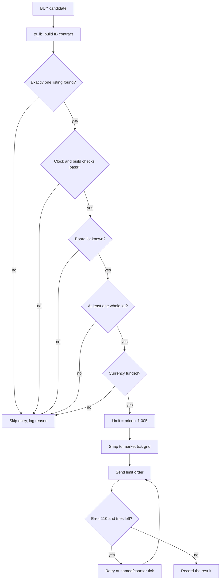

An entry passes these gates in this order; the `HK_ENABLED` switch and the London pence skip also sit just before the lot check.

### Market summary

| Yahoo suffix | IB venue | Currency | Session, local time (Mon-Fri) | Tick rule | Lot | Traded? |
| --- | --- | --- | --- | --- | --- | --- |
| none (e.g. AAPL) | NASDAQ hint; NYSE, NASDAQ, ARCA, AMEX, BATS, IEX, PSE accepted | USD | 09:30-16:00 | IB `minTick` (0.01) | 1 | Yes |
| .HK | SEHK | HKD | 09:30-16:10, incl. closing auction | `hk_tick` | HKEX file, per stock | Yes (`HK_ENABLED=1` on the live VM) |
| .T | TSEJ | JPY | 09:00-15:30 | `jp_tick` | IB if above 1, else 100 | Yes |
| .DE | IBIS (Xetra) | EUR | 09:00-17:30 | `eu_limit` | 1 | Yes |
| .PA / .AS / .BR | SBF / AEB / ENEXT.BE | EUR | 09:00-17:30 | `eu_limit` | 1 | Yes |
| .MC / .MI / .VI | BM / BVME / VSE | EUR | 09:00-17:30 | `eu_limit` | 1 | Yes |
| .HE | HEX | EUR | 10:00-18:30 | `eu_limit` | 1 | Yes |
| .LS | BVL | EUR | 08:00-16:30 | `eu_limit` | 1 | Yes |
| .L | LSE | GBP | 08:00-16:30 | IB `minTick` | 1 | Entries skipped (prices in pence); held positions can exit |
| .SW / .CO / .ST / .OL | EBS / CPH / SFB / OSE | CHF / DKK / SEK / NOK | 09:00-17:30 / 09:00-17:00 / 09:00-17:30 / 09:00-16:20 | `eu_limit` (unused) | 1 | No: the resolver refuses them |
| -USD | PAXOS | USD | Always open | IB `minTick` | 1 | Needs IB crypto permission |

### Where it lives in the code

| File | What it holds |
| --- | --- |
| `execution/market_clock.py` | `MARKET_SESSIONS`, `SESSION_SETTLE_MIN`, `market_decidable`, `last_settled_close`, `parse_generated_at` |
| `execution/ib_bot.py` | `_build_behind_close`, `_stale_signals_alert`, `place`, `min_tick`, `hk_tick`, `jp_tick`, `eu_floor_tick`, `eu_limit`, `_retry_price`, `lot_size`, `hk_board_lot`, `HK_ENABLED` |
| `execution/contracts.py` | `to_ib`, `currency_of`, the `_EU` suffix map |
| `execution/ib_orders.py` | `resolve_conid`, `_CCY_EXCHANGES`, `_VENUE_LISTINGS`, conid cache |
| `execution/broker.py` | `qualifyContracts`, `_listing_venue`, `reqContractDetails` (minTick, price bands), `_translate_error` |
| `execution/daily_signal.py` | The digest's use of the same clock and build check |
| `engine/build_dashboard.py`, `engine/data_fetch.py` | The `generated_at` stamp; per-calendar download batches |
| `.github/workflows/daily.yml` | Hourly build, cron `5 * * * *` |
| `data/hk_board_lots.json` | HKEX board lots |
| `execution/test_market_clock.py`, `test_hk_market.py`, `test_eu_tick.py`, `test_lot_size.py`, `test_symbol_collision.py`, `test_conid_resolver.py` | Tests that pin these rules down |

## Safety nets

Every failure this system has hit, or that a reviewer could reproduce, now has a named guard that either blocks it or makes it loud. Some guards stop a bad order. Others turn a silent failure into a Telegram alert, or make sure a crash never leaves the bot's memory half-written.

### The nets at a glance

| Risk | What could go wrong | The net that catches it | File |
| --- | --- | --- | --- |
| IB refuses an order | Refusal recorded as "sent", bot believes it acted | Missing `order_id` raises `OrderError`, read as `REJECTED` | `ib_orders.py`, `broker.py`, `ib_bot.py` |
| Price off the exchange's tick grid | Entry refused ("Error 110") | Retry at IB's stated step, at most 6 sends | `ib_bot.py` |
| Exit refused, expired or lapsed | Position held with no working stop, nobody notices | Alert spool, refusal episodes, `exit_attempts` memo | `alerts.py`, `ib_bot.py`, `telegram_poll.py` |
| Phone SELL on top of a bot exit | Same shares sold twice, account ends short | Net against working SELLs and a fresh positions read | `ib_commands.py` |
| Crash in the middle of a run | A filled order has no stops | `_save_state_on_abort()` saves `state.json` | `ib_bot.py` |
| Bot's own HKD cannot be measured | Earmarked transfer money treated as trading money | Fall back to `min(marker, HKD held)` | `earmark.py`, `ib_bot.py` |
| A preview changes live files | Phantom positions, fake dashboard rows | `--dry` writes nothing | `ib_bot.py` |
| Deep drawdown | Bot keeps buying into a crash | Kill switch blocks entries 8% below peak | `ib_bot.py` |
| Signal build stops | Decisions on old prices | Market deferral, plus alert after 26 h | `ib_bot.py`, `market_clock.py` |
| Bot sells HKD | Operator's monthly transfer money converted away | `_fx_order()` refuses unless `FX_CONVERT=1` | `ib_bot.py` |
| Account number leaks | Public repo links positions to a real account | `redact()` and `scrub()` write `U***` | `ib_web.py`, `ib_orders.py`, `publish_web.py` |
| A test touches live files | Test run erases real records on the VM | `/root` audit guard in `run_all_tests.py` | `run_all_tests.py`, `testenv.py` |
| A fix hides a new bug | New failure goes live | Board review before and after deploy | commit history |

### IB refusals: no order id means REJECTED

An order is an instruction to the broker to buy or sell. When Interactive Brokers (IB) accepts one, it answers with an `order_id`. When it refuses, it may answer with only an error message, and no order exists.

`ib_orders.place()` used to return normally without an id. Two BAYN buys were refused that way on 2026-09-13/14, yet the dashboard showed "sent". Now `place()` raises `OrderError("order not accepted: ...")` whenever the id is missing.

The adapter in `broker.py` catches that error and marks the trade `Inactive`. `ib_bot._order_verdict()` reads `Cancelled`, `ApiCancelled` or `Inactive` as `REJECTED` and keeps IB's message. An unreadable status counts as `pending`, never `filled`, and a stock order still waiting is recorded as `sent`.

IB can also reply with a warning question instead of an id. Only an allow-list (`SUPPRESSIBLE` in `ib_orders.py`, such as `o163`, the price-cap warning) is confirmed. Any other question is declined and the order counts as refused.

### The Error-110 retry

A tick is the smallest price step a stock may trade in, such as 0.01 EUR. A limit order (buy at this price or better) priced between ticks is refused, which IB's old socket API called "Error 110". The Web API has no such number, so `broker._translate_error()` rewrites "price does not conform" text into an Error 110 message.

`place()` then retries, with at most 6 sends in total. `_retry_price()` uses the step IB named in its refusal, or else the next coarser rung of a ladder (0.0001, 0.001, 0.01, 0.05, 0.1 ... 1000). It never resends a refused price or sends one at zero or below, and the dashboard row records the last price actually sent.

Example from `test_order_reject.py`: a BAYN buy goes out at 48.415 EUR. IB answers "minimum price variation of 0.01". The second send is 48.41, which is legal, so the order stands. Stock exits are market orders (no price), so this retry matters for entries.

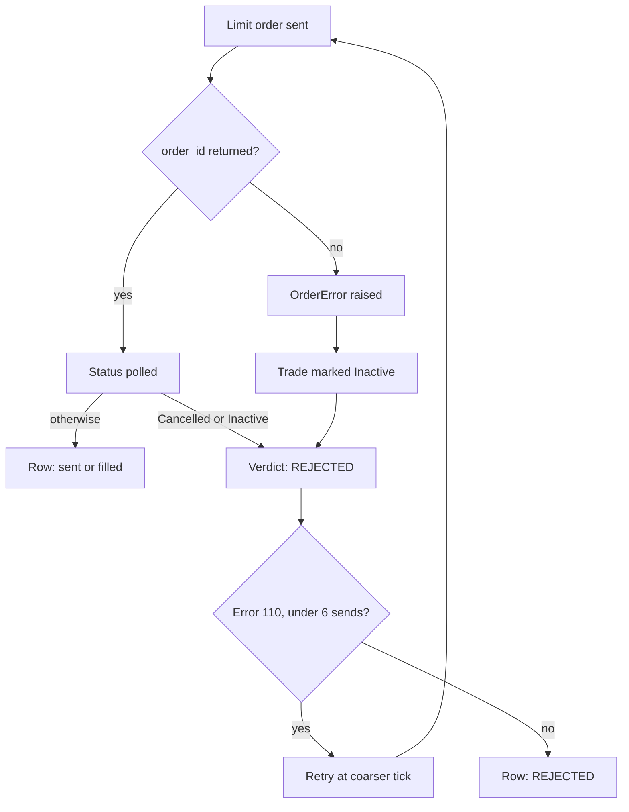

A refusal takes the same road whether IB refuses at submission or cancels the order moments later.

### Refused and unfinished exit alerts

An exit is a sell that closes a position (shares the account holds). A refused exit leaves money exposed, and it used to show only as a dashboard row. BEN's trailing-stop exit was refused five times over about 35 hours before a manual rerun sold it.

Detection and delivery are split on purpose. Only `ib_bot` and `ib_commands` see IB's verdict, but a Telegram call inside a trading run can hang for 30 seconds. So they drop a small JSON (plain-text data) file into a spool (a folder used as a queue), `/root/alert_outbox`, and `telegram_poll.py` sends it.

- **`alerts.enqueue(key, text, once)`** writes one file per key and never raises. Queuing the same key twice leaves one file. With `once=True` the key is remembered for 14 days, so a failure repeated every 10 minutes alerts once.
- **Episodes** (`exit_episodes.json`). A symbol's first refusal sends a full alert with the exit rule and IB's words. Each later run adds one short "still refused - attempt N" line, until the position is gone or the exit lapses.
- **The exit-attempts memo** (`/root/exit_attempts.json`). After every live exit the bot records time, status, quantity and reason. The next run compares that record with what it finds.
- **The drain.** Every 2 minutes, before anything else, `telegram_poll` calls `alerts.drain()`. It HTML-escapes the text (so IB's own markup cannot break the message), packs alerts into messages of at most 3,800 characters, and deletes a file only after Telegram accepts it.

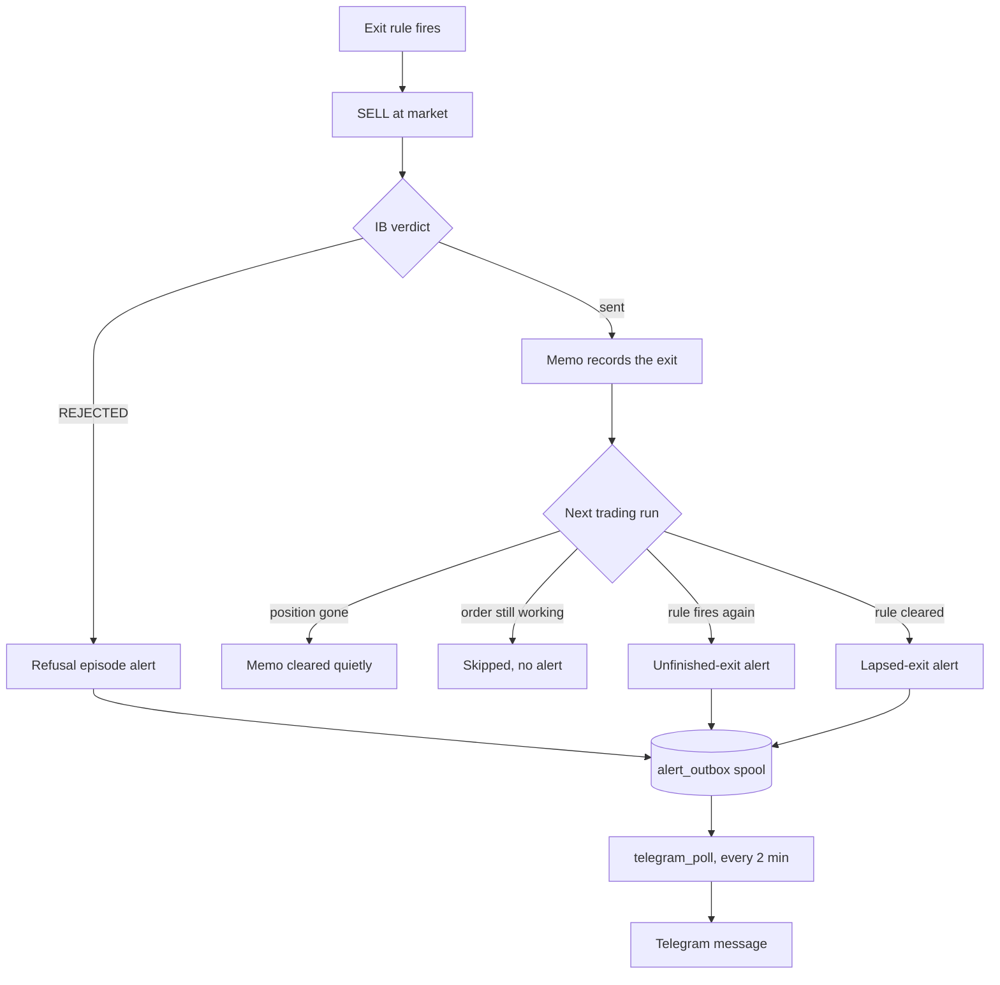

Each exit ends in one of four outcomes at the next run, and every alert reaches the phone through the spool.

All of this is alert-only. The `_alert()` wrapper swallows any error, so a broken spool costs an alert, never a trading run. Re-sending a lapsed exit stays the operator's decision; the lapsed alert says "Sell by hand if you still want out".

### Phone SELL netting

The dashboard's Sell button opens a GitHub issue titled like `SELL: DELL 4`. `ib_commands.py` checks issues every 10 minutes. It acts only on an exact title from the repo owner (`btctree`) that is under 48 hours old.

The danger is a working order: one IB has accepted but not yet filled. It does not reduce the position until it fills. A 23:35 UTC bot exit waits for the market open, so a morning tap could send a second full sell and leave the account short (owing shares it never had).

So each poll reads the working SELL orders first, then the positions (`fresh_positions()` flushes IB's cache first), once each. Shares available = held − full size of every working SELL − SELLs already sent this poll. A working SELL of unknown size counts as covering everything.

Worked example: the account holds 100 DELL and a bot exit of 60 is working. A tap on `SELL: DELL` (meaning all) sends 40. A second tap in the same poll finds 100 − 60 − 40 = 0, sends nothing, and alerts that a sell is already on its way out.

- If either read fails, nothing is sent, the command stays open for the next poll, and one alert goes out.
- The command is saved as done in `/root/commands_done.json` straight after the order and before any alert, so a crash cannot re-send it.
- A SELL that IB refuses is alerted and not retried; the operator taps again.

The code errs toward selling too little. Its reasoning: under-selling costs one more tap, while over-selling opens a short that nothing ever closes.

### A crashed run still saves state

`state.json` is the bot's memory. Its `map` links each IB symbol to its signal symbol, and `pos` holds entry price, high-water mark (highest price since entry), stop and entry date. The exit loop silently skips any holding with no `map` entry, so that position gets no stops.

The file used to be written only at the end of a run. A crash after an order went out lost that order's entry, and the filled position ran unprotected. Now `run()` catches every exception, including Ctrl-C, calls `_save_state_on_abort()`, logs `!! run aborted`, and re-raises.

It skips the save when `state.json` was never loaded, so a corrupt file stays on disk for repair. It publishes nothing, since the crash may be the network. Separately, `_drop_pocket_file()` deletes the HKD pocket file before any order, so a dead run leaves no stale pocket behind.

### Pocket coverage fallbacks

The operator's month-end GBP deposit is converted to HKD and earmarked with a number in `/root/excluded_cash`. Earmarked cash is taken out of NetLiq (net liquidation value: the account's worth if everything were sold now), because it is about to be withdrawn. The bot also buys HKD to fund Hong Kong orders; that is its "pocket", found from fills carrying its `mps-` order stamp.

`earmark.exclusion()` applies one rule, with H = HKD held, M = marker and P = pocket:

| Pocket known? | HKD excluded from NetLiq |
| --- | --- |
| Yes | min(M, H − P), with P kept between 0 and H |
| No (fallback) | min(M, H) |

Example: M = 20,000, H = 26,000, P = 8,000. With the pocket, 18,000 is excluded. The fallback excludes 20,000, understating NetLiq by 2,000 but never treating transfer money as tradable.

`_sweep_pocket()` reports the pocket as unknown, so the fallback applies, when:

- IB's executions (fills) cannot be read, or the read misses fills the ledger or VM cache already hold;
- the read is empty although IB accepted a bot order in the last 6 days (`COVERAGE_MAX_DAYS`);
- coverage has a gap: the anchor is over 6 days old and no complete read is on record within 6 days, so the anchor is deleted;
- there is no anchor (a start line, set only by a live run that sees HKD below 1);
- IB has never echoed the `mps-` stamp, or a bot order's fill came back without it (the "canary").

Programs that cannot read IB fills (`publish_web.py`, the digest, `ib_commands.py`) read `earmark_pocket.json` instead. They fall back too when that file is missing, unconfirmed or over 36 hours old.

### --dry mode

`python3 ib_bot.py --dry` previews a run against the live account. It makes every decision and prints every order, but `place()` returns before sending anything.

It writes nothing: no `state.json`, no dashboard commit, no alert, no exit memo, no pocket file or anchor, no contract-id cache update, no remembered FX rate. It records no position for orders it never sent. `--publish-only --dry` does nothing at all and says so.

One caveat in the docstring dates from the IB Gateway era. The gateway self-heal in `connect_or_heal()` runs before the dry check, so a dry run against a wedged gateway could still restart it.

### Kill switch

A drawdown is a fall from the account's highest value. Each run stores the highest NetLiq seen as `_peak_netliq` in `state.json`. If NetLiq falls more than 8% below it (`DAILY_LOSS_KILL = 0.08`), new entries are blocked.

Example: peak 230,000 HKD gives a limit of 230,000 × 0.92 = 211,600. A run reading 210,000 logs `KILL-SWITCH`, sets its free slots to 0, and adds one HALT row per UTC day to the dashboard. NetLiq here is measured after the earmark, so a deposit waiting to leave does not lift the peak.

Exits always run. Before 2026-08-06 the switch stopped exits too, and a withdrawal froze the bot silently from 2026-08-03 to 08-06. The peak ignores deposits and withdrawals, so the operator resets `_peak_netliq` by hand after one, and after a genuine loss resuming is also a human decision.

Two caps sit beside it: `MAX_ORDER_BASE = 20000` HKD per order, and `TARGET_POSITIONS = 15`.

### Stale-signal alert

GitHub Actions builds signals hourly and stamps each build with `generated_at`, the time it started. `market_clock.py` decides a market only after its close plus 90 minutes (`SESSION_SETTLE_MIN`), and only from a build that started after that moment. Otherwise that market's exits, stop updates and entries wait, with a log line.

Waiting is routine, because a 09:00 UTC run often reads a build that started before Tokyo's close settled. So `_stale_signals_alert()` fires only when the newest build is over 26 hours old (`STALE_SIGNALS_ALERT_H`), once per UTC day, on live runs. Separately, the dashboard shows a red "Bot data Xh old" banner when the bot's published state is over 2 hours old.

### Account-id redaction

IBKR account ids look like `U` followed by digits. Every order goes to a web address containing the id, so error text carried it. Nine rows of the public `data/bot_state.json` from 2026-09-01 to 09-03 showed the live id.

`ib_web.redact()` replaces any known id, and any `U` followed by 5 or more digits, with `U***`; it never raises. `OrderError` and `IbWebError` redact when created, and `broker._translate_error()` redacts again. Both publishers run `scrub()` over every activity row on every write, which cleaned the old rows; git history was deliberately not rewritten.

### Test suites and the /root guard

The repo has 23 "golden" test suites: 22 `execution/test_*.py` files plus `engine/test_data_fetch.py`. Each replays a real failure against a fake IB and ends by printing a line starting `ALL` and ending `PASS`. `run_all_tests.py` runs them all.

On the VM, the live files sit under `/root`. A review found that `test_bot_pocket.py`, run as root there, would have erased every owed-exit record. Now each suite runs in its own Python process under an audit hook (a callback Python fires on file access): any `/root` access is blocked and fails the suite (exit 3), as does a module still pointing at `/root` (exit 4).

A self-check first proves the guard fires. `testenv.isolate()` points 16 `MPS_*` path settings at a temp folder before any bot module loads. The runner refuses to run from a checkout under `/root` (exit 2), so on the VM tests run from a `git archive` export (a clean copy of committed code) in `/tmp/mps-test`.

```bash
PYTHONIOENCODING=utf-8 IB_BACKEND=web python run_all_tests.py
```

### Board reviews

Every change is reviewed by a board before it is deployed and again after. The board is a team of AI reviewer agents run as one workflow: one reviewer per area of the change, then two sceptics per finding. One sceptic traces the code end to end; the other asks whether the problem can really happen on the live VM and whether it is an approved decision. A finding counts as confirmed only when both uphold it, and the operator approves which confirmed findings get fixed.

The trail the process leaves in `dc1e520`:

- Each fix lived on its own `fix/*` branch, merged into `integration/review-2026-09-17`, then into `main`.
- Comments cite the finding by name, such as `board review 2026-09-17, "The pocket never checks for gaps in coverage"`.
- Each finding became a golden test, and each `--dry` test is paired with a live control so a broken test harness cannot pass.
- The merge commit lists the approved findings by letter: A B C D G H J L.

The process pays for itself. The `/root` guard exists because a board review caught the test leak. The kill switch's withdrawal flaw was "board-predicted" on 2026-08-01, days before it froze the bot.

### Where it lives in the code

| File | Safety nets |
| --- | --- |
| `execution/ib_orders.py` | `place()` raises on a missing `order_id`; question allow-list; `OrderError` redaction |
| `execution/broker.py` | `placeOrder()` marks refusals `Inactive`; `_translate_error()` makes Error 110 and redacts |
| `execution/ib_bot.py` | `place`, `_retry_price`, `_order_verdict`, `_exit_alerts_*`, `_save_state_on_abort`, `_sweep_pocket`, `_fx_order`, kill switch and `--dry` in `run()`, `_stale_signals_alert` |
| `execution/alerts.py` | `enqueue`, `exit_refused` episodes, `drain` |
| `execution/telegram_poll.py` | `drain_alerts()` every 2 minutes |
| `execution/ib_commands.py` | `working_sells`, `fresh_positions`, `_on_its_way_out`, done-before-alert ordering |
| `execution/earmark.py` | `exclusion`, `coverage_gap`, `bot_pocket`, `published_pocket` |
| `execution/market_clock.py` | `market_decidable`, `last_settled_close` |
| `execution/ib_web.py`, `execution/publish_web.py` | `redact`, `scrub` |
| `execution/run_all_tests.py`, `execution/testenv.py`, `test_*.py` | audit guard, path isolation, golden tests |
| `docs/index.html` | "Bot data Xh old" banner |

## The dashboard and Telegram

The operator watches and steers the live system from two places: a phone web page called the dashboard, and a private Telegram chat. The dashboard mostly shows files that other programs publish, but three of its buttons send commands back to the trading server. Telegram brings a nightly action digest, reports on request, and alerts when an order goes wrong.

### Where the page gets its numbers

The dashboard is one file, `docs/index.html`, made of HTML and JavaScript with no server behind it. GitHub Pages hosts it at `btctree.github.io/multi-product-signals`, and a phone can pin it to the home screen as "Signals". Every number on the page comes from a JSON file (a plain-text data file) that the browser downloads.

**If a change does not appear, the page itself is cached.** Pages serves it with `Cache-Control: max-age=600` and the home-screen app keeps its own copy, so a deploy can sit unseen behind an old page while the owner looks straight at it. Neither of the page's own refreshes helps: "Refresh now" and pull-to-refresh refetch the DATA, and the stale JavaScript that renders it keeps running. The page therefore compares the build stamp inside the document it is RUNNING against the one the server serves, and offers a reload when they differ. The stamp is a hash of the page's own bytes, written by `execution/stamp_app.py`, and a test fails if `index.html` changes without it - so the check cannot quietly stop working. Two things it deliberately does NOT do: baseline against the server at startup, which would record whatever the server has now as "my version" and make an already-stale page look current forever; or compare ETags, which Pages derives from mtime and size, so an unchanged page would raise the banner after every hourly build. To force it by hand, open the site in Safari with a query string (`?v=2`) - a different URL cannot be served from the cached entry.

Signal files are rebuilt every hour by GitHub Actions (`daily.yml`, cron `5 * * * *`) and served by Pages. Account files live in the repo's `data/` folder and are read from `raw.githubusercontent.com`. That way a fresh push from the VM shows up without waiting for the next Pages build.

| File | Written by | Used for |
| --- | --- | --- |
| `docs/data.json` | `engine/build_dashboard.py` (hourly Action) | header stats, Actions cards, Search list, last prices |
| `docs/products/<sym>.json` | same | price chart, 200-day average, exit banners |
| `data/bot_state.json` | `publish_web.py` (hourly at :25) and `ib_bot.publish_state` (after trading runs and phone commands) | net worth, cash, earmark card, bot positions, bot orders |
| `data/fills_ledger.jsonl` | `fills_capture.py`, called by `publish_state` | "FILLED @ price" badges |
| `data/tax_report.json` | `uk_cgt.py`, called by `publish_state` | Tax mode |
| `data/netliq_history.json` | both publishers, one value per UTC day; flows by hand | Calendar |

The page downloads `bot_state.json` again every 5 minutes on its own. "Refresh now" at the top, or pulling the page down from its top edge, reloads everything at once. With a saved GitHub token (see Phone controls), Refresh also asks the VM for a live IB snapshot, due within about 10 minutes.

A bar at the bottom switches between five tabs: Actions, Positions, History, Calendar and Search.

### Header and Actions tab

The header shows the product name and build date, then four chips: Win rate, CAGR, Max DD and Universe. CAGR is compound annual growth rate, and Max DD (maximum drawdown) is the worst fall from a peak. The first three come from the `headline` field of `data.json`, copied from the latest "D" backtest in `data/revalidation.json`.

The Actions tab lists today's buy candidates (the `actions` field, at most 20), highest score first. Each card shows the market, the regime (a trend label such as "Downtrend"), price, confidence, entry, target, cut-loss (the stop-loss price) and the engine's reasons. A note explains the score: 90-day momentum scaled to 0-100, with full marks at +50%. A BUY needs a score above 60.

The green BUY box on a card ("tap = bought") only records a trade you made by hand. It stores the trade in this phone's browser storage (`localStorage` key `mps_positions`) and places no order. A coverage card at the bottom counts the monitored products in each market.

### Positions tab

This tab is the live account view, built mostly from `bot_state.json`. From top to bottom:

- **Stale-data banner.** A red card when the `updated` time is more than 2 hours old. It warns that the VM or the IB link is probably down and exits may not be running.
- **Account net worth.** `netliq` in HKD, the sync time, and "excl. N HKD earmarked" when `excluded_cash` is not zero. NetLiq (net liquidation value) is what the account would be worth if everything were sold now.
- **Growth vs S&P 500.** Two lines from the same days, both starting at 0%: this account's TIME-WEIGHTED growth and SPY's price return, over All / 3M / 1M. Time-weighted means each day's return is measured against the capital actually at work that day and the days are chained, which is the only way a deposit or withdrawal cannot masquerade as performance - raw first-vs-last is not comparable to an index, and the 2026-08-02 withdrawal of 32,000 alone turns a +8.7% run into +4.5%. SPY is used because its card is already published for the Search tab, so the card needs no new data anywhere. A day joins the chart only once BOTH sides have closed, judged from the price file's own build stamp: the dashboard build is hourly and Yahoo fills the in-progress bar with the live price, so mid-session the newest day would otherwise compare two different moments.
- **Cash on hand.** Every currency balance in `cash`, rounded, largest first. A negative balance (money owed to the broker) shows in red.
- **HKD — not trading capital.** The earmark card, described below.
- **Holding cards.** One per position. Each shows the price the SIGNAL proposed beside the price actually PAID, with the gap as a percent - that gap is the execution, and it runs to -1.7% on this book. `entry` is IB's own cost basis; `sig_entry` is what the engine proposed. There is NO target row for bot positions: `engine_rr` replaced the fixed target with a chandelier trailing stop ("let winners run"), `ib_bot` has no take-profit exit, and no bot position carries the field, so the row was permanently blank. The cut-loss takes its place, with how far price can fall to reach it. A position recorded by hand on the phone DOES carry a target, so that row still appears for those.
  **Tap a card** for that holding's price since it was bought, against its 200-day average, with the cut-loss drawn across. The 200-day is the line the strategy is built on - it only buys a dip while price is above it - so the gap between the two says whether the reason for owning the thing still holds. The entry DATE is not published beside a position, so it is derived from `fills_ledger`: the earliest buy of the lot still held, the same rule `ib_bot` uses to age a position for its time stop.
- **Investment positions.** One card per holding, then Export backup and Import buttons for trades stored on the phone.

Bot holdings come from `positions` and carry an AUTO tag. Rows named after a currency (HKD, USD, JPY and so on) are hidden, because they are cash, not investments. A third source, the `positions` field of `data.json`, is empty in the live build because `data/positions.json` is not in the repo.

| Card field | Where it comes from |
| --- | --- |
| Entry | `avg_cost`, IB's cost basis (fill price plus commission); if missing, the signal price `entry` |
| Last | `index[].price` in `data.json`, the newest card price |
| P&L % and amount | Last ÷ Entry − 1, and (Last − Entry) × qty, in the holding's own currency |
| Target | "—" for bot holdings |
| Cut-loss | `stop`, the bot's trailing stop from `execution/state.json` |

Each card then loads that product's card file and may add a banner. A red SELL banner appears when the price is under the SMA200 (the average close of the last 200 days), or at or below the stop. An amber "Raise your stop to \~X" appears when price − k × ATR is above the current stop.

ATR (average true range) is the size of a typical daily move. k is 2.0 once the price is 1.5 ATR above the signal price, and 3.5 before that. The banners are advice only and place nothing.

Bot cards carry a red "Sell on IB" button. Cards recorded by hand get "Record sell" and "Remove" instead.

#### The earmark card

Each month end the operator deposits GBP and converts it to HKD the same day, then withdraws it at the start of the month. That money is not trading capital, but the bot sizes each position at NetLiq ÷ 15. The earmark is one number in `/root/excluded_cash`: how much HKD to leave out.

The card shows three lines:

- **HKD balance**: `cash.HKD`.
- **Bot's own HKD — stays in the pool**: `earmark_bot_hkd`, shown only when known.
- **Earmarked — excluded from the pool**: `excluded_cash`.

The bot's own HKD, called the pocket, counts only executions that carry the bot's order-id prefix `mps-`. `earmark.py` caps the exclusion, so a forgotten marker cannot shrink NetLiq for ever:

- pocket confirmed: exclusion = min(marker, HKD held − pocket);
- otherwise: exclusion = min(marker, HKD held).

Two amber warnings can appear:

- **Marker above the exclusion.** "Your marker is X but only Y of the HKD here is yours… send 0 to clear it." This is normal if the GBP has not converted yet.
- **1,000 HKD or more unmarked.** "N HKD is NOT earmarked, so the bot is sizing positions against it."

Below the lines sit an amount box and a Set button, which sends the EARMARK command. Entering 0 clears the marker.

Worked example (made-up numbers). On 30 September the account holds HK$26,000, of which 5,000 is the bot's pocket, and the operator sets 21,000. Exclusion = min(21,000, 26,000 − 5,000) = 21,000, so a raw NetLiq of 236,000 is published as 215,000.

On 2 October the 21,000 is withdrawn. HKD held is now 5,000, so exclusion = min(21,000, 5,000 − 5,000) = 0, and published NetLiq stays near 215,000. The card now warns that the marker is 21,000 while none of the HKD is the operator's, which prompts a 0.

### History tab

Two chips at the top switch between Activity and Tax.

**Activity** shows the newest 40 of up to 100 rows in the `activity` field of `bot_state.json`. Each row is one order: action, symbol, quantity, time, "market order" or the limit price, and the reason. BUY is green, SELL red and currency conversions (FX) amber.

The status is what IB said at the moment the order was placed. It is never updated later.

| Badge | Stored status | Meaning |
| --- | --- | --- |
| SENT | `sent` (older rows: `ok`) | Reached IB; the fill is not yet known. Most orders go in before their market opens |
| NOT FILLED | `pending` | FX only: the conversion had not filled after about 10 seconds, so no stock order used it |
| FILLED | `filled` | Already filled when IB was checked, seconds after placing |
| REJECTED | `REJECTED` | IB refused it; "IB said:" gives the reason |
| no badge | `notice` | An information row, such as HALT ENTRIES when the kill switch blocks new buys |
| status not recorded | none | The oldest rows, written before statuses existed |

The kill switch is a guard that blocks new buys once NetLiq falls 8% below its recorded peak. Exits still run.

Stock rows are then checked against `fills_ledger.jsonl`. Each fill is credited to the most recent order with the same symbol and side, placed up to 5 days earlier. There is 1 hour of slack for hand-entered times, and real orders win over hand-entered rows.

Example (made-up): "SELL 10 ABC" shows SENT at 23:35. Next day the ledger holds fills of 6 at 50.10 and 4 at 50.00. The row becomes "FILLED @ 50.06", since (6 × 50.10 + 4 × 50.00) ÷ 10 = 50.06; with only the 6 it would read "PART-FILLED 6/10".

A phone sale shows the reason "sell button (your phone)", and a market-at-open exit shows its price as "MKT-open". IB's error text is HTML-escaped before display. Each publish also runs `ib_web.scrub`, which turns any account id (U plus 5 or more digits) into `U***`, because the repo is public.

Below the bot orders come "My recorded trades (this device)" and "Backtest trade history". The second lists the latest 80 trades from the 11-year backtest, labelled "validation, not live fills".

**Tax** reads `data/tax_report.json` and prepares UK capital gains tax (CGT, tax on profits from selling). Chips pick a UK tax year, such as 2026/27. The summary shows disposals (sales), total proceeds and gains, losses and the net result.

Two bars measure the year. One compares proceeds with £50,000, the trigger for the SA108 capital-gains pages of a tax return. The other compares the net gain with the £3,000 annual exempt amount.

Each disposal names its UK matching rule: same day, 30 day, or S104 pool (the running average cost of the shares). Red pills flag estimated cost or proceeds, a missing GBP rate, or an unknown cost. An amber "PROVISIONAL until" pill covers the 31 days in which a buy-back can still change the match.

Further cards list open positions at cost, dividends against the £500 allowance, and currency conversions. A button exports three CSV files for an accountant.

### Calendar tab

The Calendar shows daily trading P&L (profit and loss) in HKD from `netliq_history.json`. Its `series` holds one NetLiq per UTC day, overwritten by every publish, so the last publish before midnight UTC sets the day's value. Its `flows` list holds deposits (positive) and withdrawals (negative), entered by hand.

For each recorded day the page works out:

- day P&L = today's NetLiq − the previous recorded NetLiq − flows dated after that day, up to today, PLUS any change in `exc`. Both publishers write a NetLiq already NET of earmarked cash, so without that last term the day an earmark is set paints a 23,746 HKD loss in red on a day nothing was traded;
- day % = day P&L ÷ (previous NetLiq + those flows);
- month % = every daily (1 + return) multiplied together, minus 1, so money moving in or out does not distort it.

**Tap a day** and the page breaks that number down: every holding's contribution, the trades made in the window, commissions, dividends, one line per currency for the exchange-rate effect, and whatever is left over as its own named line rather than smeared into the biggest mover. What is genuinely unaccounted for runs at a median of 0 HKD a day, p90 40.

It reads `day_parts.json`, which carries per day each holding's value in HKD, the cash in each currency, and the rate each was valued at. Three things about it are worth knowing, because each was got wrong first:

- **Days are matched by the SNAPSHOT TIMES, not the calendar date.** A day's row is written by whichever publish ran last that day, which can be 07:20 UTC, so windowing trades by date charges a fill to a snapshot taken before it happened.
- **Rows before 2026-09-19 are REBUILT, not measured**, from the git history of `bot_state.json` plus the published closes and that day's real exchange rate (Yahoo's `<CCY>HKD=X`, the same feed the engine already uses - cross-checked at 7.8441 against IB's own 7.8451). IB never published a per-holding mark for those days and its historical bars are not reachable from the publisher, which needs a brokerage session `publish_web` must not open. So the holdings are SCALED to add up to exactly what IB valued the account at that day: the day's TOTAL is the broker's own figure, and only each holding's SHARE of it is apportioned by its published close. The dashboard undoes that scaling before differencing two days, so a holding's line is its real close-to-close move and the scaling appears as its own "price source" line - each day carries a different scale factor, and differencing the scaled values booked the change in scale onto every holding.
- **One day bridges the two eras** and says so: nothing on it is a market move, only the difference between published closing prices and the broker's own marks, which disagree because IB prices the closing auction and after-hours trade.

Example (made-up numbers): Monday ends at 210,000, and Tuesday ends at 238,500 after a 25,000 deposit. Tuesday's P&L is 238,500 − 210,000 − 25,000 = +3,500. Its return is 3,500 ÷ 235,000 = +1.49%.

The grid runs Monday to Sunday, with green and red cells and a small two-way arrow on days with a flow. Arrows beside the month name move back and forward. The header shows the month's total, its % and the number of green and red days.

### Search tab

Search filters every monitored product by symbol or name, with chips for market and for signal (BUY, WATCH, HOLD, AVOID). Up to 400 rows are drawn at once. Tapping a row shows a chart of about 500 daily closes with the 200-day average, above that product's card.

If a search of two or more characters finds nothing, an "Add SYM to monitoring" button appears. It opens a GitHub issue titled `ADD: SYM`, which `.github/workflows/add-product.yml` handles. The workflow accepts only the repo owner, at most 20 adds a day, and symbols with at least 20 daily Yahoo bars in the last 6 months.

### Phone controls: from a tap to an order

Three buttons act on the account: Sell on IB, the earmark Set, and Refresh now. The page cannot reach the VM directly. Instead, each button opens a GitHub issue (a titled note on the repo) whose title is the command, and the VM reads the issues.

Opening an issue needs a GitHub token, a password-like key for GitHub's API. On first use the page guides the operator to make a fine-grained token for `multi-product-signals` only, with just "Issues: read and write". The token is stored only in that phone's browser (`mps_gh_token`). Set and Add delete it if GitHub rejects it (HTTP 401 or 403).

| Button | Issue title | Handled by |
| --- | --- | --- |
| Sell on IB | `SELL: DELL 100` (the quantity held) | `ib_commands.py`, VM cron every 10 min |
| Set (earmark) | `EARMARK: 21000` | `ib_commands.py` |
| Refresh now, token saved | `REFRESH` | `ib_commands.py` |
| Add to monitoring | `ADD: SYM` | `add-product.yml` on GitHub |

The public repo lets `ib_commands.py` read recent issues without logging in. It asks GitHub for the OWNER's issues only (`creator=`) and keeps paging until they run older than `MAX_AGE_H`, up to `MAX_PAGES` - a window in TIME, not a single page. It acts on an issue only when all four hold:

- the title matches the whole command pattern, so "SELL: NVDA when it hits 200" is ignored;
- the author is `btctree` with the OWNER role; anyone else is logged as REJECTED;
- the issue is less than 48 hours old;
- its number is not yet in `/root/commands_done.json`.

Commands run oldest first. EARMARK writes the number to `/root/excluded_cash`, and `earmark.py` applies the cap later. REFRESH is only marked done, because any poll with commands ends by publishing `bot_state.json` fresh from IB.

A SELL is netted against shares already on their way out. The poll reads IB's working orders once (accepted but unfilled: PendingSubmit, PreSubmitted, Submitted or ApiPending). It then reads positions once, after clearing IB's cached copy.

If either read fails, nothing is sent and a "PHONE SELL waiting" alert goes out once. The next poll tries again.

Available = shares held − full size of working sells − sells this poll already sent. The poll places a market order (sell at the best price on offer) for the smaller of the requested and available amounts. It is a DAY order, so IB cancels it if it is still unfilled when the session ends.

The issue number is saved to `commands_done.json` before the next command runs, so a crash cannot repeat a sale. Alerts are queued only after that save. A workflow that would comment on and close SELL issues, `sell-ack.yml`, is uncommitted and not part of the deployed code.

Example (made-up): you hold 100 DELL. The 23:35 run's exit, SELL 100, is PreSubmitted, meaning accepted and waiting for the open. You tap Sell, which sends `SELL: DELL 100`.

Available is 100 − 100 = 0, so nothing is sent and Telegram reports a sell already working. Had that exit been for 40 shares, the poll would sell 60.

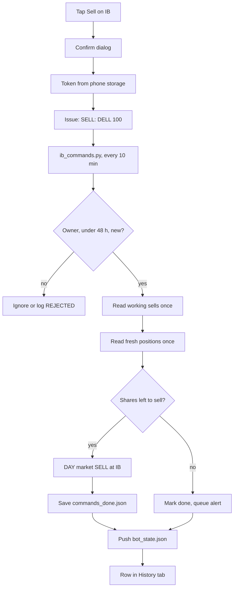

The tap never talks to IB itself: GitHub holds the request, and the VM's 10-minute poller checks it, nets it, places it and republishes the page's data.

### Telegram

The VM sends all these messages, using the bot token and chat id in `/root/telegram.env` (file mode 600, readable only by root). Three kinds arrive: the 23:40 UTC digest, `/update` replies and alerts.

#### The 23:40 UTC digest

`daily_signal.py` runs at 23:40 UTC, five minutes after the 23:35 trading run. It is read-only: it places no orders and never imports `ib_bot.py`. It replays the bot's rules and lists what the bot would do.

It reads the book (positions, cash and NetLiq) live from IB over the Web API. If that fails it uses `/root/manual_state.json`, then `data/bot_state.json`. Exit decisions use the Pages card prices, while valuation uses Yahoo quotes that include trading before and after the session.

| Part | Contents |
| --- | --- |
| NET WORTH | Est. NetLiq (IB's NetLiq minus the earmark), positions and cash, "Since last digest", "Since launch" net of flows, unrealised P&L |
| SELL | `SELL SYM qty @ MKT` with the reason: below SMA200, trailing stop hit, or held 60+ weekdays |
| BUY | `BUY SYM shares @ LMT price`, with score and HKD size |
| DECIDED AFTER THE CLOSE | markets not judged yet, grouped by reason |
| POSITIONS | price, headroom above the stop, unrealised %, a warning mark on exits; tightest stop first |
| Notes | where the book came from, kill switch state, earmark, "exits are market-at-next-open" |
| Problems | up to 8 data failures |

A BUY line needs a free slot out of 15 and a clear kill switch. The switch trips when NetLiq is below 92% of the stored peak (`_peak_netliq`). Size = min(NetLiq ÷ 15, HK$20,000), converted to the stock's currency and rounded down to whole shares.

Japan rounds down to 100-share lots. Hong Kong buys appear only with `HK_ENABLED` switched on; it is off in code but on (1) on the live VM. The limit (the highest price the order may pay) is price × 1.005.

Example (made-up): Est. NetLiq is HK$215,000, the peak is 228,000 and 13 positions are held. The switch is clear, since 215,000 is above 209,760. A US signal at $120 with USD/HKD at 7.80 gets 14,333 ÷ 7.80 ÷ 120 = 15.3 shares, printed as `BUY XYZ 15 @ LMT 120.6`.

"DECIDED AFTER THE CLOSE" comes from `market_clock.py`. On a local weekday, a market cannot be judged from its open until 90 minutes after its close, because its daily bar is still moving. It is also held back when the newest build's `generated_at` (when its price download began) is earlier than that market's last close plus 90 minutes.

Example: New York closes at 16:00 EDT (20:00 UTC), so its bar settles at 21:30 UTC. At 23:40 the clock allows US decisions. But if the newest build began at 18:32Z, every US name is listed under "newest build started 18:32Z, before its close settled".

Those names get no SELL or BUY line. Held ones appear after "held:", and candidates after "buy signals:", 8 names and then "+N more".

Every dynamic value is HTML-escaped. If Telegram still refuses the formatting, the same text is sent again once as plain text. Messages longer than 3,900 characters are split at line breaks.

The line under the heading still says "Manual mode — IB gateway down". That text dates from the August 2026 gateway outage and prints even when the book is read live. Only the scheduled run saves `/root/daily_signal_prev.json`, the baseline for "Since last digest".

#### /update on demand

`telegram_poll.py` runs every 2 minutes. It first sends any queued alerts, then fetches messages newer than the offset saved in `/root/telegram_offset.json`. Anyone can find the bot, so messages from any chat other than `TELEGRAM_CHAT_ID` are logged and ignored.

The words `update`, `u`, `status`, `refresh` or `start`, with or without a slash, trigger a report. Several at once get a single reply. The reply is the digest report headed "UPDATE — 17 Sep 10:15 UTC", and it does not move the baseline.

For example, at 10:15 UTC on a Thursday a held `DBK.DE` sits under "Europe/Berlin session 09:00-17:30 is still open or settling (local Thu 12:15; its bar is final from 19:00)". A lock file, `/tmp/mps_tg_poll.lock`, stops two polls from overlapping.

#### Alerts

Programs that place orders never call Telegram themselves. A slow send could delay orders, and IB's error text contains HTML. Instead `alerts.py` drops a small file in `/root/alert_outbox`, and `telegram_poll.py` sends it within about 2 minutes, deleting the file only once Telegram accepts it.

| Alert begins | Raised by | When |
| --- | --- | --- |
| EXIT REFUSED by IB | `ib_bot.py` | IB refuses an exit; later runs send one short "exit still refused - attempt N" |
| the exit IB accepted … did not complete | `ib_bot.py` | an exit sent earlier is still held and had to be sent again |
| … never completed, and its condition has cleared | `ib_bot.py` | the exit rule stopped firing; the bot keeps the holding |
| Signals are stale | `ib_bot.py` | the newest build is more than 26 h old; once per UTC day |
| … two instruments share one IB symbol | `ib_bot.py` | a card symbol and the held position are different contracts |
| PHONE SELL REFUSED by IB | `ib_commands.py` | IB refused a phone sale; it is not retried |
| PHONE SELL did nothing | `ib_commands.py` | no held position matches the symbol |
| PHONE SELL not sent | `ib_commands.py` | working or same-poll sells already cover the holding |
| PHONE SELL waiting | `ib_commands.py` | working orders or positions could not be read; once per command |
| Phone command did not complete | `ib_commands.py` | the poll crashed; retried for 48 h, alerted once |

An older, separate message also exists. `engine/notify_telegram.py` runs in the daily GitHub Action (00:20 UTC) and sends the top 8 signals, but only if repo secrets are set. The code does not show whether those secrets are set.

### Where it lives in the code

| File | Role |
| --- | --- |
| `docs/index.html` | the whole dashboard: tabs, earmark card, fill matching, calendar maths, phone buttons |
| `engine/build_dashboard.py` | writes `docs/data.json` and `docs/products/<sym>.json` with `generated_at` |
| `execution/publish_web.py` | hourly read-only publish of `bot_state.json` and `netliq_history.json` |
| `execution/ib_bot.py` | `publish_state`, activity rows and statuses, exit alerts |
| `execution/ib_commands.py` | SELL, EARMARK and REFRESH issues |
| `execution/earmark.py` | marker, pocket and exclusion cap |
| `execution/daily_signal.py` | 23:40 digest and the shared report builder |
| `execution/telegram_poll.py` | `/update` replies and alert delivery |
| `execution/alerts.py` | the alert outbox |
| `execution/market_clock.py` | market hours table and the 90-minute settle rule |
| `execution/ib_web.py` | live IB reads and account-id redaction |
| `.github/workflows/daily.yml`, `add-product.yml` | hourly signal build and one-tap adds |

## Platform part 1: GitHub

GitHub is the system's shared filing cabinet, signal factory, website host and phone-to-bot mailbox, all in one public repository. Every program lives there, and the Oracle VM takes its code from it.

### Git and GitHub in plain words

Git is a tool that records snapshots of a folder over time. Each snapshot is a commit (a saved change with a message, author and time). The folder plus its whole history is a repository, or repo.

A branch is a parallel line of commits, used to work on a change without touching the main line, `main`. Merging joins a branch back into `main`. Pushing uploads new commits to the shared copy; pulling downloads them.

GitHub is a website that hosts that shared copy, here `github.com/btctree/multi-product-signals`. The repo is public, so anyone can read it. The system also uses three GitHub extras: Actions, Pages and Issues.

### What is in the repo

| Path | What it holds | Written by |
| --- | --- | --- |
| `engine/` | Signal factory: price download, indicators, strategy, dashboard builder | Operator |
| `execution/` | Trading bot, phone-command poller, publishers, Telegram tools, tests | Operator |
| `execution/vm_ops/` | VM shell scripts, plus `crontab.reference` (marked stale) | Operator |
| `docs/` | Dashboard page `index.html`, icons, app manifest | Operator |
| `docs/data.json`, `docs/products/` | Built signal files | Actions; never committed |
| `data/universe.json`, `company_names.json`, `backtest_trades.json` | Watch list (993 symbols on 17 Sep 2026), names, backtest trades | Actions, daily |
| `data/bot_state.json`, `netliq_history.json`, `fills_ledger.jsonl`, `tax_report.json`, `dividends_ledger.jsonl` | Live positions, cash, NetLiq series, fills, tax | VM |
| `data/prices/` | 10 years of daily prices as CSV | Rebuilt each run; never committed |
| `.github/workflows/` | `daily.yml`, `add-product.yml` | Operator |

NetLiq (net liquidation value) is what the account would be worth if everything were sold now. The `.gitignore` file lists what git must never store: built dashboard data, `execution/state.json`, `IB KEY/`, `oauth_keys/`, `*.pem` and chat backups. The top-level `README.md` describes a superseded strategy and says so in its own banner.

### GitHub Actions: the signal factory

GitHub Actions lends short-lived Linux computers, called runners, that run scripts when something happens. The instructions are a workflow, written in YAML (an indented settings format). The main one, `daily.yml`, is named "Signals + dashboard (hourly)".

| Trigger | Setting | Meaning |
| --- | --- | --- |
| Hourly schedule | `cron: "5 * * * *"` | Minute 5 of every hour, UTC |
| Daily schedule | `cron: "20 0 * * *"` | 00:20 UTC; adds the universe refresh |
| Manual | `workflow_dispatch` | Run button on GitHub; treated as daily |
| Push | `branches: [main]` | Every new commit on `main` rebuilds and redeploys |

A cron string has five fields: minute, hour, day of month, month, weekday; `*` means "every". A run counts as daily when `github.event.schedule == '20 0 * * *'` or it was started by hand. That test still works when GitHub starts the job late.

Permissions are `contents: write` (commit the daily files), plus `pages: write` and `id-token: write` (deploy the website). `concurrency: group: signals` with `cancel-in-progress: true` lets a new run cancel an older one still running. The job runs on `ubuntu-latest` in the `github-pages` environment.

The steps, in order:

1. `actions/checkout@v4` copies the repo onto the runner.
2. `actions/setup-python@v5` installs Python 3.12, with `cache: pip` to reuse downloaded packages.
3. `pip install -r requirements.txt` installs `yfinance>=0.2.40`, `pandas>=2.0` and `numpy>=1.24`.
4. `python data_fetch.py` downloads daily prices from Yahoo Finance, 80 symbols per batch, one trading calendar per batch.
5. Daily only: `update_universe()` refreshes the watch list, `data_fetch.py` runs again for new names, and `export_backtest_trades.py` runs. A failed refresh warns and keeps the old list.
6. `python build_dashboard.py --names` writes `docs/data.json` and one card per symbol in `docs/products/`.
7. Daily only: `notify_telegram.py` sends up to 8 BUY signals to Telegram.
8. Daily only: commit three `data/` files as `daily: universe + name cache [skip ci]`, `git pull --rebase`, then push.
9. `configure-pages@v5`, `upload-pages-artifact@v3` (path `docs`) and `deploy-pages@v4` publish the website.

The refresh only grows the list; a symbol leaves only after 5 daily checks in a row find very low trading volume. It reads `data/bot_state.json`, pushed by the VM, so a live holding is never removed. The pull before the push in step 8 is needed because the VM pushes every hour, so the runner's copy is usually behind.

Every card and `data.json` carry `generated_at`, the UTC time the price download started, like `2026-09-17T04:56:24Z`. The bot decides a market only on a build that started after that market's close plus 90 minutes (`market_clock.py`). The Telegram step exits quietly when its secrets are missing, and a send failure only prints a warning.

### "Hourly" in practice

GitHub does not promise to start scheduled jobs on time. Its run history for 5 to 16 September 2026 shows 6 to 8 scheduled runs a day, not 24. Runs took 2 to 11 minutes, about 3 typically.

From 10 to 17 September the daily-refresh commits landed between 04:44 and 05:10 UTC, about four and a half hours after 00:20. `market_clock.py` notes that on 12 of 14 weekdays from 28 Aug to 14 Sep, the 09:00 UTC run saw a build from about 04:45. That is why the bot checks `generated_at` instead of trusting the schedule.

### GitHub Pages: the website

GitHub Pages hosts static websites (plain files, no server program) free for public repos. The last three steps upload the built `docs/` folder as an artifact, a bundle of files, and publish it at `https://btctree.github.io/multi-product-signals/`.

Because `docs/data.json` and `docs/products/` are git-ignored, hourly price churn never bloats the history. The dashboard, `ib_bot.py` (`SIGNALS_URL`) and the Telegram digest (`daily_signal.py`) all read signals from that address. Card file names swap dots for underscores, so `0700.HK` becomes `products/0700_HK.json`.

Live account data takes another road. The dashboard reads `bot_state.json`, `netliq_history.json`, `tax_report.json` and `fills_ledger.jsonl` straight from `raw.githubusercontent.com`, the raw-file address of `main`. A VM push therefore reaches the phone without any Pages rebuild.

### Bot state commits and "\[skip ci\]"

The VM keeps a clone (full local copy) of the repo at `/root/multi-product-signals`. After writing its files it runs `git add`, `git commit` and `git push` as author `ib-bot`.

| Writer | Commit message | Files |
| --- | --- | --- |
| `publish_web.py`, hourly at :25 | `bot: state update (web api) [skip ci]` | `bot_state.json`, `netliq_history.json` |
| `ib_bot.py` `publish_state()`, after trading runs and phone commands | `bot: state update [skip ci]` | Those two, plus fills, tax and dividend ledgers |
| `daily.yml`, author `signals-bot` | `daily: universe + name cache [skip ci]` | `universe.json`, `company_names.json`, `backtest_trades.json` |

`[skip ci]` in a commit message tells GitHub not to start push-triggered workflows. Without it, each of the 217 `ib-bot` commits between 10 and 17 September would have started a rebuild. A `--dry` run writes nothing, so it never commits or pushes.

Being public is why account-id redaction exists. `ib_web.scrub()` replaces the IBKR account number with `U***` in every activity row. Nine rows from 1 to 3 September had leaked it; each rewrite cleans them, but git history keeps old copies.

### Issues as a phone command channel

An issue is a numbered post on a repo, normally a bug report. Here each dashboard button creates one through GitHub's API (its interface for programs), and the title is the command.

| Title | Dashboard control | Handled by | Effect |
| --- | --- | --- | --- |
| `SELL: SYM` or `SELL: SYM QTY` | Sell button | `ib_commands.py` on the VM | Market sell, capped at shares held minus sells already working |
| `REFRESH` | Pull-to-refresh | `ib_commands.py` | Republishes live account state |
| `EARMARK: AMOUNT` | Earmark card | `ib_commands.py` | Sets the HKD amount excluded from NetLiq; `0` clears it |
| `ADD: SYM` | Add button | `add-product.yml` on Actions | Adds a symbol to the watch list |

`ib_commands.py` runs every 10 minutes and reads recent issues without logging in. The title must match its pattern exactly. The author must be `btctree` with GitHub's `OWNER` label, and the issue must be under 48 hours old (`MAX_AGE_H`).

**Why it pages rather than reading one batch.** The dashboard's refresh used to open a `REFRESH` issue every single time, so the repo's last 100 owner issues were all `REFRESH` - 38 of them inside one rolling 48-hour window. Reading a single 30-item page meant a SELL held pending (the order book unreadable, positions not flushable) could be pushed off that page by the owner's own refreshes and then never fetched: never executed, never aged out, never recorded, and never alerted, because the alerts only fire for commands that are IN the fetch. The poll looked healthy throughout. Two changes close it - the fetch is bounded by `MAX_AGE_H` instead of a page size, and the dashboard no longer opens a request the VM cannot act on yet (it reads commands every 10 minutes, so a second ask inside that window is noise).

Commands run oldest first, and handled issue numbers go into `/root/commands_done.json`. Nothing closes these issues, so they pile up: GitHub counted 593 open on 17 September. A local `sell-ack.yml` would close SELL issues, but it was never committed, so GitHub never runs it.

Worked example, with made-up numbers: at 07:52 UTC the operator taps Sell for 40 DELL, creating issue #612 `SELL: DELL 40`. At 08:00 the poller finds 60 DELL held and a 25-share SELL still working (sent, not yet filled) from 23:35.

It sends a market SELL (at the best available price) of min(40, 60 - 25) = 35. It then records #612 as done and pushes `bot: state update [skip ci]`. `add-product.yml` also woke for #612 and was skipped.

`add-product.yml` starts on every new issue but is skipped unless the title starts `ADD:` and the author is the repo owner. When it does run, it:

- refuses with a comment if more than 20 `ADD:` issues were opened today, this one included;
- checks the symbol against `[A-Z0-9^=.\-]{1,15}` and needs 20+ days of Yahoo prices in 6 months;
- appends it to `data/universe.json`, commits `add product on request (#N)` and pushes;
- comments "Processed" and closes the issue.

That push uses the run's built-in token, and GitHub does not start workflows from such pushes. Run history agrees: the 18 August add at 03:14 UTC waited for the 03:53 scheduled build. So the comment's "within a few minutes" can be an hour or more.

### Secrets

A secret is a password-like value kept out of the code. Only names appear here.

| Name | Stored in | Used for |
| --- | --- | --- |
| `TELEGRAM_BOT_TOKEN`, `TELEGRAM_CHAT_ID` | GitHub repo Actions secrets | Daily message from `notify_telegram.py` |
| `GITHUB_TOKEN` (`github.token`) | Made by GitHub for each run | Checkout, pushes, issue comments in workflows |
| `mps_gh_token` | Phone browser storage (`localStorage`) only | Fine-grained token (a key limited to chosen repos and rights), set up for Issues read/write on this repo only |
| `TELEGRAM_TOKEN`, `TELEGRAM_CHAT_ID` | `/root/telegram.env` on the VM | Digest, `/update` and alerts |
| IBKR OAuth files | `/root/oauth/` on the VM | Key-based login to the IBKR Web API |

If GitHub rejects the token (401 or 403), the earmark and add controls delete it so it can be re-entered. The credential the VM uses to push is not in the repo, so its type is unknown here.

### How a code change reaches production

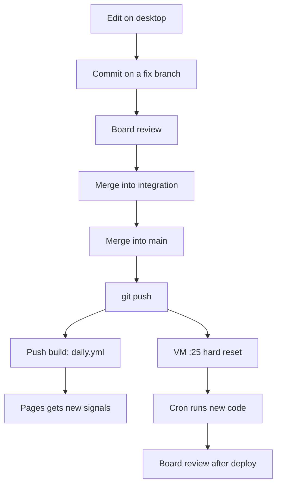

Pushing to `main` is deploying: GitHub rebuilds the website from the push, and the VM runs the same commit after its next hourly reset.

The "board" is a panel of AI review agents that checks every change before merging and again once it is live. Commit `dc1e520` shows the path: fix branches such as `fix/eu-tick-bands` merged into `integration/review-2026-09-17`, then into `main`.

It was pushed at about 09:57 UTC on 17 September, and its push build ran from 09:57 to 10:03. The 10:25 reset then put it on the VM, ahead of the 23:35 trading run.

`git reset --hard origin/main` makes every tracked file match GitHub exactly and throws away unpushed local edits. Git-ignored files such as `execution/state.json` survive. `earmark.py` records the cost: fills-ledger rows the VM failed to push are wiped by that reset.

The live crontab (the VM's schedule table) is not stored in the repo. `crontab.reference` warns it is stale and says to dump the real one with `sudo crontab -l` first.

### Where it lives in the code

| File | Role |
| --- | --- |
| `.github/workflows/daily.yml` | Build, daily refresh, Telegram, Pages deploy |
| `.github/workflows/add-product.yml` | `ADD:` issues |
| `engine/data_fetch.py`, `engine/universe.py`, `engine/build_dashboard.py`, `engine/notify_telegram.py` | Steps the build runs |
| `execution/ib_commands.py` | `SELL`, `REFRESH`, `EARMARK` poller |
| `execution/publish_web.py`, `execution/ib_bot.py` (`publish_state`) | VM state commits |
| `execution/ib_web.py` (`scrub`) | Account-id redaction |
| `docs/index.html` (`sendSell`, `setEarmark`, `requestAddAuto`, `getGHToken`) | Issue creation on the phone |
| `.gitignore` | What never enters the repo |

## Platform part 2: the Oracle VM

All the live trading programs run on one small rented Linux computer in Oracle's cloud, and a timer called cron starts them. Your laptop can stay off. New code arrives from GitHub every hour, and a set of files on that computer holds the bot's memory from one run to the next.

### What a VM is

A VM (virtual machine) is a slice of a large data-centre server that acts like a computer of its own. You rent it, log in over the internet, and it runs day and night. `oracle_launch.sh` created this one as `multi-product-bot`, on Oracle's "Always Free" shape `VM.Standard.E2.1.Micro`: x86, 1 GB of memory, Oracle Linux 9.

Memory is the tight spot. `setup_vm.sh` notes that only about 500 MB is usable, so on machines under 1,500 MB it adds a 4 GB swap file (disk space used as spare memory). It also turns off the crash-dump reserve and the Oracle Cloud Agent, which it says uses about 150 MB.

Every job runs as `root`, the Linux administrator account. That is why the bot's private files live in `/root`. It is also why you need `sudo` (run as administrator) to read them.

### What cron is

Cron is the Linux service that starts programs at set times. Each line of its table (the crontab) has five time fields, then a command. `25 * * * *` means minute 25 of every hour, `*/10 * * * *` means every 10 minutes, and `40 23 * * *` means 23:40 every day.

### The scheduled jobs

The live root crontab is not stored in the repo. This table combines the operator's live schedule with what each program's own code says about itself. Commands run in `/root/multi-product-signals/execution`.

| Job | UTC | UK now (BST) | Command | Python | What it does | Log |
| --- | --- | --- | --- | --- | --- | --- |
| Trading run | 23:35 and 09:00 | 00:35 (next day) and 10:00 | `ib_bot.py` with `IB_BACKEND=web`, `CONFIRM_FIRST=0`, `HK_ENABLED=1` | `python3.11` | Reads signals from GitHub Pages, sells exits, buys entries, saves `state.json`, publishes dashboard state | `/root/bot.log` |
| Deploy and publish | every hour at :25 | :25 | `git fetch` and `git reset --hard origin/main`, then `publish_web.py` | Not in the repo (its docstring says `python3`) | Installs the newest code, reads the account, commits and pushes `data/bot_state.json` and `data/netliq_history.json` | Not in the repo |
| Phone commands | every 10 min | every 10 min | `ib_commands.py` | `python3.11` (it imports `ib_bot`) | Reads GitHub issues titled `SELL:`, `EARMARK:` or `REFRESH` from owner `btctree`, under 48 h old, then acts and republishes | Not in the repo |
| Digest | 23:40 | 00:40 (next day) | `daily_signal.py` | `/usr/bin/python3` (3.9) | Sends the Telegram digest and moves the P&L baseline | Not in the repo |
| Telegram poll | every 2 min | every 2 min | `telegram_poll.py` | `/usr/bin/python3` (3.9) | Sends queued alerts first, then answers `/update` from the owner's chat only | Not in the repo (prints to stderr) |

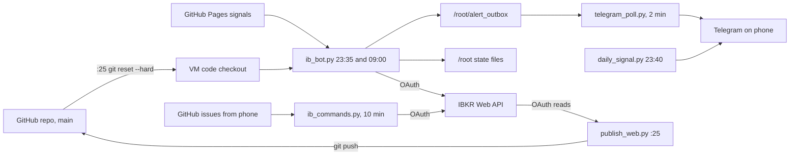

Code comes down from GitHub every hour, the bot and the phone poller trade over OAuth, and results go out by Telegram and git push.

Why two trading runs: `market_clock.py` decides a market only once its close is 90 minutes past, and only on a signal build that started after that. At 23:35 UTC the US, Europe, Japan and Hong Kong can all be decided. At 09:00 UTC only the US and Japan can; Europe and Hong Kong wait for the evening run.

Two Python versions exist on purpose. The digest and the poller run on the system's Python 3.9, which has no broker library. So `market_clock.py` and `alerts.py`, which they import, use only the standard library and 3.9 syntax.

Five things to know before touching the schedule:

- **The reference file is stale.** The header of `execution/vm_ops/crontab.reference`, checked 2026-08-01, says it lacks the hourly publish, the 10-minute poller and the 09:00 run. Run `sudo crontab -l` to see the real one.
- **`IB_BACKEND=web` is required.** `broker.py` defaults to `socket`, the dead IB Gateway connection.
- **Rollback switches are environment variables** (settings passed on the command line). The README warns they must be added to every line that runs `ib_bot.py`.
- **Watch the clock change.** The reference writes the trading line as `35 0 * * *` but says it fires at 23:35 UTC, which suggests London time. In September 2026 the runs were observed at 23:35 and 09:00 UTC; check which way each line moves when UK clocks go back on 25 October 2026.
- **Weekends.** A comment in `ib_bot.py` calls both runs daily, but the README calls 09:00 the "weekday" run. `sudo crontab -l` settles it.

### Leftovers from the IB Gateway era

Until August 2026 the bot reached IBKR through IB Gateway, a desktop program kept logged in on the VM. IBKR made passkey 2FA (approving each login on your phone) compulsory on 2026-08-24. Gateway cannot complete that login unattended, so the bot moved to OAuth, and these scripts lost their purpose.

| Script | Reference schedule | What it did |
| --- | --- | --- |
| `ensure_gateway.sh` | every 15 min | Restarted Gateway if port 4001 was down, but never 23:30-07:00 London |
| `weekly_reauth.sh` | Mon 07:30 London | Forced a fresh login so the 2FA push came at a sensible hour |
| `reauth_check.sh` | Mon 08:30, 09:30, 11:00; daily 09:00 London | Called `sunday_reauth.sh` for a new push if still logged out |
| `monday_catchup.sh` | Mon 10:00 and 12:00 London | Ran `ib_bot.py` if today's `/root/ran_<date>` marker was missing |

The repo does not record whether these lines still run. `monday_catchup.sh` quits at once while nothing listens on port 4001. `setup_vm.sh` and `oracle_launch.sh` are also from that era: they install a paper Gateway on port 4002, schedule a `--dry` run and never install `ibind`. Rebuilding from them would not give you today's VM.

### Files the bot keeps under /root

JSON is a plain-text data format. A `.jsonl` file holds one JSON record per line. "Mode 600" means only root can read or write the file.

| Path | Written by | Purpose |
| --- | --- | --- |
| `/root/multi-product-signals/` | git, at the hourly reset | The code, plus tracked data files the dashboard reads |
| `.../execution/state.json` | `ib_bot.py` live runs, also when a run aborts | The bot's memory. `pos` holds each holding's high-water mark `hw`, trailing `stop`, `entry` and `entry_date`. `map` links IBKR tickers to Yahoo symbols. `_peak_netliq` is the peak the 8% kill switch measures from |
| `/root/excluded_cash` | Phone `EARMARK:` command, or by hand | One HKD figure: cash passing through, not trading capital. Set the day the month-end GBP deposit becomes HKD; clear it once the money leaves |
| `/root/earmark_anchor` | A live run that finds HKD cash under 1 | The UTC minute from which the bot's own HKD "pocket" is counted |
| `/root/earmark_pocket.json` | End of each live run | `p` (bot's own HKD), `pending` (HKD owed to working HK buys), `confirmed`, `anchor`, `at`. Other programs trust it for 36 h |
| `/root/earmark_execs.jsonl` | Live runs | Copy of every execution (fill) IBKR returned, kept 8 days |
| `/root/earmark_covered` | Live runs | Time of the last complete executions read. An anchor older than 6 days is trusted only while this is fresh |
| `/root/orders_ledger.jsonl` | `ib_orders.py` | Append-only log of order events (`submit`, `submitted`, `declined`) with the `mps-` order id |
| `/root/conid_cache.json` | `ib_orders.py`, never on `--dry` | Symbol and venue mapped to IBKR's contract id (conid) |
| `/root/fx_last_good.json` | Live `ib_bot.py` runs | Last live exchange rate per currency pair, with its time |
| `/root/exit_attempts.json` | `ib_bot.py` | Exits owed, sent or refused; read only by the alert code |
| `/root/alert_outbox/` | `ib_bot.py`, `ib_commands.py` | One `a-*.json` per queued alert, plus `once_registry.json` and `exit_episodes.json` |
| `/root/commands_done.json` | `ib_commands.py` | GitHub issue numbers already handled, so a tap never sells twice |
| `/root/telegram.env` | Operator, mode 600 | `TELEGRAM_TOKEN` and `TELEGRAM_CHAT_ID` |
| `/root/oauth/` | Operator, mode 600 | IBKR OAuth credentials and keys |
| `/root/bot.log` | The trading run's cron line | Everything the trading run prints |

Smaller files sit there too. `telegram_offset.json` holds the last Telegram message handled, and `daily_signal_prev.json` holds the digest's P&L baseline. `manual_state.json` is an optional hand-kept list of positions, and `flex.conf` is an optional dividend-report config. `/tmp/mps_tg_poll.lock` stops two polls overlapping.

A worked example of `fx_last_good.json`, with made-up numbers: the Friday 09:00 run reads USD/HKD at 7.79 and stores it. IBKR quotes no FX (currency exchange) rates from Friday evening to Sunday evening. On Saturday a US buy is sized as NetLiq HK$215,000 / 15 = HK$14,333, or about US$1,840 at the remembered rate. The rate may be up to 96 h old, but only for sizing. Anything that moves money asks for a live rate and refuses the old one.

### How code is deployed

Pushing to the `main` branch on GitHub deploys the code. A commit is a saved snapshot of files, and a push uploads commits to GitHub. At :25 every hour the publish job runs `git fetch origin main`, then `git reset --hard origin/main`, which makes every tracked file on the VM match GitHub exactly.

- **Hand edits vanish.** Any change to a tracked file on the VM is undone within the hour. Repairs to tracked data such as `data/fills_ledger.jsonl` must be committed and pushed.
- **Ignored files survive.** `.gitignore` lists `execution/state.json`, and the reset never touches files in `/root` outside the checkout.
- **Unpushed commits are lost.** `earmark.py` notes that fills-ledger rows can vanish this way, which is one reason the VM keeps `earmark_execs.jsonl`.

The VM's own commits use the name `ib-bot` and end in `[skip ci]`. That tag stops GitHub Actions rebuilding on each one; the build workflow otherwise runs on every push to `main`.

Example: a fix is pushed at 14:10 UTC. The 14:25 job resets the checkout and runs the new `publish_web.py` straight away. The 14:30 phone poll uses the fix, and the 23:35 run is its first trade. That speed is why a multi-agent review "board" checks every change before it is pushed and again after deploy.

### How the VM talks to IBKR: OAuth

The bot uses IBKR's Client Portal Web API, a set of web addresses that programs call to read an account and place orders. It signs in with OAuth 1.0a: instead of a password, the VM signs every request with a private key it holds. No login screen and no phone approval are involved, so 2FA rules cannot stop it.

`/root/oauth/` holds `oauth.env` (`IB_CONSUMER_KEY`, `IB_ACCESS_TOKEN`, `IB_ACCESS_TOKEN_SECRET`) and two RSA private keys, `private_signature.pem` and `private_encryption.pem`. It also holds `dhparam.pem`, from which `_dh_prime_hex()` pulls a Diffie-Hellman prime (a number used to agree a shared session secret). `ib_web.client()` loads all of these into `IBIND_OAUTH1A_*` variables and builds one `ibind.IbkrClient(use_oauth=True)` per process.

`ibind` is a Python library for this API. It is not in `execution/requirements.txt`, which lists only `ib_async` and `requests`. How it was installed on the VM is not recorded.

| Address family | What it needs | Used for |
| --- | --- | --- |
| `portfolio/...` | The access token alone | Positions, cash and NetLiq (the account's total value) |
| `iserver/...` | A brokerage session from `ensure_session()`: POST `iserver/auth/ssodh/init`, then GET `iserver/accounts`, up to 4 tries 3 s apart | Orders, trades, contract search |

If the session dies mid-run, `_post()` sets it up again once. The code is split for safety. `ib_web.py` only reads, `ib_orders.py` places orders, and `broker.py` makes the Web API look like the old `ib_async` library, so `ib_bot.py` barely changed.

The repo is public, so account ids must never be published. `ib_web.redact()` replaces anything shaped like `U1234567` with `U***` before messages reach the published files.

### How the operator reaches the VM

Oracle Cloud Shell is a terminal inside the Oracle web console, already signed in as you. `oracle_launch.sh` ran there, created the SSH key pair `~/mp_vm_key` (SSH is secure remote login), and gave the VM the public half. The private key therefore exists only in Cloud Shell's home folder, not on the desktop.

```bash
ssh -i ~/mp_vm_key opc@<vm-public-ip>
sudo bash -c 'cd /root/multi-product-signals/execution && IB_BACKEND=web python3.11 ib_bot.py --dry'
```

`opc` is Oracle Linux's default user and can use `sudo`. `--dry` places nothing and writes nothing: no `state.json`, no dashboard commit, no conid cache update. It still reads the live account.

The operator's notes add two practical points. The console's Run Command feature does not work here, and `setup_vm.sh` turns off the Oracle Cloud Agent that feature needs. Multi-line pastes into the VM's shell arrive garbled, so pipe scripts over `ssh` from Cloud Shell instead.

### Running tests on the VM safely

`run_all_tests.py` runs all 25 test suites, 24 in `execution/` and 1 in `engine/`, each in its own process. An audit hook (a Python feature that sees every file access) blocks any path under `/root` and fails that suite. `testenv.isolate()` also points all 16 `MPS_*` path variables at a temporary folder before any bot code loads.

The guard exists because `test_bot_pocket.py` once ran a real `ib_bot.run()` against `/root/exit_attempts.json`. Run as root on the VM, it would have wiped every record of owed exits.

On the VM the checkout itself sits under `/root`, and its `state.json` is the live one. So the runner refuses there with exit code 2 and prints this instead:

```bash
rm -rf /tmp/mps-test && mkdir -p /tmp/mps-test && git -C /root/multi-product-signals archive HEAD | tar -x -C /tmp/mps-test && cd /tmp/mps-test && PYTHONIOENCODING=utf-8 IB_BACKEND=web python3.11 execution/run_all_tests.py
```

`git archive` exports only committed files, so untracked live files such as `state.json` stay behind. `engine/test_data_fetch.py` also needs pandas and numpy under python3.11, which the VM lacks. Install them in the export first, or treat the desktop run as the check for that suite.

### Where it lives in the code

| File | What it covers |
| --- | --- |
| `execution/vm_ops/crontab.reference` | Old reference crontab, marked stale |
| `execution/vm_ops/*.sh` | Gateway-era watchdog, re-login and catch-up scripts |
| `execution/oracle_launch.sh`, `execution/setup_vm.sh` | VM creation, SSH key, first-boot install (Gateway era) |
| `execution/README.md` | Run modes, rollback switches, test command |
| `execution/ib_web.py`, `execution/ib_orders.py`, `execution/broker.py` | OAuth client, order placement, `IB_BACKEND` switch |
| `execution/earmark.py`, `execution/alerts.py` | Earmark files, alert queue |
| `execution/market_clock.py` | Why there are two trading runs |
| `execution/run_all_tests.py`, `execution/testenv.py` | The `/root` test guard |
| `.gitignore` | Keeps `state.json` out of git |

## Code walkthrough

Every important file belongs to one of eight layers, and data moves through them in a loop: prices in, orders out, results back. The signal factory runs on GitHub's servers. Everything else runs as root on the Oracle VM, started by cron (the Linux scheduler that launches programs at set times).

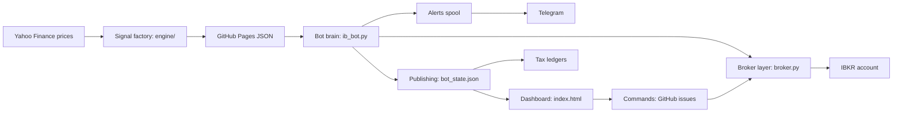

The factory and the VM never call each other; they meet only through files published on GitHub.

### Signal factory

The factory turns free daily prices into one card per ticker: a small JSON file (plain-text data) holding a verdict, a stop and the reasons. `daily.yml` runs it at :05 every hour, at 00:20 UTC for the daily refresh, on every push to `main`, and on demand.

| File | Purpose | Key functions | Reads → writes | Run by |
| --- | --- | --- | --- | --- |
| `.github/workflows/daily.yml` | Hourly build and deploy | steps: download, refresh universe, build, Telegram, deploy | repo → Pages copy of `docs/` | GitHub Actions, Python 3.12 |
| `engine/config.py` | Every strategy number | `PROD`, `CRY_TREND`, `SCORE_ENTRY_GATE = 60`, `COST_BP` | none | imported |
| `engine/data_fetch.py` | Downloads about 11 years of daily bars | `fetch_all`, `_download_chunks`, `_fill_last_close`, `download_started` | `data/universe.json` → `data/prices/*.csv`, `_download_started.json` | workflow step |
| `engine/universe.py` | The watch list and its upkeep | `market_of`, `update_universe`, `prune_dead`, `held_from_bot_state` | Yahoo, `data/bot_state.json` → `data/universe.json` | workflow, build |
| `engine/indicators.py` | Indicator maths on past data only | `sma`, `rsi`, `atr`, `roc`, `add_features` | none | imported |
| `engine/scoring.py` | The 0-100 score | `momentum_score` (live), `composite` (rejected), `band` | none | imported |
| `engine/production.py` | One price history → one card | `analyze`, `_crypto_card`, `scan_actions` | none | imported by build |
| `engine/build_dashboard.py` | Writes what the bot and phone read | `main`, `generated_at`, `build_name_map` | prices, `data/*.json` → `docs/data.json`, `docs/products/<sym>.json` | workflow (`--names`) |
| `engine/company_names.py` | Curated display names | `CURATED` | none | imported |
| `engine/export_backtest_trades.py` | Latest 200 backtest trades | `main` | prices → `data/backtest_trades.json` | daily refresh |
| `engine/engine_rr.py` | The validated backtest engine | `run`, `summarize`, `gate` | prices | export script |
| `engine/notify_telegram.py` | Top 8 BUY signals to Telegram | `send`, `main` | `docs/data.json` → Telegram | daily refresh, if secrets set |
| `engine/report.py` | Legacy report; the workflow uses one helper | `load_positions` | `data/positions.json` | daily refresh |
| `.github/workflows/add-product.yml` | Adds a ticker from an `ADD: SYM` issue | inline Python, 20 adds a day | Yahoo → `data/universe.json` commit | GitHub, owner's issues only |

An SMA200 is the average of the last 200 daily closes. Price and the 50-day average both above it mean an uptrend. RSI(3) is a 0-100 gauge of the last three days, where low means oversold, and ATR (average true range) is the typical daily move.

`_download_chunks` puts at most 80 tickers in one Yahoo request and never mixes trading calendars. A mixed batch once gave US names a fake empty bar on a day only Hong Kong traded. `generated_at` stamps every file with the UTC time the download started, which the bot checks later.

These files are not on the hourly path: `run_daily.py`, `run_daily.bat`, `strategy.py`, `backtest.py`, `position_cli.py`, `analyze_rr.py`, `fx_contribution.py`, `options_model.py`, `gen_expanded_universe.py`. They belong to the older manual product and to research. One research file is live anyway: `export_backtest_trades.py` imports `research_r7_trend.run_trend` for the crypto trade list.

### Broker connection

Four modules stand between the strategy and IBKR, and `broker.py` hides which connection is in use. With `IB_BACKEND=socket`, the code default, it re-exports the `ib_async` library, which needs a logged-in IB Gateway program. With `IB_BACKEND=web`, the live setting, it rebuilds the same objects over IBKR's Web API using OAuth (signed requests, no password prompt).

| File | Purpose | Key functions | Reads → writes | Run by |
| --- | --- | --- | --- | --- |
| `execution/broker.py` | Makes the Web API look like `ib_async` | class `IB`: `accountValues`, `positions`, `qualifyContracts`, `placeOrder`, `openTrades`, `reqExecutions`; `_listing_venue`, `_translate_error` | none | imported by bot, commands |
| `execution/ib_web.py` | Read-only account calls; account-id redaction | `snapshot`, `positions`, `netliq_and_cash`, `account_id`, `redact`, `scrub` | `/root/oauth/` keys | imported by bot, publishers, digest |
| `execution/ib_orders.py` | The write half: orders | `resolve_conid`, `fx_pair_conid`, `place`, `poll_status`, `trades`, `open_orders`, `make_coid` | → `/root/conid_cache.json`, `/root/orders_ledger.jsonl` | via `broker.py` |
| `execution/contracts.py` | Yahoo ticker → IB contract | `to_ib`, `currency_of` | none | imported |
| `execution/vm_ops/*.sh` | Gateway watchdog and weekly re-login | `ensure_gateway.sh`, `weekly_reauth.sh`, `monday_catchup.sh` | `/root/watchdog.log` | from the Gateway era |
| `execution/oracle_launch.sh`, `setup_vm.sh` | One-time VM creation and install | none | none | by hand |

A conid is IBKR's number for one instrument on one exchange. `resolve_conid` accepts only a listing on the venue named in `_VENUE_LISTINGS`, so SAN.MC (Santander, Madrid) cannot turn into Sanofi in Paris. US lookups are the exception: `to_ib` stamps NASDAQ on every US stock, so `_listing_venue` passes no venue.

According to the `ib_web.py` header, the socket connection stopped working when IBKR forced passkey 2FA on 2026-08-24. `crontab.reference` and `setup_vm.sh` both label themselves stale.

### Bot brain

The brain decides and trades, and nearly all of it is one 2,747-line file. `ib_bot.run` handles exits first, then entries, then saves `execution/state.json` and publishes. Exits read each held ticker's card; entries read the `actions` list in `data.json`, highest score first.

| File | Purpose | Key functions | Reads → writes | Run by |
| --- | --- | --- | --- | --- |
| `execution/ib_bot.py` | One trading run | `main`, `run`, `net_liq`, `place`, `ensure_ccy`, `fund_from_nonbase`, `_fx_order`, `lot_size`, `hk_tick`, `jp_tick`, `eu_limit`, `_sweep_pocket`, `_save_state_on_abort`, `publish_state`, `publish_only` | Pages JSON, IB → `execution/state.json`, `data/bot_state.json`, `/root/exit_attempts.json`, git push | cron 23:35 and 09:00 UTC |
| `execution/market_clock.py` | Is a market's daily bar finished? | `MARKET_SESSIONS`, `market_decidable`, `last_settled_close`, `parse_generated_at` | none | imported by bot and digest |
| `execution/earmark.py` | One rule for HKD that is not trading capital | `marker`, `set_marker`, `exclusion`, `bot_pocket`, `publisher_exclusion` | `/root/excluded_cash`, `/root/earmark_*` | imported by bot, publishers, digest, commands |

`state.json` maps IB symbols to Yahoo tickers and keeps each position's entry, high-water mark (highest price seen) and stop. A tick is the smallest legal price step, and `jp_tick`, `hk_tick` and `eu_limit` snap every limit price onto one.

`market_decidable` refuses a market from its local open until 90 minutes after its close (`SESSION_SETTLE_MIN = 90`). `_build_behind_close` also demands a build that started after that settled close. So the weekday 09:00 UTC run decides US and Japan but defers Europe and Hong Kong.

Each operator rule has a named home in the code.

| Rule | Enforced in |
| --- | --- |
| Never sell HKD; buying HKD is fine | `fund_from_nonbase` skips HKD as a source; `_fx_order_pair` and `_fx_order` refuse it (unless `FX_CONVERT=1`) |
| Shortfall × 1.03 for HKD, × 1.02 otherwise | `BASE_FUND_BUFFER = 1.03`; `fund_from_nonbase(buffer=1.02)`; both sides of the pair carry it |
| A conversion must fill before sizing on it | `_fx_order` returns True only on a fill; if `ensure_ccy` returns False, the order is skipped |
| No holiday calendar | `market_clock` treats a holiday as a trading day; the order waits |
| GBP entries skipped | entry loop: London quotes in pence, so sizing would be 100 times too small |
| CHF, DKK, SEK, NOK not traded | `ib_orders._CCY_EXCHANGES` has no entry, so lookups refuse |
| HK entries | `HK_ENABLED`, default `0` in code; `1` on the live VM since 2026-09-12 |
| Month-end GBP deposit, earmarked in HKD | `earmark.exclusion` = min(marker, HKD held minus the bot's own HKD) |

### Safety and alerts

A refused order used to show up only as a dashboard row, and nobody noticed. Now the program that placed the order drops a small file into a spool (a folder of messages waiting to go out), and a poller sends it. Keeping these two jobs separate means a slow Telegram call can never delay a trade.

| File | Purpose | Key functions | Reads → writes | Run by |
| --- | --- | --- | --- | --- |
| `execution/alerts.py` | The alert spool; never raises | `enqueue`, `exit_refused`, `drain`, `clear_episodes` | → `/root/alert_outbox/a-*.json` | called by bot, commands |
| `execution/telegram_poll.py` | Delivers alerts; answers `/update` | `main`, `drain_alerts`, `get_updates` | outbox, `/root/telegram.env` → Telegram, `/root/telegram_offset.json` | cron every 2 min |
| `execution/daily_signal.py` | Read-only digest replaying the bot's rules | `build_report`, `send_message`, `esc`, `split_message` | Web API, Pages cards, `state.json`, `bot_state.json` → Telegram, `/root/daily_signal_prev.json` | cron 23:40 UTC |

`ib_bot.py` also holds the hard limits. `DAILY_LOSS_KILL = 0.08` blocks new entries once NetLiq (the account's value if everything were sold) drops 8% below its peak. Exits still run, and `MAX_ORDER_BASE = 20000` caps any one entry at HK$20,000.

`daily_signal.esc` HTML-escapes every value that changes from run to run, and a Telegram parse error triggers one plain-text resend. The digest runs on the VM's Python 3.9 and never imports `ib_bot`. That is why `market_clock.py` uses the standard library only.

### Publishing

Two programs write the same file, `data/bot_state.json`, and the phone reads it straight from raw.githubusercontent.com. It holds NetLiq, cash per currency, positions and the last 100 activity rows.

| File | Purpose | Key functions | Reads → writes | Run by |
| --- | --- | --- | --- | --- |
| `ib_bot.publish_state` | Full publish after a run | snapshot, NetLiq series, fills, dividends, tax report | IB → `data/bot_state.json`, `data/netliq_history.json`, ledgers, commit and push | end of a live run; `ib_commands.py` |
| `execution/publish_web.py` | Hourly read-only refresh; never imports `ib_orders` | `build`, `main` (`--dry`, `--backfill`) | Web API, `state.json` → `bot_state.json`, `netliq_history.json`, push | cron hourly at :25 |
| `docs/index.html` (+ `manifest.webmanifest`) | The phone dashboard, installable as a home-screen app | `boot`, `loadBot`, `renderActions`, `renderPositions`, `exitAlert`, `renderHistory`, `loadCal`, `forceRefresh` | Pages `data.json` and cards; repo `bot_state.json`, `tax_report.json`, `fills_ledger.jsonl`, `netliq_history.json` | your browser |

The dashboard has five tabs: Actions, Positions, History, Calendar and Search. Positions shows a red banner when `bot_state.json` is over 2 hours old, and measures P&L against IB's `avg_cost`. `exitAlert` uses the same trailing-stop maths as the bot and, like the bot, starts from the signal price.

Both publishers run `ib_web.scrub` on every write, because the repo is public and old rows once carried the account number. Neither overwrites an unreadable `netliq_history.json`, whose hand-entered deposits and withdrawals cannot be rebuilt.

### Commands

The phone controls the VM through GitHub issues, the repo's to-do tickets, used here as a message box. The dashboard creates an issue with a token stored only on that device, and the VM polls for it.

| File | Purpose | Key functions | Reads → writes | Run by |
| --- | --- | --- | --- | --- |
| `execution/ib_commands.py` | Runs `SELL: SYM [QTY]`, `REFRESH`, `EARMARK: AMOUNT` | `fetch_commands`, `main`, `working_sells`, `fresh_positions`, `_on_its_way_out` | issues, IB → market SELL, `/root/commands_done.json`, `/root/excluded_cash`, then `publish_state` | cron every 10 min |
| `docs/index.html` buttons | Create the issues | `sendSell`, `setEarmark`, `forceRefresh`, `requestAddAuto` | → GitHub issues API | your tap |
| `.github/workflows/sell-ack.yml` | Comments on and closes a `SELL:` issue | inline script | issue → comment | untracked in git at dc1e520 |

`fetch_commands` accepts only titles that match a command exactly, from `btctree` with owner status, and drops issues older than 48 hours. A phone SELL subtracts any sells already working at IB or sent earlier in the same poll. So a tap while a bot exit is still pending cannot sell the same shares twice.

### Tax

The tax files follow UK (HMRC) rules, so every fill is stored with a GBP exchange rate. They run inside `publish_state` as three separate steps, and a failure in one never stops the next.

| File | Purpose | Key functions | Reads → writes | Run by |
| --- | --- | --- | --- | --- |
| `execution/fills_capture.py` | Appends executions with GBP rates | `capture`, `fill_row` | IB executions → `data/fills_ledger.jsonl` | `publish_state` |
| `execution/flex_dividends.py` | Dividends from IB Flex statements | `capture_if_configured`, `parse_cash_transactions`, `gbp_rate_on` | `/root/flex.conf`, IB Flex, ECB rates → `data/dividends_ledger.jsonl` | `publish_state` |
| `execution/uk_cgt.py` | UK capital-gains matching | `compute`, `build_report`, `dividends_section` | both ledgers → `data/tax_report.json` | `publish_state` |
| `execution/repair_fx_ccy.py` | One-off fix for FX rows booked as USD | `main` (`--apply`) | `data/fills_ledger.jsonl` | by hand |

`uk_cgt.compute` matches a sale to same-day buys, then buys in the next 30 days, then the Section 104 pool (the UK average-cost pool).

### Tests

Each suite holds golden tests: functions named `t1_...`, `t2_...` that lock in exactly what the code must do. `run_all_tests.py` runs every suite in its own interpreter and fails any suite that touches `/root`, where the live files are. `testenv.isolate` points every `MPS_*` path at a temp folder before a bot module is imported.

| Suite | Proves |
| --- | --- |
| `test_alerts.py` | refused or unfinished exits and failed phone sells reach the spool, once |
| `test_bot_pocket.py` | the bot's own stamped HKD is told apart from the operator's |
| `test_commands.py` | command grammar, owner-only rule, oldest-first order |
| `test_conid_resolver.py` | a symbol resolves on its own exchange or not at all |
| `test_digest_html.py` | the digest is valid HTML, split under Telegram's cap, still delivered on errors |
| `test_dividends.py` | dividend parsing and the UK dividend section |
| `test_dry_run.py` | `--dry` changes no file, queues no alert, pushes nothing |
| `test_earmark.py` | the earmark is capped at the HKD actually held |
| `test_eu_tick.py` | EU limits start on a legal RTS 11 tick (the EU price-step rule) and retry at IB's stated tick |
| `test_fund_buffer.py` | conversions deliver shortfall × buffer on either pair side |
| `test_fx_weekend.py` | a weekend run may size on a remembered rate but never converts on one |
| `test_hk_market.py` | HKEX board lots and the spread table give legal HK orders |
| `test_hkd_funding.py` | an HKD order buys only the shortfall × 1.03 and never sells HKD |
| `test_lot_size.py` | board lots for Japan and HK; US never asks IB for a lot |
| `test_market_clock.py` | each market is decided only on a finished, freshly built bar |
| `test_order_reject.py` | an IB refusal counts as rejected, and the tick retry recovers |
| `test_phone_sell.py` | a phone SELL never re-sells shares already being sold |
| `test_redact.py` | the account number never reaches a published file |
| `test_root_checkout.py` | the runner refuses a checkout under `/root` |
| `test_run_abort.py` | a run that dies after an order still saves `state.json` |
| `test_symbol_collision.py` | two listings sharing one IB symbol never share a position |
| `test_uk_cgt.py` | same-day, 30-day and Section 104 matching |
| `engine/test_data_fetch.py` | batches never invent a price bar; Tokyo's missing close still gets filled |

Run the suites from `execution/` with `PYTHONIOENCODING=utf-8 IB_BACKEND=web python run_all_tests.py`. A clean run ends with `ALL N SUITES PASS`. On the VM, run them from a `git archive` export in `/tmp/mps-test`, never from the live checkout.

Many suites exist because the multi-agent board review reproduced a bug. The dc1e520 changes are covered by `test_alerts`, `test_eu_tick`, `test_bot_pocket`, `test_conid_resolver`, `test_symbol_collision`, `test_run_abort`, `test_phone_sell` and `test_fund_buffer`. Also `test_market_clock`, `test_data_fetch`, `test_digest_html` and `test_redact`.

### Follow the data: one ticker end to end

This example follows SAP.DE, a German share priced in euros. The numbers are made up but realistic.

1. **Yahoo to CSV.** The 22:05 UTC build downloads SAP.DE in a batch of `.DE` names and saves `data/prices/SAP_DE.csv`.
2. **CSV to card.** `production.analyze` sees close 188.40 above its SMA200, RSI(3) 18, 90-day momentum +34% and ATR 4.10. That is a BUY with score `momentum_score(0.34)` = 68 and stop max(188.40 − 3.5 × 4.10, 188.40 × 0.88) = 174.05.
3. **Card to Pages.** `build_dashboard.py` writes `docs/products/SAP_DE.json` and lists SAP.DE under `actions` in `data.json`, stamped 22:05Z.
4. **Clock check.** At 23:35 UTC it is 01:35 in Berlin, before the open, so `market_decidable` passes. The build started after the last settled close (17:30 plus 90 minutes, Berlin time), so `_build_behind_close` passes too.
5. **Sizing.** NetLiq HK$215,000 ÷ 15 = HK$14,333 per position, under the HK$20,000 cap. At 9.10 HKD per EUR that is int(14,333 ÷ 9.10 ÷ 188.40) = 8 shares, or €1,507.20.
6. **Funding.** With €400 spendable, the shortfall is €1,107.20. `fund_from_nonbase` buys €1,107.20 × 1.02 = €1,129 with about US$1,321 on EUR.USD and waits for the fill.
7. **Order.** `place` sets the limit at 188.40 × 1.005 = 189.342 and snaps it to a 0.02 tick, giving 189.34. The DAY order waits at IB until Xetra opens at 07:00 UTC.
8. **State.** `run` records `map["SAP"] = "SAP.DE"` and `pos["SAP.DE"]` with entry 188.40, high-water mark 188.40 and stop 174.05. `publish_state` pushes a "BUY 8 SAP" activity row for History.
9. **Dashboard row.** At 07:25 UTC `publish_web.py` reads the filled position into `bot_state.json`. The Positions tab shows "auto-traded on IB · EUR", with P&L measured against `avg_cost`.
10. **Later runs.** The 09:00 UTC run sweeps the fill into `data/fills_ledger.jsonl` for the tax view. If SAP.DE later closes at 197, above entry + 1.5 ATR, the stop rises to 197 − 2.0 × 4.10 = 188.80.

### Conventions

| Convention | Meaning |
| --- | --- |
| `MPS_*` env vars | Override each default path under `/root`, e.g. `MPS_REPO`, `MPS_ALERT_DIR`, `MPS_EARMARK_DIR`, `MPS_CONID_CACHE`; `testenv.PATH_VARS` lists all 16 |
| `IB_BACKEND` | `socket` (code default) uses `ib_async` and IB Gateway; `web` uses OAuth and ignores `IB_HOST`/`IB_PORT` |
| `CONFIRM_FIRST` | Default `1`: `confirm()` waits for Enter before each order; `0` runs unattended |
| `--dry` | `ib_bot.py` and `publish_web.py` compute and print but write nothing: no state, push, conid cache or alert |
| `--publish-only` | `ib_bot.py` connects, runs `publish_state`, trades nothing; with `--dry` it does nothing |
| Other knobs | `TARGET_POSITIONS=15`, `MAX_ORDER_BASE=20000`, `DAILY_LOSS_KILL=0.08`, `LIMIT_BUFFER=0.005`, `MAX_HOLD_BARS=60`, `FX_CONVERT=0`, `FX_FUND_NONBASE=1`, `BASE_FUND_BUFFER=1.03`, `HK_ENABLED=0` (the VM sets 1) |
| Secrets | Never in the repo: `/root/oauth/`, `/root/telegram.env`, `/root/flex.conf` |

One caveat sits in the `ib_bot.py` header. On the socket backend, `connect_or_heal` runs before `--dry` takes effect, so a dry run can still kill a frozen Gateway.

**Where it lives in the code:** `engine/` (signal factory), `execution/` (VM programs and tests), `docs/index.html` (dashboard), `.github/workflows/` (cloud jobs). Start reading at `build_dashboard.main` and `ib_bot.run`.

## UK tax pipeline

The system keeps its own UK tax records by logging every fill and dividend with a sterling (GBP) value. The operator is a UK tax resident with a Hong Kong account, and HMRC (the UK tax authority) wants figures in pounds. None of this is tax advice; the dashboard itself says an accountant must check the figures.

### The flow at a glance

The pipeline runs inside `publish_state()` in `ib_bot.py`. That happens at the end of each trading run (23:35 and 09:00 UTC) and after `ib_commands.py` handles a phone command. The hourly `publish_web.py` does not run it, and `--dry` skips it entirely.

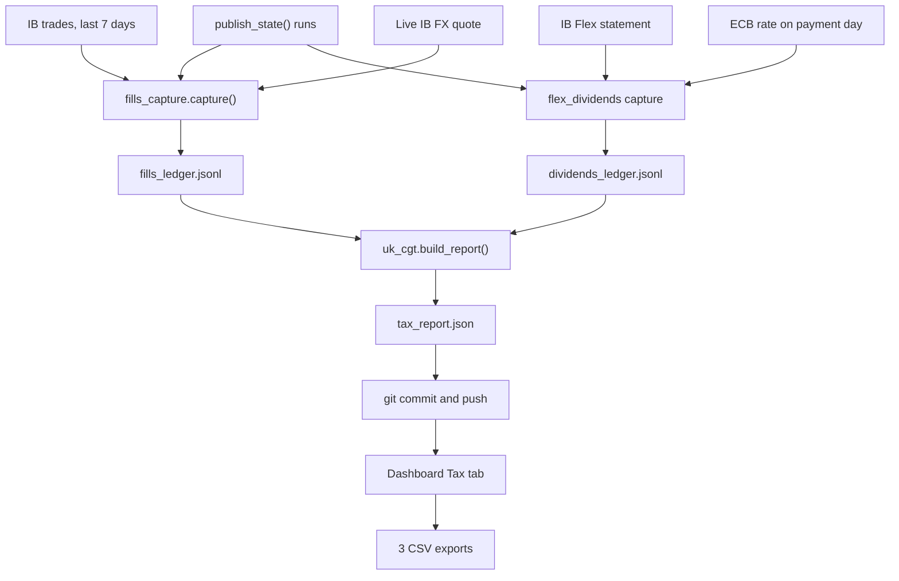

Two ledgers feed one report, which the bot pushes to GitHub for the dashboard to read. Each stage sits in its own `try/except` (error catcher), so a failed fills sweep cannot block the dividend sweep or the report.

### Step 1: capturing fills

A fill (or execution) is one real trade at the broker: some shares at one price. IB can split one order into several fills, as CRL's 8-share sale on 2026-09-11 arrived as 7 + 1. `fills_capture.capture()` calls `reqExecutions()`, which reads the Web API's `/iserver/account/trades?days=7`.

That endpoint often returns an empty list on a session's first call, so `ib_orders.trades()` tries up to 3 times. Each fill becomes one line of `data/fills_ledger.jsonl`. JSON Lines means one self-contained JSON record per text line, so new records are simply appended.

| Field | Meaning | Real example |
| --- | --- | --- |
| `execId` | IB's unique id for the fill | `000295b5.6aa8d41b.01.01` |
| `date`, `ts` | UTC day and minute | `2026-09-15`, `2026-09-15 07:02` |
| `symbol`, `con_id`, `exchange` | ticker, IB contract id, venue | `DBK`, `14121`, `IBIS` |
| `sec_type` | `STK` shares, `CASH` currency conversion | `STK` |
| `side` | `BOT` bought, `SLD` sold | `BOT` |
| `qty`, `price`, `ccy` | shares, price each, trade currency | `46.0`, `33.64`, `EUR` |
| `commission`, `commission_ccy` | broker fee and its currency | `3.0`, `EUR` |
| `gbp_rate`, `gbp_rate_commission` | pounds per 1 unit of `ccy` | `0.856465` |
| `source` | `api`, `estimate` or `manual` | `api` |
| `flags` | warnings about the row | `[]` |
| `order_ref`, `order_id` | who placed the order | only if the backend sends them |

`_append()` reads every `execId` already stored and writes only new ones. This dedupe (dropping duplicates) makes the sweep safe to repeat, because each 7-day window overlaps the previous one.

`order_ref` is IB's echo of the client order id the bot sends, which starts `mps-`. `earmark.bot_pocket` uses it to tell the bot's own HKD conversions from the operator's month-end one. The tax engine ignores it.

Automatic capture began on 23 July 2026. Earlier trades are 16 seeded `source: "estimate"` rows built from IB average cost, flagged `seed`. Three trades placed by hand during the August gateway outage were added in a data commit as `source: "manual"`.

### Step 2: valuing everything in pounds

For fills, `ib_bot.py` passes `fx_rate_live(ib, ccy, "GBP")`. It reads IB's live quote (the midpoint of buy and sell prices) for the pair, its inverse, or a cross through USD. A rate remembered from an earlier run is refused, because it could be days old.

With no live rate, `gbp_rate` is `null` and the row is flagged `rate_missing`. A fill with no currency is booked as USD, flagged `ccy_guessed`, and deliberately given no rate. `uk_cgt.py` treats any row without a `gbp_rate` as unvalued.

The rate is the quote when the sweep runs, not at the minute of the fill. A US fill at 14:30 UTC normally gets the 23:35 run's rate, the same UTC day. The dashboard's phrase "transaction-date rates" is true only in that sense.

Dividends use the ECB (European Central Bank) reference rate for the payment date, from frankfurter.dev with frankfurter.app as backup. Rows whose lookup fails are flagged `rate_missing`, and `_backfill_missing_rates()` retries them on later sweeps.

`repair_fx_ccy.py` was a one-off fix for an early bug. IDEALPRO (IB's currency venue) fills arrive with no currency, so they were guessed as USD. A 10 USD conversion into 1,562 JPY was booked as 1,562 USD, worth £1,155.37.

The script finds each CASH row's quote currency (the pair's second currency) from its conid via `ib_orders.fx_quote_ccy()`. It deletes the wrong rate rather than invent one, adds `rate_missing` and `ccy_repaired`, and writes only with `--apply`. Three ledger rows carry those flags today.

### Step 3: UK share matching

Capital gains tax (CGT) is charged on the profit when you dispose of (sell) an asset. UK law does not let you choose which purchase a sale came from. `uk_cgt.compute()` applies HMRC's identification rules per symbol, in strict order:

| Order | Rule | Sale is matched against | Label |
| --- | --- | --- | --- |
| 1 | Same day | buys of that symbol on the same day | `same_day` |
| 2 | 30-day ("bed and breakfast") | buys in the 30 days after the sale, earliest first | `30_day` |
| 3 | Section 104 pool | all older shares at their average cost | `s104_pool` |

"Bed and breakfast" means selling to book a loss and buying straight back; the 30-day rule matches the sale to the buy-back instead. The Section 104 pool is a running total of shares held and their combined GBP cost.

- Each buy enters at price plus its commission, converted at that buy's own rate.
- The same-day pass runs for every sale before any 30-day pass, a board-review fix from 2026-09-11.
- Fills of one symbol sold on one day merge into one disposal in `_merge_same_day()`.
- A sale under 31 days old gets `provisional_until` (sale date + 31 days), since a buy-back could still change it.
- Selling more shares than the ledger holds creates an `unmatched` slice with unknown cost.

**Worked example (made-up numbers).** ACME trades in USD, with a $1 fee on every trade.

| Date | Trade | GBP per USD | GBP figure |
| --- | --- | --- | --- |
| 2026-05-04 | buy 100 @ $10.00 | 0.80 | cost £800.80 |
| 2026-06-01 | buy 50 @ $14.00 | 0.78 | cost £546.78 |
| 2026-07-10 | sell 120 @ $15.00 | 0.76 | proceeds £1,368.00, fee £0.76 |
| 2026-07-10 | buy 20 @ $15.20 | 0.76 | cost £231.80 |
| 2026-07-25 | buy 30 @ $13.00 | 0.77 | cost £301.07 |

The 120 shares sold match in three slices. Same day: 20 shares costing £231.80. 30-day: 30 shares costing £301.07.

The last 70 come from the pool of 150 shares costing £1,347.58, so 70 × £8.9839 = £628.87. Gain = £1,368.00 − £0.76 − £231.80 − £301.07 − £628.87 = **£205.50**. The pool keeps 80 shares at £718.71, and running these rows through `uk_cgt.compute()` gives exactly these figures.

**Tax years.** `tax_year_of()` starts each year on 6 April, using the fill's UTC date. A sale on 2027-04-05 is in `2026/27`; one on 2027-04-06 is in `2027/28`.

### What tax\_report.json holds

`uk_cgt.build_report()` writes one JSON file with these top-level keys:

| Key | Holds |
| --- | --- |
| `generated`, `coverage_start` | build time; date of the first non-estimate row (`2026-07-23`) |
| `years` | CGT totals per tax year |
| `disposals` | one record per disposal, with `slices` showing each match |
| `open_positions` | what is left in each pool: `qty`, `cost_gbp`, `estimated` |
| `fx_conversions` | CASH rows with a `gbp_value`, for reference only |
| `dividends` | `payments`, `years`, `allowance_gbp`, `undated_rows` |

Flags decide which totals a disposal joins. `basis_quality: "ESTIMATED"` means a seed row or a missing rate touched it. `proceeds_unvalued` sales are in no GBP total, and `cost_unknown` sales count their proceeds but have a `null` gain.

Each year carries two sets of totals. `proceeds_gbp`, `gains_gbp`, `losses_gbp` and `net_gain_gbp` use captured rows only; the `all_*` versions count every valued disposal. The 2026-09-17 09:00 UTC report shows 20 disposals in 2026/27: captured net gain £203.06, best-estimate net loss £1,107.25.

CASH rows never enter matching. Currency gains on cash are outside CGT for individuals since 6 April 2012 (TCGA 1992 s252), so they are only listed.

### Dividends via the Flex query

Dividends arrive as cash credits, not trades, so the fills sweep never sees them. `flex_dividends.py` pulls them from IB's Flex Web Service, which returns a saved report (a "Flex query") as XML.

| Stage | What the code does |
| --- | --- |
| Config | reads `FLEX_TOKEN` and `FLEX_QUERY_ID` from `/root/flex.conf`; without them it silently does nothing |
| Fetch | `fetch_statement()` sends SendRequest, then polls GetStatement up to 6 times, 5 s to 30 s apart |
| Parse | keeps `CashTransaction` rows typed Dividends (`dividend`), Payment In Lieu Of Dividends (`pil`), Withholding Tax (`wht`); skips SUMMARY rows |
| Id | IB `transactionID`, else a content hash; descriptions pass through `ib_web.redact()` to hide the account number |
| Throttle | one successful sweep per day; at least 3,600 s between failed attempts |

The throttle exists because about 144 requests a day once made the Flex service reply "Too many failed attempts". `DIVIDENDS_SETUP.md` says the hourly publish runs this sweep, but in the current code only `publish_state()` does.

Withholding tax is tax the paying country keeps back before paying you. A payment in lieu (PIL) is a substitute payment made while your shares are lent out. `dividends_section()` attaches each withholding row to the nearest same-symbol payment within 10 days (`WHT_MATCH_DAYS`), else keeps it as a `wht_adjustment`.

The gross dividend is the UK-taxable amount; withholding is shown for Foreign Tax Credit Relief, never subtracted. Say a US stock pays $40.00, $12.00 (30%) is withheld, and the rate is 0.74. Gross is £29.60, withheld £8.88, net £20.72, and £29.60 counts against the £500 allowance (`DIVIDEND_ALLOWANCE_GBP`).

The page warns when US withholding tops 20%. A code comment records every 2026/27 US dividend at 30%, double the 15% treaty rate. The page tells the operator to check the W-8BEN form (the US form claiming treaty residence).

### What the Tax tab shows and exports

The dashboard's History view has two chips, Activity and Tax. Tax mode fetches `data/tax_report.json` from the repo's raw GitHub URL, with one chip per tax year. From top to bottom it shows:

- a banner with the coverage start;
- a summary with a bar against the £50,000 SA108 proceeds trigger and a bar against the £3,000 annual exempt amount;
- a status line, "Likely SA108 filing required" when proceeds pass £50,000 or gains before losses pass £3,000;
- one card per disposal, with rule pills, warning pills and a tap-to-open cost breakdown;
- open positions at pool cost, the dividend summary and list, and currency conversions.

SA108 is the capital gains section of the UK tax return. The annual exempt amount is the gain a person may make each year tax-free.

The "Export for accountant (3 CSV files)" button downloads spreadsheet-ready text files:

| File | Contents |
| --- | --- |
| `uk_cgt_disposals_<year>_<yyyymmdd>.csv` | chosen year's disposals: rules, proceeds, rate, fees, cost, gain, basis quality, provisional date |
| `raw_trades_<year>_<yyyymmdd>.csv` | every disposal in the report (all years) as SELL rows, plus open pools as HOLD rows; no buys |
| `uk_dividends_<year>_<yyyymmdd>.csv` | chosen year's payments in local currency and GBP, status `captured` or `AWAITING_FX_RATE` |

### Known limitations

- **Corrected fills.** `uk_cgt.py` reads "later lines win (corrections)", but `_append()` drops any row whose `execId` is already stored. A corrected copy under the same id is lost; one under a new id would count beside the original.
- **Unrated fills stay unrated.** Unlike dividends, nothing re-prices a fill flagged `rate_missing`. It stays out of GBP totals until someone fixes the ledger by hand.
- **Same-ticker pooling.** Matching groups rows by the bare `symbol` text and ignores `con_id` and `exchange`. "SAN" is both Santander (Madrid) and Sanofi (Paris), so their trades would share one pool and one 30-day window.
- **Venue currency map.** Fills carry no currency, so `broker._EXCH_CCY` infers it from the exchange; an unmapped exchange gets a USD guess and no rate. LSE maps to GBP, but London quotes are in pence and the bot skips GBP entries. The code does not say whether London fill prices would also be in pence.
- **Unpushed rows.** The hourly `git reset --hard` can wipe ledger rows not yet pushed. A later sweep restores them only while the fill is inside IB's 7-day window.
- **No corporate actions.** No code handles share splits, mergers or ticker changes.
- **Hard-coded thresholds.** The £500 allowance lives in `uk_cgt.py`; £3,000 and £50,000 live in the page's JavaScript.

### Where it lives in the code

| File | Role |
| --- | --- |
| `execution/fills_capture.py` | fill sweep, dedupe, estimate seeds |
| `execution/broker.py` | `reqExecutions()` shim, `_EXCH_CCY` venue map |
| `execution/ib_bot.py` | `publish_state()` runs the stages; `fx_rate_live()` |
| `execution/uk_cgt.py` | share matching, dividend totals, `data/tax_report.json` |
| `execution/flex_dividends.py` | Flex pull, ECB rates, `data/dividends_ledger.jsonl` |
| `execution/repair_fx_ccy.py` | one-off FX currency repair |
| `execution/test_uk_cgt.py`, `execution/test_dividends.py` | golden tests |
| `docs/index.html` | `renderTaxMode()`, `exportTaxCSV()` |
| `DIVIDENDS_SETUP.md` | one-time Flex setup |

## Operating runbook

Day to day, running this system means reading one Telegram message and glancing at two dashboard tabs. You act only when something is flagged. Everything else runs unattended on the Oracle VM (a rented, always-on Linux computer) and on GitHub, and all times below are UTC.

### The daily routine

Cron (the Linux scheduler) starts the VM's programs. GitHub Actions (GitHub's hosted job runner) builds the signals.

| Time (UTC) | What runs | What you look at |
| --- | --- | --- |
| Hourly at :05 | GitHub Actions rebuilds the signals and redeploys the dashboard | Nothing, unless a build fails |
| Hourly at :25 | VM pulls the latest code, then `publish_web.py` refreshes account data | "synced" time on the Positions tab |
| 23:35 | `ib_bot.py` trading run; normally decides every market | History rows stamped 23:35 |
| 23:40 | `daily_signal.py` sends the Telegram digest | The digest (checklist below) |
| 09:00 | Second trading run; decides US and Japan, defers Europe and Hong Kong | History rows stamped 09:00 |
| Every 10 min | `ib_commands.py` carries out phone commands | Only after you tap a button |
| Every 2 min | `telegram_poll.py` answers `/update` and delivers queued alerts | Any alert |

A market is "deferred" (left for a later run) from its open until 90 minutes after its close. It is also deferred when the newest signal build started before that point. Orders sent at 23:35 wait at IBKR for each market's open: Tokyo 00:00, Hong Kong 01:30, then Europe and the US.

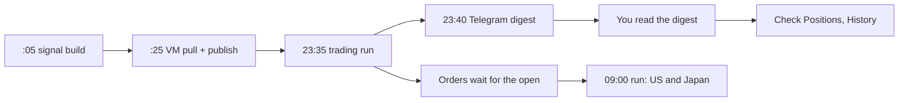

Builds feed the publishes and the runs, and you check the results once a day, after the 23:40 digest.

Daily checklist:

- **Digest "Notes".** "Book: LIVE from IB" means IBKR reads work. "Kill switch: clear" means entries (buys that open positions) are allowed.
- **Digest "Problems".** Each line names a data or connection failure. The tables below explain them.
- **Digest SELL and BUY lists.** They replay the bot's rules offline, so they show what the 23:35 run should have sent. "DECIDED AFTER THE CLOSE" lists names still waiting.
- **Positions tab.** Check for a red "Bot data Nh old" box and for amber warnings in the "HKD — not trading capital" card. Normally there are none.
- **History tab.** The newest rows should have no REJECTED label and no HALT row.

Ignore the digest subtitle "Manual mode — IB gateway down". That text is fixed in the code and appears whatever the connection state. Send `/update` to the Telegram bot for a fresh report at any time. It does not reset the "Since last digest" figure.

### Month-end deposit: convert, earmark, withdraw, clear

The earmark is an amount of HKD that the bot must not treat as trading capital. It is a single number stored in `/root/excluded_cash` on the VM. Every program subtracts it from NetLiq (net liquidation value: what the account would be worth if everything were sold now).

The subtraction is capped at the HKD actually held, not counting HKD the bot can prove it bought itself. It matters twice: each position's budget is NetLiq ÷ 15, and the kill switch stops buying once NetLiq falls 8% below its peak.

1. **Month-end, deposit day.** When the GBP lands, convert it to HKD yourself in IBKR. The bot never sells HKD, but converting into HKD is allowed.
2. **Same day, before the next trading run.** On the Positions tab, type the HKD amount (digits only) into the earmark card and tap **Set**.
3. **Within about 10 minutes.** The page has opened a GitHub issue titled `EARMARK: 20900`. `ib_commands.py` writes the number and republishes, and the card shows "Earmarked — excluded from the pool 20,900".
4. **Start of the month.** Withdraw the HKD in IBKR. The capped exclusion shrinks along with the balance, so NetLiq does not drop.
5. **Same day.** Type 0 and tap **Set** to clear the earmark.

Why same day, and before a run? GBP that has not been converted is ordinary non-HKD cash, and the bot may use it to pay for a US or European buy. A marker set before the conversion excludes almost nothing, because it is capped at the HKD held.

Worked example: NetLiq is HK$215,000, and a GBP 2,000 deposit converts at 10.45 into HK$20,900.

|  | Earmarked the same day | Forgotten |
| --- | --- | --- |
| NetLiq the bot sizes on | 215,000 | 235,900 |
| Budget per position (÷ 15) | 14,333 | 15,727 |
| Kill-switch peak after a run | 215,000 | 235,900 |
| After the withdrawal | 215,000, nothing happens | 215,000 is below 235,900 × 0.92 = 217,028, so buying halts |

The Calendar tab's P&L (profit and loss) subtracts a hand-kept `flows` list in `data/netliq_history.json`. Money earmarked on the day it lands never reaches the day-end NetLiq figure, so it needs no flows entry. A deposit or withdrawal of trading capital does need one, for example `{"d": "2026-10-01", "amt": -20000, "note": "withdrawal"}`.

For that kind of cash movement, also reset the peak (see below). Check the file with `python -m json.tool data/netliq_history.json`, then pull, commit and push.

### Selling by phone

Each bot position on the Positions tab has a **Sell on IB** button. The first tap asks for a GitHub fine-grained token, a password stored only on that device and limited to Issues read/write on this repository.

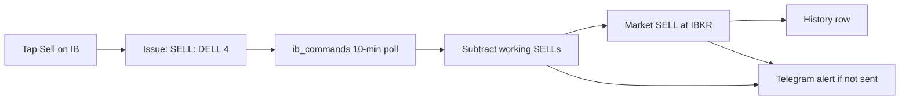

Your tap becomes a GitHub issue, and the VM poller turns it into an order or an alert.

The poller only acts on issues that meet three conditions. The repo owner (`btctree`) opened it, it is under 48 hours old, and its whole title is `SELL: SYM` or `SELL: SYM QTY`. The order is a market order (sell at the best available price), and a closed market holds it until the open.

The quantity is at most the shares held, minus every SELL already working. Example: at 23:35 the bot sent a trailing-stop exit, SELL 4 DELL, which waits for the US open. At 08:00 you tap Sell on DELL. The poll finds 4 shares already on their way out, sends nothing, and Telegram says "PHONE SELL not sent: a sell of 4 DELL is already working".

A sell that IBKR refuses, or that matches no position, is marked done and never retried. Tap again if you still want out.

### What each Telegram alert means

Alerts are first written as files in `/root/alert_outbox`, and the 2-minute poller sends them. A Telegram outage therefore delays alerts but does not lose them.

| Alert starts with | Meaning | What to do |
| --- | --- | --- |
| EXIT REFUSED by IB: SELL 22 XYZ | IBKR refused a bot exit (a sell that closes a position) | Read "IB said". Sell by phone if you want out now |
| XYZ exit still refused - attempt 3 | A later run sent the same exit and it was refused again | Repeated refusals suggest a lasting cause. Sell by hand |
| XYZ: the exit IB accepted at ... did not complete | An accepted exit expired, was cancelled or only partly filled. A new exit was sent | Check History and Positions after the open |
| XYZ: the exit from ... never completed, and its condition has cleared | The exit rule no longer fires. The bot keeps the shares and will not resend | Decide yourself: hold, or sell by phone |
| XYZ exit (...): ... two instruments share one IB symbol | `state.json`'s map points to a different listing than the one held | Compare `state['map']` with the IBKR positions |
| Signals are stale: the newest build started ... | No fresh signal build for over 26 hours | See "A signals build failing" |
| PHONE SELL REFUSED by IB | IBKR refused your order, so nothing was sold | Read "IB said". Tap again if wanted |
| PHONE SELL did nothing: no held position matches | That symbol is not held | Check the symbol |
| PHONE SELL not sent: a sell of ... is already working | Working SELL orders already cover the holding | Tap again only if that order ends unfilled |
| PHONE SELL waiting: ... | IBKR positions or orders could not be read. Retried every 10 min for up to 48 h | If it persists, see the OAuth section |
| Phone command did not complete | The poll crashed, often on an IBKR session error. Retried every 10 min for up to 48 h | Same as above |

### Other warning signs

| Where | What you see | Meaning | What to do |
| --- | --- | --- | --- |
| Positions tab | Red "Bot data 3h old" | No account data published for over 2 hours | Usually an IBKR session or VM problem. See the OAuth section |
| History tab | `HALT ENTRIES` row | The kill switch tripped. Exits still run | See the kill-switch section |
| History tab | REJECTED | IBKR refused the order when it was sent | See "A REJECTED row" |
| History tab | NOT FILLED on a currency row | IBKR accepted the conversion but did not fill it, so the buy it was paying for was skipped | Nothing. The next run checks again |
| IBKR app | Order "PreSubmitted" | The order is waiting for a closed market to open | Expected. There is deliberately no holiday calendar |
| Digest Problems | "IB read failed (...) - falling back" | The digest could not read IBKR | See the OAuth section |
| Digest Problems | "HK entries are switched off" | `HK_ENABLED` is 0 for that process. The live VM sets 1 since 2026-09-12, so this line means the schedule lost the setting | Check `sudo crontab -l` for `HK_ENABLED=1` |
| bot.log | "LSE prices are in pence and not scaled yet" | London (GBP) buys are skipped for now | None |
| bot.log | "skip X: IB could not qualify" | No listing on that exact exchange. The bot never guesses another one | None. CHF, DKK, SEK and NOK names always stop here |
| bot.log | "!! run aborted (...)" | The run crashed, but `state.json` was saved first | Read the error. The next run carries on |

### Reaching the VM and reading bot.log

The VM's SSH key (the file that unlocks an encrypted remote login) is `~/mp_vm_key` in Oracle Cloud Shell. Cloud Shell is the browser terminal in the Oracle Cloud console. The key is not on the desktop.

Send each command as a single `ssh` line from Cloud Shell. Pasting into an open VM session garbles the text.

```bash
ssh -i ~/mp_vm_key opc@<vm-ip> 'sudo tail -n 150 /root/bot.log'
ssh -i ~/mp_vm_key opc@<vm-ip> 'sudo grep -nE "KILL-SWITCH|REJECTED|run aborted|Traceback" /root/bot.log | tail -n 40'
ssh -i ~/mp_vm_key opc@<vm-ip> 'sudo crontab -l'
```

You need `sudo` (run as administrator) because the jobs run as root and the OAuth keys are in `/root/oauth/`. `/root/bot.log` is the log path used by the repo's cron scripts. `sudo crontab -l` shows the live schedule and log paths, whereas the repo's `crontab.reference` is marked stale.

A healthy 23:35 run looks roughly like this (made-up values):

```text
[bot] signals 2026-09-17: 9 BUY candidates
[bot] connected via IBKR Web API (OAuth) — LIVE account
[bot] NetLiq 215000 HKD | 13 positions | target/pos ~14333
[bot] EXIT DELL: trailing stop 118.40
[bot] SELL 4 DELL @ MKT-open (USD)
[bot]   bot state published to dashboard
[bot] done.
```

### Kill switch tripped: resetting `_peak_netliq`

The kill switch blocks new buys when NetLiq is more than 8% (`DAILY_LOSS_KILL=0.08`) below the highest NetLiq any trading run has seen. Exits still run. There are three kinds: regime break (a close below the 200-day average), trailing stop (a sell level that rises with the price) and a time stop after 60 weekdays.

You will see `KILL-SWITCH: ... ENTRIES BLOCKED` in bot.log, a `HALT ENTRIES` row in History, and "Kill switch: ACTIVE" in the digest.

The peak does not account for deposits or withdrawals, so find the cause first. If a withdrawal of trading capital tripped it, reset straight away. After a real loss the pause is intentional, so reset only once you have decided to take risk again.

Example: a peak of 230,000 sets the trip level at 211,600. You withdraw HK$20,000 of trading capital, NetLiq reads 210,000, and buying halts. Setting `_peak_netliq` to 210,000 moves the trip level to 193,200.

Make sure no run is active first. A run saves its own copy of `state.json` when it ends, which would overwrite your edit.

```bash
ssh -i ~/mp_vm_key opc@<vm-ip> 'pgrep -fa "[i]b_bot.py"'    # prints nothing when idle
ssh -i ~/mp_vm_key opc@<vm-ip> 'sudo python3' <<'EOF'
import json, shutil
from pathlib import Path
p = Path("/root/multi-product-signals/execution/state.json")
shutil.copy(p, str(p) + ".bak")
s = json.loads(p.read_text())
print("old peak:", s.get("_peak_netliq"))
s["_peak_netliq"] = 210000
p.write_text(json.dumps(s, indent=1))
print("new peak:", s["_peak_netliq"])
EOF
```

For the new value, use the post-withdrawal net worth from the Positions tab or the last `NetLiq ... HKD` log line. Git ignores `state.json`, so the hourly `git reset --hard` leaves your edit in place. Buying resumes at the next run.

### IBKR OAuth session trouble

The bot talks to IBKR's Web API using OAuth 1.0a. The VM signs every request with private keys stored in `/root/oauth/`, so no password or phone approval is involved. Placing orders also needs a brokerage session (IBKR's trading connection), which the code opens through `ssodh/init`.

The code already retries opening a session 4 times, 3 seconds apart. If the session drops while an order is being sent, it reopens it once.

Signs of a failure:

- bot.log stops after the `signals ...` line with `could not establish a brokerage session` or `OAuth handshake failed`. No order was sent and `state.json` was not touched.
- The Positions tab shows "Bot data Nh old" once 2 hours pass without a publish.
- The digest shows "IB read failed" and "Quantities from bot\_state ... later fills NOT visible".
- Phone taps produce "Phone command did not complete".

What to do:

1. Wait for the next :25 publish. The code notes that IBKR "fairly often" returns a temporary 500 error when a session starts. If the red box clears, you are done.
2. Test a plain read: `ssh -i ~/mp_vm_key opc@<vm-ip> 'sudo env IB_BACKEND=web python3.11 /root/multi-product-signals/execution/ib_web.py'`. It prints NetLiq, cash, positions and the unmasked account number, so keep the output private.
3. If reads work but session start fails with `410`, another process is holding the session. This has happened before: `ib_commands.py` republished on almost every poll, making 126 to 143 state commits a day instead of under 40.
4. If `OAuth handshake failed` continues for hours, the keys or the IBKR consumer key need attention. The repo records no expiry date and no renewal steps for them, so that fix lies outside the code.
5. A missed run costs one run, because the next run re-checks every rule. To act sooner, run `--dry` first, then a live run by hand with `ssh -t` and the same command as step 2, but with `ib_bot.py` in place of `ib_web.py`. Unless you set `CONFIRM_FIRST=0`, every order asks `[y/N]` first.

The scripts in `execution/vm_ops/` (gateway watchdog, weekly 2FA re-login) belong to the old IB Gateway socket connection. So do the Gateway setup steps in `execution/README.md`. That connection stopped working on 2026-08-24, when IBKR forced passkey 2FA (two-factor login).

### A signals build failing

The dashboard and the bot both read signals from GitHub Pages (GitHub's free web hosting). When the "Signals + dashboard (hourly)" workflow fails, Pages keeps serving the last good build and nothing crashes. The bot then defers every market whose last close + 90 minutes came after that build's `generated_at`, the moment its price download started.

For a deferred market there are no exits, no stop updates and no buys, and bot.log says `deferred to a fresh build`. Deferring Japan from 09:00 to 23:35 is routine and raises no alert. The "Signals are stale" alert only fires when the newest build is over 26 hours old, and at most once per UTC day.

1. Open `https://btctree.github.io/multi-product-signals/data.json` and read `generated_at`. The dashboard header only shows a date.
2. On GitHub, open **Actions**, then the red run, then its failing step (for example "Download prices" or "Build dashboard").
3. Start a new build with **Run workflow**. A manual run also refreshes the product list, and it cancels any run still in progress.
4. If the cause is a code bug, fix it using the deploy steps below.

### A REJECTED row

REJECTED means IBKR refused the order at the moment it was sent. The bot reads IBKR's answer about 3 seconds after sending and never updates the label afterwards. The row shows "IB said: ..." with the account number masked as `U***`.

Some refusals are handled automatically. A price-step refusal (IBKR Error 110) is re-sent at IBKR's stated step or a coarser one, up to 6 attempts in total. Euro limit prices now start on the MiFID II RTS 11 minimum price step, the finest step EU rules allow. IBKR order warnings that are not on the code's allow-list are declined, and those orders also show as REJECTED.

| Row type | What happens next | Your action |
| --- | --- | --- |
| BUY | Nothing this run. The next run re-reads the signal | None, unless the same refusal repeats |
| SELL, bot exit | Telegram alert. Re-sent at the next run only if the exit rule still fires | Check the position, and sell by phone if needed |
| SELL, "sell button (your phone)" | Marked done and never retried | Tap again if you still want to sell |
| FX conversion | The bot tries the next currency balance, otherwise skips the buy. No money moved | None |

### A stale earmark warning

The earmark card shows an amber warning in two cases:

- **"Your marker is 20,900 but only 12 HKD is here."** Either the deposit has already left, so send 0, or the GBP has not been converted yet, which is expected. While the bot's own HKD cannot be confirmed from its stamped fills, the marker also hides any HKD the bot buys for a Hong Kong order, so clear it promptly.
- **"5,000 HKD is NOT earmarked, so the bot is sizing positions against it."** At least 1,000 HKD is not marked. If it is only passing through, earmark it.

bot.log shows the same problem as `earmarked cash marker is ... Either the money has left (clear the marker) or it has not converted yet`. The usual fix is **Set** with 0 on the dashboard. From Cloud Shell, `ssh -i ~/mp_vm_key opc@<vm-ip> 'echo 0 | sudo tee /root/excluded_cash'` writes the file directly.

### Previewing a run with `--dry`

A dry run goes through the whole decision process and prints every order it would send, but sends nothing. It also writes nothing: no `state.json`, no dashboard commit, no contract-ID cache, no remembered FX rate, no alert. Any currency conversion it needs is logged and assumed to have filled, so the preview can carry on.

```bash
ssh -i ~/mp_vm_key opc@<vm-ip> 'sudo env IB_BACKEND=web python3.11 /root/multi-product-signals/execution/ib_bot.py --dry'
```

Example output for a euro buy (made-up values):

```text
[bot]   funding EUR from USD: converting ~1,875 USD for ~1,602 EUR (shortfall 1,571 x 1.02)
[bot]   FX BUY 1602 EUR.USD (USD->EUR)
[bot] BUY 46 DBK @ ~34.32 (EUR)
[bot] --dry: state.json NOT written, nothing published — this run changed no file and pushed no commit
```

How to read it: 46 Deutsche Bank shares need 1,571 more euros, so the bot converts that shortfall plus 2% from USD. A buy priced in HKD would add 3% instead (`BASE_FUND_BUFFER=1.03`) and would never pay with HKD. In a live run, the stock order is only sent after the conversion has filled.

Avoid running it during a trading run or at :25, because competing brokerage sessions have caused `410` failures. `--publish-only --dry` deliberately does nothing.

### Running tests safely

On the desktop, run this from `execution/` in Git Bash:

```bash
PYTHONIOENCODING=utf-8 IB_BACKEND=web python run_all_tests.py
```

It runs 25 test suites: 24 in `execution/` plus `engine/test_data_fetch.py`, each in its own Python process. A guard blocks and fails any file access under `/root`, where the VM keeps its live files, and a self-check first proves the guard works. Success ends with `ALL 25 SUITES PASS, none touched /root or left a /root default loaded`. The runner finds suites by globbing both folders, so that number goes up on its own whenever a suite is added - match it against what the run prints, not against this page.

On the VM, never run the tests inside `/root/multi-product-signals`: the test runner refuses and exits with code 2. Instead, test a clean copy as root:

```bash
rm -rf /tmp/mps-test && mkdir -p /tmp/mps-test && git -C /root/multi-product-signals archive HEAD | tar -x -C /tmp/mps-test && cd /tmp/mps-test && PYTHONIOENCODING=utf-8 IB_BACKEND=web python3.11 execution/run_all_tests.py
```

The engine suite also needs pandas and numpy for python3.11, which the VM does not have installed. Without them, treat the desktop run as the gate.

### Deploying a code change

Pushing to `main` is deploying. The :25 job runs `git reset --hard` to make the VM's copy match GitHub, which also wipes any uncommitted edit to a tracked file on the VM.

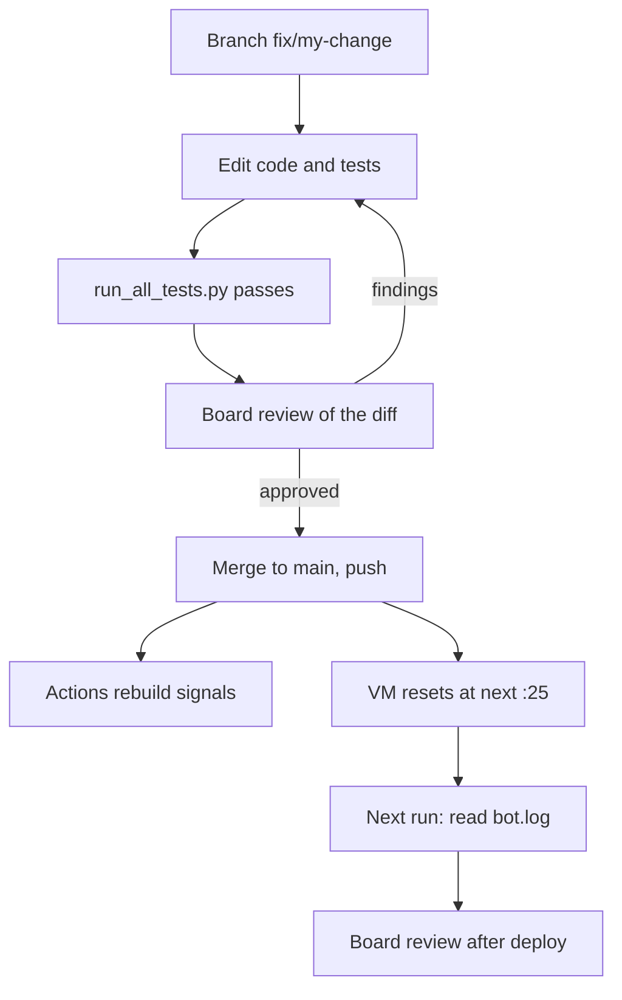

A change can only reach real money after passing the tests and a review, and it is reviewed again after its first live run.

1. **Branch.** `git checkout -b fix/my-change` creates a branch (a separate line of commits). Recent examples: `fix/eu-tick-bands`, merged through `integration/review-2026-09-17`.
2. **Test.** Run the suites until all 23 pass.
3. **Board review.** A multi-agent review board reads the diff. Each finding is either fixed or explicitly declined by the operator. The repo contains no script for this step.
4. **Merge and push.** `git checkout main && git pull && git merge --no-ff fix/my-change && git push`. Pull first, because the VM pushes a state commit every hour.
5. **Watch the build.** Your push starts the signals workflow. The bot's own commits contain `[skip ci]`, so they do not start it.
6. **Watch the :25 pull.** `ssh -i ~/mp_vm_key opc@<vm-ip> 'sudo git -C /root/multi-product-signals log --oneline -3'` should show your merge, usually just below a new "bot: state update (web api)" commit.
7. **Watch the next run.** bot.log should say "connected via IBKR Web API (OAuth) — LIVE account", contain no `run aborted`, and end with `done.`. Then the board reviews the deployed result.

To undo a change, run `git revert -m 1 <merge-commit>` and push, and the VM picks it up at the next :25. Behaviour switches such as `MAX_HOLD_BARS=0` are not in the code. They are environment variables set on every crontab line that runs `ib_bot.py`.

### Where it lives in the code

| File | Role in this runbook |
| --- | --- |
| `execution/ib_bot.py` | Trading runs, kill switch, `--dry`, exit alerts, saving `state.json` when a run aborts |
| `execution/ib_commands.py` | Phone SELL and EARMARK commands |
| `execution/earmark.py` | Earmark cap and the bot's own HKD |
| `execution/alerts.py`, `execution/telegram_poll.py` | Alert queue, Telegram delivery, `/update` |
| `execution/daily_signal.py` | 23:40 digest |
| `execution/publish_web.py` | Hourly dashboard publish |
| `execution/market_clock.py` | Close + 90 min rule and build-freshness check |
| `execution/ib_web.py`, `execution/ib_orders.py`, `execution/broker.py` | OAuth reads, brokerage session, orders |
| `execution/run_all_tests.py`, `execution/testenv.py` | Test runner with the `/root` guard |
| `docs/index.html` | Dashboard warnings, Sell and Set buttons |
| `.github/workflows/daily.yml` | Hourly signal build |
| `execution/README.md` | Kill-switch reset, flows, test commands |

## Build your own system

You can build a system like this one in thirteen steps. Each step has a cheap first version, and each comes with a lesson this system learned the hard way. Build the steps in order, try everything with fake money first, and turn every mistake into a written rule plus a test.

The sections named below cover each part of this system in full. This section is the path through them.

### The roadmap

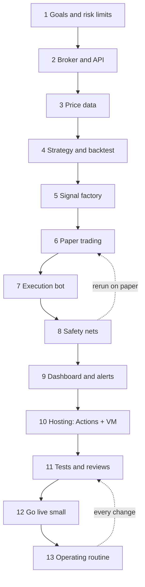

Work down the chain. The dotted lines show two loops: the bot and its safety nets go back to paper trading, and every later change goes back through tests and review.

### Step 1: Goals, markets and risk limits

Write down what you want and what you refuse to lose before you write any code. A risk limit is a hard number the system must never cross. Drawdown means the fall from the account's highest value.

Minimum version: a one-page list of limits. Here are this system's limits:

| Limit | Value here | Where it is set |
| --- | --- | --- |
| Worst backtest drawdown allowed | 30% | `MAX_DRAWDOWN = 0.30` in `engine/config.py` |
| Positions held at once | 15 | `TARGET_POSITIONS` |
| Largest single entry | HK$20,000 | `MAX_ORDER_BASE` |
| Stop new buys after a fall from peak | 8% | `DAILY_LOSS_KILL` |
| Short selling (betting on falls) | never | `LONG_ONLY = True` |
| Money the bot may never spend or sell | all HKD | three separate functions in `execution/ib_bot.py` |

Lessons from this system:

- **Goals drift unless you make them binding.** The win-rate goal started at 70%. It was lowered to 68%, then 60%, then quietly dropped, and product D ships at 52.5% (`SYSTEMS_OVERFIT_REVIEW.md`).
- **Name the money that is off-limits.** HKD is the operator's monthly transfer money, so "never sell HKD" is enforced in three places. The month-end deposit is earmarked (left out of the account value) the same day, as "Trading logic: slots, sizing and protection" explains.
- **A narrow start is fine.** Even now, London, Swiss and Nordic stocks are not bought, and the README says the live bot has never traded crypto.

Checklist:

- [ ] Target return and maximum drawdown written down
- [ ] Position count, per-position cap and kill-switch level chosen
- [ ] Markets and currencies listed, including the ones you skip
- [ ] Money the system may never touch named

### Step 2: Choose a broker and API

A broker holds your account and sends your orders to exchanges. An API (application programming interface) is the set of calls a program uses to read the account and place orders. Choose one that can log in with nobody present and that offers a paper account (a practice account with fake money).

Minimum version: a script that only reads cash, positions and NetLiq (net liquidation value: what the account is worth if everything were sold now). `execution/ib_web.py` is exactly that. It is read-only on purpose, and order placement lives in a separate file, `ib_orders.py`.

Lessons from this system:

- **An unattended login matters most.** The first build used IB Gateway, a desktop program that needed a phone approval every week. IBKR forced passkey 2FA on 2026-08-24, the Gateway could not log in, and the fix only arrived when an OAuth key went live on 2026-08-28.
- **OAuth avoids login screens altogether.** The VM signs each request with key files in `/root/oauth/`, so a future 2FA change cannot lock it out.
- **Every API has quirks that cost money once.** A refusal without an `order_id` was recorded as "sent" for two BAYN buys on 2026-09-13/14. Orders routed straight to one exchange were refused (Error 10311 on SBF), so stocks now use SMART routing, where IBKR picks the venue.

Checklist:

- [ ] Login works with no human and no phone approval
- [ ] Paper account available
- [ ] Read-only code kept separate from order code
- [ ] Refusal, partial fill and "accepted but waiting" responses tested by hand

### Step 3: Get data

A daily bar is one day's open, high, low, close and volume. This system downloads free bars from Yahoo Finance with the `yfinance` library (`engine/data_fetch.py`). Minimum version: download bars, drop empty or zero closes, cache them to CSV, and stamp every output with the time the download started (`generated_at`).

Lessons from this system:

- **The newest bar can be missing.** On 2026-08-31 Yahoo left Tokyo's close empty. The engine read 5301.T at 1,681.5 instead of 1,811.0, and that fake fall caused a false trailing-stop exit. `_fill_last_close()` now repairs only the newest row, and only with proof that the exchange traded.
- **Mixed calendars invent flat days.** `yfinance` lines up a batch on every date any member traded. US stocks batched with Tokyo names got zero-range bars, which cut ATR (typical daily move) by 1/14, or 7.1%, and tightened stops. Batches now never mix trading calendars.
- **Check the units.** London prices are in pence, not pounds. BP.L at 539.7 pence sized to 2 shares, about HK$114 against a HK$14,274 budget, so GBP entries are skipped for now.
- **Beware survivorship bias.** A universe built from today's index members leaves out companies that failed. The dashboard warns that the backtest figures carry this bias.

Checklist:

- [ ] Bars cleaned, cached and stamped with a download-start time
- [ ] Missing and zero prices handled on purpose
- [ ] Price units checked per exchange (pence, lots, currency)
- [ ] Product list's history and bias written down

### Step 4: Design and backtest a simple strategy

A backtest replays your rules over past prices to see how they would have done. Start with one idea and few settings. This system buys a sharp dip inside an uptrend, as "How signals are designed" describes.

Minimum version: decide on a day's close, fill at the next day's open, and charge costs on every buy and sell. Report CAGR (compound annual growth rate), maximum drawdown and win rate. `engine/engine_rr.py` follows exactly these rules.

Three traps ruin backtests:

| Trap | What it is | Defence in this repo |
| --- | --- | --- |
| Look-ahead bias | Using data the rule could not have known yet | `indicators.py` uses past data only; fills happen at the next open |
| Ignoring costs | Commission, spread and stamp duty left out | `COST_BP`: US 0.10%, HK 0.25%, Japan and EU 0.15%, crypto 0.20% per side |
| Overfitting | Tuning settings until they fit the past by luck | Delay test and split-period checks in `SYSTEMS_OVERFIT_REVIEW.md` |

Worked example with made-up numbers: a rule earns +0.6% per trade before costs. In the US, a buy and a sell cost 2 × 0.10% = 0.20%, leaving +0.40%. In Hong Kong they cost 2 × 0.25% = 0.50%, leaving only +0.10%, so most of the edge is gone. That is why a BUY here also needs ATR above 1.2% of the price (`min_atr_pct`).

Lessons from the 2026-07-14 overfit review:

- **Many tries inflate results.** At least 170 to 220 configurations were tested on the same visible years, and the live configuration changed 6 times in 9 days.
- **Returns decayed out of sample.** The rules made 37.8% a year in 2015-20 but 23.7% a year in 2021-26. With an older product list, D made 21.3% a year, and the review expected 15 to 22% a year live.
- **Some checks did pass.** Acting two days late (the T+2 delay test) cut CAGR by only 0.4 percentage points, so the edge is not a timing artefact.
- **Simpler often wins.** A richer composite score cut backtest CAGR from 26.7% to 5.1% and was rejected (see "Conditions and selection").

Checklist:

- [ ] Main metric and pass rules fixed before testing
- [ ] An untouched test period kept aside
- [ ] Next-open fills and per-side costs in every run
- [ ] Delay test run, with honest discounted figures published next to the headline

### Step 5: The signal factory

The signal factory runs your strategy on fresh data on a schedule and publishes the results as files. Here GitHub Actions (GitHub's hosted job runner) builds at :05 every hour. It publishes `docs/data.json` and one card per product to GitHub Pages.

Minimum version: one scheduled job that writes one JSON file (structured text data). The file lists BUY symbols with price, stop and a `generated_at` stamp. "How signals are designed" and "Platform part 1: GitHub" show the full build.

Lessons from this system:

- **Keep the factory and the bot apart.** They meet only through published files, so a failed build makes the bot wait instead of crash.
- **Schedules are not promises.** On 12 of 14 weekdays from 08-28 to 09-14, the newest build the 09:00 run saw was from about 04:45 UTC. On 15 and 16 September it read cards built 35 minutes into Europe's session.
- **Stamp and check freshness.** `market_clock.py` now decides a market only after its close plus 90 minutes, and only on a build that started after that.

Checklist:

- [ ] Every published file carries a download-start stamp
- [ ] The consumer rejects data built before the market settled
- [ ] Dashboard, digest and bot all read the same files
- [ ] A failed build leaves the last good files in place

### Step 6: Paper trading

Paper trading runs the whole chain against a practice account, so orders are real in form but the money is fake. A dry run is lighter: the bot computes and prints every order but sends and writes nothing (`ib_bot.py --dry`). Minimum version: start with safe defaults and watch the paper orders for days.

The original bot defaulted to the Gateway's paper port 4002 and `CONFIRM_FIRST=1`, which waits for Enter before each order. `execution/README.md` says to watch it "for a few days against paper" and to compare orders with the dashboard. The repo does not record how long the bot actually ran on paper before going live.

Lessons from this system:

- **Paper finds the big bugs.** The bot was added on 2026-07-12. On 2026-07-14 a commit labelled "CRITICAL sizing fix" stopped USD buys being sized 7.8 times too large.
- **"Accepted" is not "filled".** At 23:35 UTC on 2026-09-04, already Saturday in Japan, three conversions and a Tokyo buy were recorded "ok". None of them filled.
- **Reconcile live against the backtest.** The review found no tool comparing live fills with simulated ones and said to build one before scaling. None exists in the code at dc1e520.

Checklist:

- [ ] Every paper order matched to its signal by hand
- [ ] A weekend and a market holiday included in the test
- [ ] Filled and merely accepted orders told apart
- [ ] Paper fills compared with the backtest's assumed fills

### Step 7: The execution bot

The bot reads signals and the account, sells exits first, buys entries, then saves its memory. The memory is a state file (`execution/state.json`) holding each position's entry, high-water mark, stop and entry date. See "How a trade actually happens" and "Currencies and funding".

Minimum version, with this system's rules:

| Piece | Rule here |
| --- | --- |
| Free slots | 15 − positions held − working buy orders |
| Budget per entry | min(NetLiq ÷ 15, HK$20,000) |
| Share count | Rounded down to a board lot (the minimum trading unit) |
| Buy order | Limit order (price cap) at signal price × 1.005, snapped to a legal tick (price step) |
| Exit order | Market order (best price available), filling at the next open |
| Funding | Convert only the shortfall × 1.03 for HKD, × 1.02 for others, never selling HKD |
| Timing | Decide a market only after its close + 90 min, on a fresh build |

Lessons from this system:

- **Count working orders as used slots.** On 2026-07-31 a 23:35 buy was still waiting at 09:00, and the bot tried to open a 16th position. Only IBKR's rejection stopped it.
- **Fund only orders you will place.** On 2026-09-04 three Tokyo names each converted about US$1,847, and only one became an order. A conversion must also fill before the stock order is sized on it.
- **A broker's number can mislead.** IBKR reported a size step of 100 for US stocks. Read as a board lot, a 20-share DXCM buy became 20 // 100 × 100 = 0.
- **Look up the exact listing.** SAN.MC (Santander, Madrid) once matched Sanofi in Paris. A review reproduced a roughly €9,900 order against €1,566 of funding.
- **Plan for closed currency markets.** IBKR quotes no exchange rates from Friday evening to Sunday evening, so weekend runs skipped every non-HKD entry. A remembered rate up to 96 hours old may now size an order but never convert money.
- **Save state even when crashing.** A holding missing from `state.json` gets no exits, so `_save_state_on_abort()` saves it before the error is raised again.
- **Know where the bot differs from the backtest.** The backtest splits slots 13 stocks and 2 crypto, but the live bot runs one pool of 15.

Checklist:

- [ ] Exits run before entries
- [ ] Working orders reserve both a slot and their cash
- [ ] Lots, ticks and exact venues checked per market
- [ ] State saved on success and on crash

### Step 8: Safety nets

A safety net either blocks a bad action or makes a failure loud. Minimum version: a dry-run flag that writes nothing, hard caps, and a kill switch on new entries. Guard untouchable money in more than one place, and alert on refused orders. "Safety nets" lists all of this system's guards.

Worked example: the stored peak is HK$230,000, so the trip level is 230,000 × 0.92 = HK$211,600. A run that sees HK$210,000 blocks new buys, but still runs every exit.

Lessons from this system:

- **A kill switch must never block exits.** On 2026-08-03 to 08-06 a withdrawal left NetLiq 11% below the old peak. The old code stopped before the exit loop, so every run froze silently for four days.
- **Bookkeeping can fool a cap.** On 2026-08-31 an HK$18,559 earmark outlived its withdrawal. NetLiq read 191,875 instead of 210,434, and the kill switch tripped on a loss that never happened.
- **A public repo leaks.** Nine published rows from 2026-09-01 to 09-03 carried the live account number. Account ids are now masked as `U***` on every write.

Checklist:

- [ ] `--dry` proven to change no file
- [ ] Kill switch gates entries only
- [ ] Untouchable money guarded in at least two places
- [ ] Secrets and account ids kept out of anything published

### Step 9: Dashboard and alerts

A dashboard shows the account; an alert interrupts you. Here the dashboard is one static page, `docs/index.html`, reading published JSON, and Telegram carries a 23:40 UTC digest plus alerts. Minimum version: a page with a "data is stale" banner, one daily message, and an alert for every refused order.

Lessons from this system:

- **A row nobody reads is not an alert.** BEN's exit was refused five times over about 35 hours, from 2026-09-01 23:35 to 09-03 10:54. It showed only as a REJECTED dashboard row until a manual rerun.
- **Never send messages from inside a trading run.** A Telegram call can hang for 30 seconds, and IBKR's error text contains HTML that breaks formatted messages. The bot drops alert files in a spool (a folder used as a queue), and `telegram_poll.py` sends them every 2 minutes.
- **Phone commands need guards.** A phone SELL acts only for the repo owner and within 48 hours. It subtracts sells already working, so one tap cannot sell the same shares twice.

Checklist:

- [ ] Stale-data banner on the page (here: over 2 hours old)
- [ ] Alerts for refused, unfinished and lapsed exits
- [ ] Message delivery separated from trading
- [ ] Commands limited to the owner, time-limited, and recorded as done

### Step 10: Hosting

Split the work across two hosts. GitHub Actions builds signals for free and never touches the broker. A small always-on VM (virtual machine: a rented slice of a cloud server) runs everything that does, started by cron (the Linux scheduler).

This system uses Oracle's Always Free `VM.Standard.E2.1.Micro`, with 1 GB of memory and 4 GB of swap added by `setup_vm.sh`. Every hour at :25, `git reset --hard origin/main` deploys the newest code. Minimum version: one cron line per program, logs written to files, and secrets readable only by root.

Lessons from this system:

- **Put the real schedule in version control.** The live crontab is not in the repo, and `crontab.reference` is marked stale.
- **A hard reset wipes local edits.** State lives in git-ignored files, and `earmark.py` notes that ledger rows the VM failed to push are lost.
- **Choose run times from market clocks.** The 23:35 UTC run can decide every market, while 09:00 UTC decides only the US and Japan.

Checklist:

- [ ] Broker keys only on the VM, file mode 600
- [ ] Crontab copy committed and kept current
- [ ] State files survive deploys
- [ ] Run times checked against each market's close + 90 minutes

"Platform part 2: the Oracle VM" covers the files and jobs in detail.

### Step 11: Tests and reviews

A golden test replays a real failure against a fake broker and checks the fixed behaviour. Minimum version: one test for every rule that can lose money, run before every deploy. Here `execution/run_all_tests.py` runs 25 suites and ends with `ALL N SUITES PASS`.

Every change is also reviewed by a multi-agent "board", before deploy and again after. Each finding becomes a test. The dc1e520 merge commit lists the approved findings by letter.

Lessons from this system:

- **Tests can damage production.** The board found that `test_bot_pocket.py`, run as root on the VM, would have erased every owed-exit record. The runner now blocks any `/root` access, and VM tests run from a clean copy in `/tmp`.
- **One bug can hide another.** The pence problem stayed invisible while `lot_size` wrongly returned 100, because 2 // 100 × 100 is 0.
- **Reviews pay off early.** The board predicted the withdrawal flaw in the kill switch on 2026-08-01, two days before it froze the bot.

Checklist:

- [ ] A golden test for every incident
- [ ] Tests isolated from live files
- [ ] Each dry-run test paired with a live control
- [ ] Review before merge and after the first live run

### Step 12: Going live small

Going live small means real money, small caps and one market at a time. This system's switches support that. `CONFIRM_FIRST=1` asks before each order, and `MAX_ORDER_BASE` caps each entry. `HK_ENABLED=0` kept Hong Kong off until its lot and tick rules were coded, and it was switched on on 2026-09-12.

Worked example with made-up prices: NetLiq is HK$215,000, so the normal budget is HK$14,333. With `MAX_ORDER_BASE=3000`, 15 full positions use about HK$45,000, 21% of the account. A US$120 stock at 7.80 HKD per USD gets int(3,000 ÷ 7.80 ÷ 120) = 3 shares.

A US$450 stock gets 0 shares and is skipped. A ¥2,480 Tokyo stock needs 100 shares, about HK$13,000, so small caps also shut out Japan. Choose the cap knowing which markets it excludes.

Lessons from this system:

- **Log fills from day one.** Automatic fill capture only began on 23 July 2026, so earlier trades exist only as estimates in the tax ledger ("UK tax pipeline").
- **Park what you cannot yet do safely.** London (pence) and Swiss and Nordic currencies stay off, and Hong Kong stayed off until HKEX's own lot and tick tables were in the code, rather than trading on guesses.
- **Write down deliberate simplifications.** There is no holiday calendar by choice: an order sent into a closed market simply waits.

Checklist:

- [ ] Per-entry cap set low and its excluded markets noted
- [ ] One market enabled first
- [ ] Every live run previewed with `--dry` for the first weeks
- [ ] Fills, fees and FX rates logged from the first trade

### Step 13: The operating routine

A live system needs a short, fixed routine. "Operating runbook" gives the full commands, and this table shows the core.

| When (UTC) | Task | Incident behind it |
| --- | --- | --- |
| Daily after 23:40 | Read the digest, History and the Positions stale banner | BEN's exit refused unnoticed |
| Month-end deposit day | Convert GBP to HKD and set the earmark before the next run | Unmarked money inflates position budgets |
| Start of month | Withdraw, then set the earmark to 0 | 2026-08-31 stale earmark tripped the kill switch |
| After moving trading capital | Reset `_peak_netliq`, add a `flows` entry | 2026-08-03 withdrawal froze the bot |
| Every code change | Branch, tests, board review, merge, then read the next run's log | Each fix above |

Checklist:

- [ ] Daily check done and anything flagged acted on
- [ ] Cash movements follow the written procedure
- [ ] Deploys only through tests and review
- [ ] Every new incident becomes a rule, a test and a runbook line

### Where it lives in the code

| Step | Files to study |
| --- | --- |
| 1 Goals and limits | `engine/config.py`, settings at the top of `execution/ib_bot.py`, `SYSTEMS_OVERFIT_REVIEW.md` |
| 2 Broker and API | `execution/ib_web.py`, `execution/ib_orders.py`, `execution/broker.py` |
| 3 Data | `engine/data_fetch.py`, `engine/universe.py` |
| 4 Strategy and backtest | `engine/indicators.py`, `engine/production.py`, `engine/engine_rr.py`, `data/revalidation.json` |
| 5 Signal factory | `engine/build_dashboard.py`, `.github/workflows/daily.yml`, `execution/market_clock.py` |
| 6 Paper trading | `execution/README.md`, `--dry` and `CONFIRM_FIRST` in `execution/ib_bot.py` |
| 7 Execution bot | `execution/ib_bot.py`, `execution/contracts.py`, `execution/earmark.py` |
| 8 Safety nets | `execution/ib_bot.py` (`run`, `_save_state_on_abort`), `execution/ib_web.py` (`redact`) |
| 9 Dashboard and alerts | `docs/index.html`, `execution/alerts.py`, `execution/telegram_poll.py`, `execution/daily_signal.py`, `execution/ib_commands.py` |
| 10 Hosting | `execution/oracle_launch.sh`, `execution/setup_vm.sh`, `execution/vm_ops/crontab.reference` (stale), `.gitignore` |
| 11 Tests and reviews | `execution/run_all_tests.py`, `execution/testenv.py`, `execution/test_*.py`, `engine/test_data_fetch.py` |
| 12 Going live small | `MAX_ORDER_BASE`, `HK_ENABLED`, `CONFIRM_FIRST` in `execution/ib_bot.py`; `execution/fills_capture.py` |
| 13 Operating routine | `execution/README.md` (kill-switch reset, flows), `data/netliq_history.json` |

## Glossary

This glossary explains, in plain language, every trading, finance, coding and system word used in this wiki. Terms are sorted word by word and grouped under letter headings. Settings and limits are the live values in the code at commit `dc1e520`, and prices in examples are made up unless an entry says otherwise.

A few words have two meanings, and the entry gives both. For example, "Actions" is a tab on the dashboard and also GitHub's job runner. "Settle" means one thing for a price bar and another for cash.

### Numbers, A and B

| Term | Meaning |
| --- | --- |
| 30-day rule | A UK tax rule that matches a sale with a buy of the same share in the 30 days after it. `uk_cgt.py` applies it after same-day matching. |
| 52-week high | The highest daily close over the last 252 bars, about one trading year. A stock BUY needs a close of at least 88% of it. |
| Action | The verdict on a signal card: BUY, BUY/HOLD, WATCH or AVOID. Cards never say SELL, because the bot decides exits itself. |
| Activity row | One line in the dashboard's History tab for an order the bot or the phone sent. Its status comes from IB's first answer and is never updated. |
| Alert outbox | The folder `/root/alert_outbox`, where programs drop one small file per alert. `telegram_poll.py` sends them every 2 minutes and deletes each file once Telegram accepts it. |
| Allow-list | A fixed list of the only things the code will accept. For example, `ib_orders.py` confirms an IB warning question only if its text is on the list. |
| Analysis only | The label on cards for ETFs, indices, FX, bonds, commodities and leveraged ETFs. The engine analyses them, but they never reach the BUY list. |
| Anchor | The UTC minute from which the bot counts its own HKD pocket, kept in `/root/earmark_anchor`. It is written only by a live run that finds less than 1 HKD in cash. |
| API | Application programming interface: the set of requests one program accepts from another. The bot uses IBKR's Web API and GitHub's issues API. |
| Artifact (GitHub Actions) | A bundle of files that one step of a GitHub Actions job hands to a later step. The build uploads `docs/` as an artifact, and Pages publishes it. |
| ATR (Average True Range) | A product's typical daily price move, averaged over 14 bars, with overnight gaps counted. A stock that usually swings $2.50 a day has an ATR of 2.50. |
| Audit hook | A Python feature that reports every file a program touches. The test runner uses one to fail any test that reaches `/root`. |
| `auto_adjust` | A yfinance option that corrects past prices for splits and dividends. Without it, a 2-for-1 split would look like a 50% crash. |
| `avg_cost` | IB's cost per share for a holding, including commission. The dashboard measures a bot position's P&L against it. |
| AVOID | The card action when a stock closes below its SMA200, or when crypto is not in an uptrend. It means stand aside. |
| Backtest | Replaying the rules over past prices to measure how they would have done. The live "D" rules scored a 52.5% win rate and 30.8% CAGR over 11.2 years. |
| Bar | One day's price summary for one product: open, high, low, close and volume. Every rule in this system is judged on daily bars. |
| Base and quote currency | In an FX pair such as USD.HKD, the first currency (the base) is priced in the second (the quote). A price of 7.80 means one USD costs 7.80 HKD. |
| Base currency | The currency an account reports its totals in. This account's base currency is HKD, set by `BASE_CCY`. |
| Bed and breakfast | Selling a share to book a loss, then buying it straight back. The UK 30-day rule matches that sale to the buy-back instead. |
| Board lot | The smallest bundle of shares an exchange matches automatically, so orders must be whole multiples of it. Tokyo uses 100, and Hong Kong sets a lot per stock, such as 500 for 2269. |
| Board review | A panel of AI review agents that checks every change before it is deployed and again afterwards. Code comments quote its findings by name. |
| Branch | A separate line of commits in git, used to work on a change without touching `main`. Fixes here start on `fix/*` branches. |
| Build | One run of the signal factory on GitHub Actions: it downloads prices, builds cards and publishes them. It is scheduled for :05 every hour, but GitHub often starts it late. |
| Build stamp (`generated_at`) | The UTC time a build started downloading prices, such as `2026-09-17T09:57:32Z`. A market is decided only on a build stamped at or after its close plus 90 minutes. |
| BUY | The card action for a stock that passes the trend, dip and quality tests. The bot treats it as a candidate to buy at the next open. |
| Buy zone | A price shown on a WATCH card when a stock is in an uptrend but has not dipped. It is the lower of the SMA50 and 97% of the current price. |
| BUY/HOLD | The crypto card action when the close is above SMA200 and SMA50 is above SMA200. It means buy if not held, and keep if held. |

### C

| Term | Meaning |
| --- | --- |
| Cache | A saved copy of data, kept so it need not be fetched again. `/root/conid_cache.json` stores contract ids, and price files are reused for up to 20 hours. |
| CAGR | Compound annual growth rate: the steady yearly rate that turns a starting value into an ending value. Growing from HK$150k to HK$3.04M in 11.2 years is 30.8% a year. |
| Canary | A tripwire in `earmark.py`. If a fill from a bot order comes back without the `mps-` stamp, the bot stops trusting its HKD pocket. |
| Capital gains tax (CGT) | UK tax on the profit made when you sell an asset. `uk_cgt.py` works out each sale's gain in pounds. |
| Card | One JSON file per product, `docs/products/<sym>.json`, holding recent prices, the action, the stop and the reasons. The bot, the digest and the dashboard all read cards. |
| CASH (`sec_type`) | IB's label for a currency conversion, as opposed to `STK` for shares. The tax report lists CASH rows but never treats them as share sales. |
| Chandelier stop | A trailing stop that hangs a set number of ATRs below the highest close since entry. Here it is 3.5 ATR, narrowing to 2.0 once the close is 1.5 ATR above entry. |
| Client order id | The label the bot attaches to each order: `mps-`, then the conid, B or S, and the UTC time. IB repeats it on fills as `order_ref`. |
| Close | The last price of a trading session. Every entry and exit rule is judged on closes. |
| Closing auction | A final matching round after continuous trading ends, for example 16:00-16:10 in Hong Kong. It is one reason the bot waits 90 minutes after a close. |
| Commission | The broker's fee for a trade. It is counted in `avg_cost` and in the tax figures. |
| Commit | A saved snapshot of changes in git, with a message, author and time. The VM commits `bot: state update [skip ci]` after publishing. |
| Commodity, futures | A commodity is a raw material such as gold, and a futures contract is an agreement to buy or sell one later. Yahoo's `GC=F` is gold futures, which the system only analyses. |
| Composite score | A rejected 0-100 score that mixed points for trend, dip, strength and risk. Ranking candidates by it cut backtested CAGR from 26.7% to 5.1%. |
| Confidence | A label on each card. A BUY is High when momentum is above 15% and the price is within 12% of its high, otherwise Medium; WATCH cards show Low or Medium. |
| Conid | IBKR's contract id: one number for one instrument on one exchange. An order names only the conid, so the conid alone decides what gets bought. |
| Contract | IB's description of one tradable instrument: its symbol, type, exchange and currency. `contracts.to_ib()` builds one from a Yahoo ticker. |
| Contract lookup | Finding a contract's conid with `ib_orders.resolve_conid`, on the named exchange only. This stops SAN.MC (Santander in Madrid) matching SAN in Paris (Sanofi). |
| Coverage gap | A situation where the bot cannot prove it has seen every fill since the anchor. The HKD pocket then counts as unknown, and the anchor is deleted. |
| Cron, crontab | Cron is the Linux service that starts programs at set times, and the crontab is its schedule. `25 * * * *` means minute 25 of every hour. |
| Crypto permission | An IBKR account setting needed to trade crypto on PAXOS. The README says the live bot has never traded crypto. |
| CSV | Comma-separated values: a plain-text table that spreadsheets can open. Prices are cached as CSV files, and the Tax tab exports three CSV files. |
| Cut-loss | The stop price on a BUY card, where a losing trade would be closed. For a stock it is the higher of close − 3.5 × ATR and 88% of the close. |

### D and E

| Term | Meaning |
| --- | --- |
| Dashboard | The phone web page at btctree.github.io/multi-product-signals, built from one file, `docs/index.html`. It has five tabs: Actions, Positions, History, Calendar and Search. |
| DAY order | An order that expires at the end of its trading session if it has not filled. Every bot order is a DAY order, so no order carries over to another day. |
| Dedupe | Removing duplicates. The fills sweep skips any fill whose `execId` is already in the ledger, so overlapping reads do no harm. |
| Deferred | Left for a later run. A market is deferred during its session and for 90 minutes after its close. It is also deferred when the newest build started too early. |
| Deploy | Putting new code into live use. Here, pushing to `main` deploys, because the VM resets its copy to `main` at the next :25. |
| Digest | The Telegram report `daily_signal.py` sends at 23:40 UTC. It shows net worth, the sells and buys the rules call for, and positions. |
| Disposal | The UK tax word for a sale. Each disposal is matched against buys to find its gain or loss. |
| Dividend | Cash a company pays to its shareholders. The system collects dividends from IB Flex statements and values them in pounds. |
| Drawdown, maximum drawdown | A drawdown is a fall from the highest value reached so far, and the maximum drawdown is the worst such fall. Dropping from HK$230,000 to HK$184,000 is a 20% drawdown. |
| Dry run (`--dry`) | Preview mode: the bot makes every decision and prints its orders, but sends none and writes no file. It still reads the live account. |
| DST (daylight saving time) | The summer clock change. US and European sessions shift by an hour in UTC, while Hong Kong and Tokyo never change. |
| Earmark | HKD that is only passing through the account, so it must not count as trading money. It is stored as a single number in `/root/excluded_cash`. Each month-end GBP deposit is converted and earmarked the same day, then withdrawn early the next month. |
| Earmark freeze | The earmark exclusion is worked out once per run and then held fixed. Otherwise, HKD bought during the run would look earmarked and set off another conversion. |
| ECB reference rate | Daily exchange rates published by the European Central Bank. Dividends are valued in pounds at the rate for their payment date. |
| Entry | Opening a position with a buy, or the price that buy was based on. The bot stores the signal price as `entry`. |
| Environment variable | A named setting passed to a program when it starts, such as `HK_ENABLED=1`. Most of the bot's limits can be changed this way without editing code. |
| Error 110 | IB's error code for a price that is not on the exchange's tick grid. The bot retries at IB's stated tick or a coarser one, sending at most 6 times. |
| Escaping | Replacing special characters such as `<` with safe codes, so text cannot break a message's formatting. The digest escapes every value it sends to Telegram. |
| ETF | Exchange-traded fund: a basket of assets that trades like a single share. Leveraged ETFs multiply daily moves, and bond ETFs hold bonds. All ETFs are analysis only here. |
| Euronext | The group that runs the Paris, Amsterdam, Brussels and Lisbon exchanges. They share a trading calendar, so their prices are downloaded in the same batches. |
| Exclusion | The HKD actually taken off NetLiq because of the earmark. It equals the marker, capped at the HKD held minus the bot's pocket when the pocket is known. |
| Execution | IB's word for a completed trade, also called a fill. A single order can produce several executions. |
| Exit | A sell that closes a position. The bot exits on a close below SMA200, a hit trailing stop, or after 60 weekdays held. |
| Exit episode | The alert history of one refused exit. The first refusal sends a full alert, and each later one sends a short "still refused - attempt N". |

### F and G

| Term | Meaning |
| --- | --- |
| Fill | A trade that actually happened at the broker. One 8-share sale arrived as two fills, of 7 shares and 1 share. |
| Fills ledger | `data/fills_ledger.jsonl`, one line per fill with its value in pounds. It feeds the tax report and the dashboard's FILLED badges. |
| Fills sweep | `fills_capture.capture()`, which reads IB's last 7 days of executions and appends any new ones to the ledger. It runs when a live trading run publishes. |
| Fine-grained token | A GitHub key limited to chosen repositories and permissions. The phone's token only allows reading and writing Issues on this repo, and it stays in that browser. |
| Flex query | A saved IBKR report, delivered as XML by the Flex Web Service. `flex_dividends.py` uses one to fetch dividends and withholding tax. |
| Flows | Deposits and withdrawals of trading capital, typed by hand into `data/netliq_history.json`. The Calendar subtracts them so they do not count as profit. |
| Foreign Tax Credit Relief | UK relief for tax that another country has already withheld. The Tax tab shows withholding for this claim but never subtracts it from the gross dividend. |
| Free slots | Position slots open for new buys: 15, minus holdings, minus working buy orders. The kill switch sets this number to 0. |
| FX | Foreign exchange: converting one currency into another. The bot converts only what an order is short, and it never sells HKD, which is the operator's monthly transfer money. |
| FX buffer | A little extra added to a conversion, so a small price move cannot leave the order short. It is shortfall × 1.03 into HKD and × 1.02 into other currencies, on both sides of the pair. |
| Git | A tool that records snapshots of a folder over time. It lets you see, compare and undo every change. |
| `git archive` | A git command that exports only committed files. On the VM, tests run from such a copy in `/tmp/mps-test`, away from the live files. |
| `git reset --hard` | A git command that makes every tracked file match a chosen commit and throws away local edits. The VM runs it against GitHub's `main` every hour at :25. |
| GitHub | A website that hosts git repositories. This system's repo is the public `btctree/multi-product-signals`, which also uses GitHub's Actions, Pages and Issues. |
| GitHub Actions | GitHub's hosted computers, which run scripted jobs on a schedule or when something happens. They build the signals, and they are not the dashboard's Actions tab. |
| GitHub Pages | GitHub's free hosting for static websites, meaning plain files with no server program. It serves the dashboard, `data.json` and the product cards. |
| Golden test | A test that pins down exactly what the code must do, often by replaying a real past failure. `run_all_tests.py` runs 25 suites of them. |
| Grow-only | The universe rule that dropping out of a top-N list never removes a name. A name is removed only after 5 failed volume or data checks in a row. |

### H to K

| Term | Meaning |
| --- | --- |
| HALT row | A dashboard activity row, added once per UTC day while the kill switch is blocking new buys. It has no status badge. |
| High-water mark (`hw`) | The highest close since a position was bought. The trailing stop hangs below it. |
| HKEX, SEHK | HKEX runs Hong Kong's markets, and SEHK is its stock exchange. The bot takes its Hong Kong board lots and tick sizes from HKEX's own tables. |
| HMRC | His Majesty's Revenue and Customs, the UK tax authority. The tax pipeline follows its rules for matching share sales to purchases. |
| Holiday calendar | A list of the days a market is closed. The system deliberately has none, so an order sent into a closed market just waits as PreSubmitted. |
| HTML, JavaScript | HTML describes a web page, and JavaScript is code that runs in the browser. The dashboard is a single file containing both. |
| IB, IBKR | Interactive Brokers, the broker that holds the account. This is an IBKR Hong Kong account whose base currency is HKD. |
| IB Gateway | IBKR's desktop program for the old socket connection. It could not log in unattended after IBKR made passkey 2FA compulsory on 2026-08-24. |
| IB sweep | A small conversion IB makes by itself, for example US$2 into HKD to pay a commission. Unstamped HKD coming in is ignored, and unstamped HKD going out is charged to the bot's pocket. |
| IDEALPRO | IBKR's currency-exchange venue, where the bot's conversions trade. Orders below its USD 25,000 minimum go through as odd lots, and the bot accepts that warning. |
| Index | A number that tracks a basket of shares, such as the S&P 500 (`^GSPC`). You cannot buy an index directly, so indices are analysis only. |
| Indicator | A number calculated from past prices, such as SMA, RSI or ATR. Each value uses only data up to its own bar. |
| Issue | A numbered post on a GitHub repo, normally a bug report. Here, an issue's title carries a phone command such as `SELL: DELL 4`. |
| JSON, JSONL | JSON is a plain-text format for named values and lists. JSONL (JSON Lines) holds one JSON record per line, so new records are simply added at the end. |
| Kill switch | A brake that blocks new buys when NetLiq is more than 8% below its stored peak. With a HK$228,000 peak it trips below HK$209,760, but exits keep running. |

### L to N

| Term | Meaning |
| --- | --- |
| Limit order | An order with a worst acceptable price, so a buy never pays more than its limit. Bot entries are limit orders at the signal price × 1.005. |
| Linux | The free operating system on the VM, here Oracle Linux 9. Its administrator account is called root. |
| Liquidity | How easily something trades without moving its price. The universe drops names whose daily traded value stays very low for 5 checks in a row. |
| `localStorage` | Storage inside one browser on one device. The dashboard keeps the GitHub token and hand-recorded trades there, never in the repo. |
| Long, short | Being long means owning shares, which profits from a rise. Being short means owing borrowed shares. The system is long-only, and phone sells are capped so they cannot create a short. |
| Look-ahead bias | Using information a trader could not yet have had, which makes a backtest look better than reality. The engine decides on a close and acts at the next open to avoid it. |
| `main` | The repo's main branch. Whatever is on `main` is what runs live. |
| Margin interest | Interest the broker charges when a cash balance goes below zero. The bot buys HKD before a Hong Kong purchase to avoid it. |
| Market cap | Market capitalisation: the share price times the number of shares. The universe was seeded with each market's largest names by market cap. |
| Market clock | `market_clock.py`, which decides whether a market's daily bar is final. A market cannot be decided from its open until 90 minutes after its close. |
| Market order | An order to trade immediately at the best available price. Stock exits, phone sells and currency conversions are all market orders. |
| Marketable limit | A limit set slightly past the current price, so the order should fill straight away. The 0.5% buffer makes bot entries marketable at the open. |
| Merge | Joining one branch's commits into another branch. Fixes are merged into an integration branch first, then into `main`. |
| MiFID II RTS 11 | EU rules that set minimum price steps by price and by how actively a share trades. The bot uses the finest steps, meant for shares with 9,000 or more trades a day, as a floor for euro limits. |
| `minTick` | IB's smallest price step for a contract. It is only the bottom of a range of steps, so Hong Kong, Japanese and euro limits also check their own tables. |
| MKT-open | How the dashboard shows the price of a market order sent while its market is closed. That order fills at the next open. |
| Momentum (`mom_90`) | The percentage price change over the last 90 bars. A stock BUY needs more than +30%. |
| `mps-` | The prefix on every bot client order id. It lets the code tell the bot's own trades apart from IB sweeps and the operator's trades. |
| NetLiq | Net liquidation value: what the account would be worth in HKD if everything were sold now. The bot uses IB's figure minus the earmark, about HK$215k. |
| Notional | The money value of an order. Each entry's notional is NetLiq ÷ 15, capped at HK$20,000, so about HK$14,333 when NetLiq is HK$215,000. |

### O to R

| Term | Meaning |
| --- | --- |
| OAuth 1.0a | A sign-in method where the VM signs every request with private RSA keys instead of using a password. No login screen or phone approval is involved, so 2FA rules cannot block it. |
| Odd lot | A number of shares that is not a whole board lot. Hong Kong's continuous market does not match odd lots automatically, so they can sit unfilled. |
| Operator | The person who owns and runs the system. Only the operator's GitHub account, `btctree`, can send phone commands. |
| Oracle Cloud Shell | A terminal inside the Oracle Cloud web console that is already signed in. The VM's SSH key is kept only there. |
| Order status | IB's name for an order's current state. PendingSubmit, PreSubmitted, Submitted and ApiPending mean working, and Filled means done. Cancelled, ApiCancelled and Inactive are read as REJECTED. |
| `order_ref` | IB's copy of the bot's client order id, attached to each fill. A value starting with `mps-` marks the fill as the bot's. |
| `outsideRTH` | Short for "outside regular trading hours". It is false on every bot order, so nothing trades before the open or after the close. |
| Pair (FX pair), spot | An FX pair is two currencies quoted against each other, such as EUR.USD; spot means for immediate delivery. IB lists each pair in only one direction, so the bot must choose between BUY and SELL. |
| PAXOS | The crypto venue IB sends Bitcoin and Ether orders to. |
| Payment in lieu (PIL) | A payment made in place of a dividend while shares are lent out. It is recorded along with dividends. |
| Peak NetLiq (`_peak_netliq`) | The highest NetLiq any trading run has seen, stored in `state.json`. It can only rise, so the operator resets it by hand after withdrawing capital. |
| Pence | Hundredths of a pound. London prices come in pence, so the bot skips GBP entries, whose orders would otherwise be sized 100 times too small. |
| P&L | Profit and loss. The Calendar shows daily P&L in HKD with deposits and withdrawals removed, and unrealised P&L is the gain on positions still held. |
| Pocket | HKD the bot bought for itself, counted only from fills stamped `mps-`. It stays available to the bot even while an earmark is set. |
| Poller | A program that keeps checking for new work. `ib_commands.py` checks GitHub issues every 10 minutes, and `telegram_poll.py` checks Telegram every 2 minutes. |
| Position | A holding of one product in the account. The bot holds at most 15 positions. |
| Position slot | One place for one holding, out of 15. A sent order uses a slot, but a skipped candidate does not. |
| PreSubmitted | IB's status for an accepted order that is waiting for its venue to open. Orders sent into a closed market, including on holidays, wait here, and that is expected. |
| Price bands (`priceBands`) | IB's list of tick sizes by price for a contract. `eu_limit` takes the coarsest of these bands, `minTick` and the RTS 11 floor. |
| Proceeds | The money received from a sale, before costs. The Tax tab compares a year's proceeds with the £50,000 trigger for filing SA108. |
| Provisional | A tax match that can still change, because a buy-back within 30 days would re-match the sale. The label lasts for 31 days after the sale. |
| Pull, push | Pulling downloads new commits from GitHub, and pushing uploads your own. The VM pushes account files at least once an hour. |
| Python | The programming language nearly all of this code is written in. The VM trades with Python 3.11, and the digest uses the system's Python 3.9. |
| Ratchet | A value that can only move in one direction. The trailing stop ratchets upwards: `stop = max(old stop, hw − k × ATR)`. |
| Redaction | Hiding sensitive text before it is published. Any IBKR account id, written as `U` plus 5 or more digits, becomes `U***`. |
| Regime, regime break | The regime is the trend label on a card, such as "Downtrend". A regime break is a close below SMA200, the first exit rule checked. |
| REJECTED | The bot's verdict when IB refuses or cancels an order. The activity row keeps IB's explanation. |
| Reply question | A warning IB sends back instead of an order id, asking for confirmation. The bot confirms only questions on its allow-list, and any other question counts as a refusal. |
| Repo (repository) | A folder together with its full git history. All of this system's code and published data are in one public repo. |
| Reservation | Cash set aside for unfilled orders, tracked in `_FX_COMMITTED`. It stops two orders from spending the same money before IB settles either one. |
| Root, `/root` | Root is the Linux administrator account, and `/root` is its home folder. Every VM job runs as root, and the live files sit under `/root`. |
| RSI (Relative Strength Index) | A 0-100 measure comparing recent gains with recent losses. Here it covers 3 bars, and a reading below 25 counts as a sharp dip. |
| Runner | A short-lived computer that GitHub Actions lends for one job. It starts empty, so every build downloads its prices again. |

### S

| Term | Meaning |
| --- | --- |
| S104 pool (Section 104) | A UK tax running total of the shares held and their combined cost. A sale not matched on the same day or within 30 days uses the pool's average cost. |
| SA108 | The capital gains pages of a UK tax return. The Tax tab flags a likely filing when proceeds pass £50,000 or gains before losses pass £3,000. |
| Score | A 0-100 number based on momentum alone: 90-bar momentum ÷ 50%, capped at 100. A +38% move scores 76, and a stock BUY needs more than 60. |
| Secret | A password-like value kept out of the code, such as a Telegram token. GitHub stores some secrets, and the VM keeps others in files only root can read. |
| Session, open | A session is the hours an exchange trades each weekday, and the open is when it starts. Tokyo's session runs 09:00-15:30 local time. |
| Settle | In the market clock, a bar is settled 90 minutes after its close. For cash, a trade settles when the money actually changes hands, which happens later. |
| Shim | A thin layer that makes one interface look like another. `broker.py` makes IBKR's Web API look like the old `ib_async` library. |
| Shortfall | The cash an order is still missing in its own currency. The bot converts the shortfall times the FX buffer, and no more. |
| Signal factory | The `engine/` code that turns daily prices into cards, running on GitHub Actions. It never contacts the broker, and the bot only reads what it publishes. |
| `[skip ci]` | A tag in a commit message that stops a push from starting GitHub workflows. The VM's state commits carry it. |
| Sleeve | A part of the strategy with its own rules and slots, such as DIP (13 slots) and CRY (2). The backtest used sleeves, but the live bot pools all 15 slots. |
| Slippage | The difference between the price you expected and the price you actually got. The buffers and the backtest's costs allow for it. |
| SMA, SMA50, SMA200 | A simple moving average is the plain average of the last N closes, such as 50 or 200. A close above SMA200, with SMA50 also above SMA200, marks an uptrend. |
| SMART routing | IB's order router, which chooses where to execute an order. Bot stock orders use SMART routing and name the stock's home exchange as primary. |
| Spool | A folder used as a queue of messages waiting to be sent. The alert outbox is a spool. |
| SSH | Secure shell: an encrypted way to log in to another computer remotely. The operator reaches the VM from Oracle Cloud Shell with `ssh -i ~/mp_vm_key`. |
| Stale | Too old to trust. Signals over 26 hours old trigger a Telegram alert, and bot data over 2 hours old turns the dashboard red. |
| `state.json` | The bot's memory file on the VM: the symbol map, entry prices, high-water marks, stops, entry dates and peak NetLiq. Git ignores this file, so code resets never touch it. |
| Stop, stop-loss | A price at which a position is sold, to limit a loss or protect a gain. The bot checks it against the close and sells at the next open. |
| `sudo` | The Linux command that runs something as administrator. You need it to read the bot's files under `/root`. |
| Survivorship bias | A distortion from testing only on companies that exist today, which leaves out those that failed. The dashboard warns that the backtest figures include this bias. |
| Swap file | Disk space used as extra memory. `setup_vm.sh` adds a 4 GB swap file to the 1 GB VM. |

### T to Z

| Term | Meaning |
| --- | --- |
| Target | An informational profit level on a card: close + 3 × ATR. The actual exit is the trailing stop, not the target. |
| Tax year | The UK tax year, which runs from 6 April to 5 April. A sale on 2027-04-05 falls in the 2026/27 tax year. |
| Telegram | A messaging app. The VM sends the digest, `/update` replies and alerts to the operator's private chat. |
| Tick | The smallest price step an exchange accepts, so a price between steps is refused. In Hong Kong the tick is 0.02 between HK$20 and HK$50. |
| Ticker, Yahoo suffix | A ticker is a product's trading symbol, and its suffix names the exchange. `0700.HK` is Hong Kong, `7733.T` is Tokyo, and no suffix means US. |
| Time stop | The exit after a position has been held 60 weekdays (`MAX_HOLD_BARS`). Holidays count as days, so it can fire slightly early but never late. |
| TOPIX 500 | Tokyo's 500 largest stocks, which trade in finer price steps. The bot uses the coarser steps, which are valid for every Tokyo stock. |
| Trailing stop | A sell level that follows the price up but never moves down. It starts 3.5 ATR below the high-water mark and narrows to 2.0 ATR. |
| TSE | The Tokyo Stock Exchange. It has traded in 100-share board lots since October 2018. |
| Two-factor authentication (2FA) | A login that needs a second proof, such as approving it on your phone. IBKR's passkey 2FA made unattended IB Gateway logins impossible. |
| Universe | The list of products analysed in every build, stored in `data/universe.json`. It contained 993 tickers on 2026-09-17. |
| UTC | Coordinated Universal Time, the world's reference clock, which never changes for summer. Every schedule in this wiki is given in UTC. |
| Venue | The exchange where a product is listed or an order executes, such as SEHK or Xetra. A contract lookup must match the exact venue. |
| VM (virtual machine) | A rented slice of a data-centre server that works like a computer of its own. This one is a free Oracle Cloud machine with 1 GB of memory. |
| W-8BEN | The US form that claims treaty residence, which lowers the tax withheld on US dividends. The Tax tab asks you to check it when withholding is above 20%. |
| WATCH | The card action for a stock that is not in a downtrend but has not had a qualifying dip. The card's reasons say what is missing. |
| Watch pool | A fixed list of 59 extra names (`EXTRA_CANDIDATES`). The daily refresh adds any that show strong momentum or trade near their 1-year high. |
| Web API | IBKR's Client Portal Web API, the web addresses for reading an account and placing orders. The bot uses it through OAuth when `IB_BACKEND=web`. |
| Wilder smoothing | A running average in which each new day gets a weight of 1/n. RSI and ATR both use it. |
| Win rate | The share of closed trades that made money. The live rules had a 52.5% win rate in the backtest. |
| Withholding tax | Tax a foreign country keeps back before it pays a dividend. A code comment records this account's US dividends withheld at 30%. |
| Workflow | A GitHub Actions script written in YAML. `daily.yml` builds the signals, and `add-product.yml` handles `ADD:` issues. |
| Working order | An order IB has accepted that has not yet filled or been cancelled. It holds a position slot and keeps its cash reserved. |
| Xetra | Frankfurt's electronic stock exchange, written `.DE` on Yahoo and `IBIS` at IB. |
| Yahoo Finance, yfinance | Yahoo Finance is the free source of daily prices, and yfinance is the Python library that downloads them. Each download batch holds up to 80 tickers that share a trading calendar. |
| YAML | An indented, plain-text format for settings. GitHub Actions workflows are written in YAML. |

### Settings and switches

These names appear throughout the wiki. An environment variable can be changed when the program starts, a constant only by editing the code, and a flag on the command line.

| Name | Kind | Default | Meaning |
| --- | --- | --- | --- |
| `--dry` | flag | off | Preview a run: decide and print everything, but send nothing and write nothing |
| `--publish-only` | flag | off | Connect, publish account state and place no trades; together with `--dry` it does nothing |
| `BASE_FUND_BUFFER` | environment variable | 1.03 | Multiplier on an HKD shortfall; other currencies use a fixed 1.02 |
| `CONFIRM_FIRST` | environment variable | 1 | Ask `[y/N]` before every order; unattended runs need 0 |
| `COVERAGE_MAX_DAYS` | constant | 6 | Longest gap in fill reads before the HKD pocket stops being trusted |
| `DAILY_LOSS_KILL` | environment variable | 0.08 | Kill switch trips at 8% below peak NetLiq; it never resets daily |
| `FX_CONVERT` | environment variable | 0 | Set to 1 to let the bot pay for foreign cash with HKD; off by operator rule |
| `FX_FUND_NONBASE` | environment variable | 1 | Cover a shortfall from other non-HKD balances |
| `FX_STALE_MAX_H` | constant | 96 | Oldest remembered FX rate allowed for sizing, never for converting |
| `HK_ENABLED` | environment variable | 0 (1 on the live VM) | Set to 1 to allow new Hong Kong buys; exits always run |
| `IB_BACKEND` | environment variable | `socket` | `web` selects the live OAuth Web API path |
| `LIMIT_BUFFER` | environment variable | 0.005 | A buy's limit is the price × 1.005 |
| `MAX_HOLD_BARS` | environment variable | 60 | The time stop, counted in weekdays |
| `MAX_ORDER_BASE` | environment variable | 20000 | Largest value of one entry, in HKD |
| `MPS_*` | environment variables | paths under `/root` | Override 16 file locations; tests point them all at a temporary folder |
| `SESSION_SETTLE_MIN` | constant | 90 | Minutes after a close before a market can be decided |
| `STALE_SIGNALS_ALERT_H` | constant | 26 | Build age, in hours, that triggers the stale-signals alert |
| `TARGET_POSITIONS` | environment variable | 15 | Most positions held at once, and the divisor for sizing each one |

### Files you will meet

| File | Meaning |
| --- | --- |
| `docs/data.json` | Hourly signal summary: headline backtest figures, up to 20 BUY cards and one row per product |
| `docs/products/<sym>.json` | One product's card with about 500 recent closes; dots in the file name become underscores, as in `0700_HK.json` |
| `data/universe.json` | The universe, the list of tickers analysed |
| `data/hk_board_lots.json` | HKEX board lots per Hong Kong stock |
| `data/bot_state.json` | Published account view: NetLiq, cash, positions and the last 100 activity rows |
| `data/netliq_history.json` | One NetLiq value per UTC day, plus the flows entered by hand |
| `data/fills_ledger.jsonl` | Every fill with its pound value, for tax |
| `data/tax_report.json` | UK capital gains and dividend report shown on the Tax tab |
| `execution/state.json` | The bot's memory on the VM, ignored by git |
| `/root/excluded_cash` | The earmark marker, one HKD number |
| `/root/earmark_pocket.json` | The bot's HKD pocket for programs that cannot read fills; trusted for 36 hours |
| `/root/alert_outbox/` | The alert spool |
| `/root/commands_done.json` | GitHub issue numbers already handled, so a tap never sells twice |
| `/root/fx_last_good.json` | The last live FX rate for each currency pair |
| `/root/exit_attempts.json` | Exits owed, sent or refused, read by the alert code |
| `/root/conid_cache.json`, `/root/orders_ledger.jsonl` | Contract ids already looked up; an append-only log of order events |
| `/root/oauth/`, `/root/telegram.env` | Credentials, readable only by root and never stored in the repo |

### Where it lives in the code

| Terms | Files |
| --- | --- |
| Indicators, score, card actions, stops | `engine/indicators.py`, `engine/config.py`, `engine/scoring.py`, `engine/production.py` |
| Universe, prices, build stamp | `engine/universe.py`, `engine/data_fetch.py`, `engine/build_dashboard.py` |
| Slots, sizing, kill switch, FX, ticks, lots | `execution/ib_bot.py` |
| Market clock, settle, deferral | `execution/market_clock.py` |
| Earmark, pocket, anchor, coverage | `execution/earmark.py` |
| Conid, order status, reply questions, OAuth, redaction | `execution/ib_orders.py`, `execution/broker.py`, `execution/ib_web.py`, `execution/contracts.py` |
| Alerts, digest, phone commands | `execution/alerts.py`, `execution/telegram_poll.py`, `execution/daily_signal.py`, `execution/ib_commands.py` |
| Tax terms | `execution/fills_capture.py`, `execution/flex_dividends.py`, `execution/uk_cgt.py` |
| Tests and the `/root` guard | `execution/run_all_tests.py`, `execution/testenv.py` |
| Dashboard, workflows | `docs/index.html`, `.github/workflows/daily.yml`, `.github/workflows/add-product.yml` |
